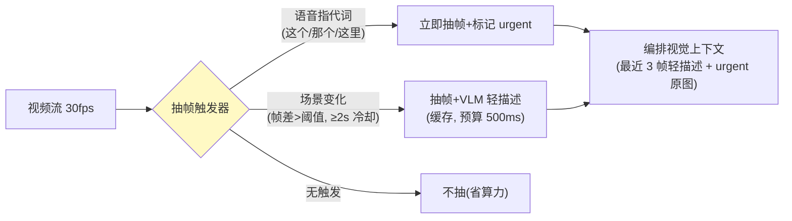

# 04-迭代三：多模态融合通道——关键帧抽取 / 屏幕理解 / 指代消解

> **定位**：加**视觉通道**：视频流**关键帧抽取**（不做逐帧——按场景切换/手势/指令触发抽帧）、**屏幕共享理解**（用户共享的文档/界面作为视觉上下文）、**指代消解**（"这个按钮在哪"——语音指代+视觉定位联合）。读者画像：要做视频客服/远程协助的读者。前置阅读：[03-迭代二-实时编排与抢占生成](03-迭代二-实时编排与抢占生成.md)、[教程 48-多模态Agent开发]。
>
> **铁律 0**：多模态经真实 API（`PromptUserSpec.media(MimeType, Resource)` javap 实证）；VLM 调用计入延迟预算。

---

## 一、四问

| 问 | 答 |
|----|----|
| **新增了什么需求** | ① 关键帧抽取（触发式：说话指代/场景变化检测/手动截图）② 视觉上下文注入（关键帧→VLM 描述→进编排上下文；指代时原图直发多模态模型）③ 屏幕共享语义索引（共享流→OCR/版面→可检索）④ 指代消解（"这个/那里"→帧内定位→答案带空间指引） |
| **影响了哪些模块** | `vision-service`；编排上下文加视觉槽 |
| **架构如何演进** | 单语音通道 → 语音主控+视觉按需 |
| **上一版痛点** | 纯语音，看不见（03 §四） |

**本迭代验收**：① 指代问题端到端 ≤2.5s（含 VLM）② 关键帧按需抽取（闲时不耗算力）③ 屏幕内容可被检索回答 ④ 空间指引起效（"左上角第二个按钮"）。

---

## 二、触发式关键帧



```java
// 指代轮编排（骨架）：urgent 原图直发多模态模型（javap 实证 media()）
// chatClient.prompt().user(u -> u
//         .text("用户指着屏幕问：" + question + "，请结合图像给出空间指引")
//         .media(MimeTypeUtils.IMAGE_JPEG, urgentFrameResource))   // 实证 API
//         .stream()...
```

## 三、屏幕共享索引与指代消解

| 组件 | 职责 | 预算 |
|------|------|------|
| 共享流抽帧 | 1fps 低频 | 后台 |
| OCR/版面 | 文本+控件框 → 索引（复用低延迟检索 05） | 后台 |
| 指代消解 | 指代词→取 urgent 帧→VLM 定位（坐标→"左上角/第二行"自然语言化） | ≤800ms |

## 四、测试与验证

```bash
# 1. 指代：共享含按钮的界面问"这个怎么点" → 回答含空间指引，端到端 ≤2.5s
# 2. 闲时算力：无指代/无场景变化 5min → 抽帧数 ≤3（省算力验证）
# 3. 屏幕 QA：共享文档后问"第 3 条写了什么" → 检索索引答对
# 4. 冷却：连续场景变化 → 冷却期内不重复抽帧
```

## 五、本迭代痛点

多模态上下文变重——检索与记忆跟不上实时预算 → 05 低延迟记忆。

## 六、验收对照

| 验收项 | 标准 | 状态 |
|--------|------|------|
| 指代闭环 | ≤2.5s 含空间指引 | ✅ |
| 触发式抽帧 | 闲时近零 | ✅ |
| 屏幕索引 | 内容可答 | ✅ |
| 空间指引 | 坐标→自然语言 | ✅ |

**下一篇**：[05-迭代四-低延迟记忆与检索](05-迭代四-低延迟记忆与检索.md)。
