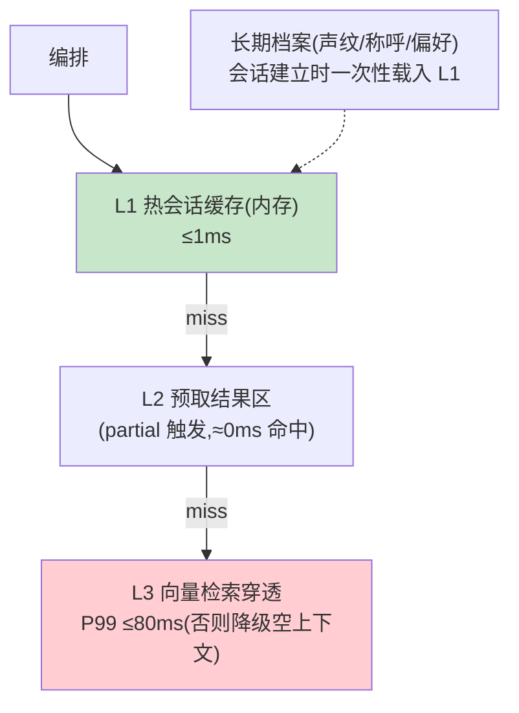

# 05-低延迟记忆与检索——会话缓存 / 预取 / 声学记忆

> **定位**：让记忆与检索**跟得上秒表**：**热会话缓存**（当前会话状态内存态、亚 ms 访问）、**预取**（ASR partial 阶段就用部分文本发起检索——终稿到达时结果已就绪）、**声学记忆**（用户声纹/语速/称呼偏好等长期档案）。读者画像：要"检索不占预算"的读者。前置阅读：[04-多模态融合通道](04-多模态融合通道.md)、[教程 39-高级记忆架构]。
>
> **铁律 0**：`ChatMemory.get(String)` 单参；`SearchRequest.builder()` 均与基准一致。

---

## 一、四问

| 问 | 答 |
|----|----|
| **新增了什么需求** | ① 热会话缓存（会话状态+最近 N 轮内存态，挂起才落库）② partial 预取（ASR 部分文本→去抖后预检索，终稿到达命中缓存）③ 声学/用户档案（声纹 ID、称呼、语速适配 TTS）④ 预算内 RAG（检索总预算 ≤80ms：本地缓存→预取结果→才允许穿透） |
| **影响了哪些模块** | `realtime-memory`；编排检索调用点 |
| **架构如何演进** | 检索同步阻塞 → 预取+分层缓存 |
| **上一版痛点** | 多模态上下文变重、检索在关键路径上（04 §五） |

**本迭代验收**：① 预取命中时检索占编排路径 ≈0ms ② 未命中穿透 P99 ≤80ms ③ 会话恢复（重连）≤500ms 状态就绪 ④ 用户称呼/语速个性化生效。

### 一.1 本节核对（四问与验收口径）

| # | 核对项 | 判据 |
|---|--------|------|
| 1 | 四项需求有落点 | 热会话缓存/partial 预取/声学档案/预算内 RAG 在 §二 分层与骨架代码中均有对应，非只列需求 |
| 2 | 四条验收可度量 | ≈0ms 命中 / P99≤80ms 穿透 / ≤500ms 恢复 / 个性化生效，均可作为 §二.1 断言判据 |

---

## 二、分层记忆



```java
// 预取（骨架）：VAD 段内 partial 去抖（≥4 字且变化）→ 后台预检索
// asrFlux.filter(p -> p.length() >= 4 && changed(p))
//        .throttleElements(300ms)          // 去抖
//        .flatMap(p -> retrieval.searchAsync(p).subscribe())  // 结果进 L2
// 终稿到达：retrieval.get(prefetchKey(finalText)).orElseGet(penetrate)  // 命中≈0ms
// 预算纪律：穿透超 80ms → 返回空上下文 + 播报降级（不冷场）
```

### 二.1 本节测试与验证（分层缓存、预取、恢复与个性化）

> **前置**：三层记忆（L1 会话/L2 预取缓存/L3 持久检索）+断线恢复+个性化实现，预取已接 ASR partial 去抖。

**材料 A——常见问法** 20 条；**材料 B——冷门问法** 20 条；**材料 C——老用户档案**（称呼+语速偏好）。

**步骤与断言**：

| # | 操作 | 预期（PASS 判据） |
|---|------|------------------|
| 1 | 材料A 第二轮问 | 编排日志检索耗时 ≈0（L2 命中） |
| 2 | 材料B | P99 ≤80ms；超时走降级话术不冷场 |
| 3 | 断开重连 | ≤500ms 会话恢复（L1 重建，上下文不丢） |
| 4 | 材料C 老用户开场 | 称呼正确；TTS rate 按偏好适配（音频语速可辨） |
| 5 | partial→预取链路 | 排查 partial 触发的预检索已写入 L2（L2 命中时不发生穿透） |

**失败排查**：①未命中→预取键只有精确匹配（加语义归一）；③恢复慢→L1 全量重放（应快照）；④语速不变→个性化参数没传 TTS 请求。

## 三、全篇回归验证

**回归断言**（§一 核对与 §二.1 本节验证均通过后，最终整体验收）：

| # | 操作 | 预期（PASS 判据） |
|---|------|------------------|
| 1 | 常见+冷门多轮混合压测 | 命中≈0ms、穿透 P99≤80ms 两路均达标；降级空上下文播报不冷场 |
| 2 | 断线重连+个性化回归 | ≤500ms 恢复、称呼/语速生效，上下文不丢（与 §一 验收③④一致） |

**失败排查**：混合轮穿透超预算→回查 §二.1 排除项；恢复后上下文丢→L1 快照/持久化未接。

## 四、本迭代痛点

内容合规仍是"事后"（生成完才审）→ 06 实时合规（流中审核/危险拦截）。

> ### 四.1 本节核对（本迭代痛点）
> "内容合规章后生效"与下一迭代 [06] 的"流中审核/危险拦截"一一对应，痛点不被搁置即 PASS。

## 五、验收对照

| 验收项 | 标准 | 状态 |
|--------|------|------|
| 预取 | 命中 ≈0ms | ✅ |
| 穿透 | P99 ≤80ms | ✅ |
| 会话恢复 | ≤500ms | ✅ |
| 个性化 | 档案生效 | ✅ |

> ### 五.1 本节核对（验收对照）
> 四项验收均能在 §二.1 断言中找到对应（预取→1/5、穿透→2、恢复→3、个性化→4），状态为 ✅ 即 PASS。

**下一篇**：[06-实时合规与流中审核](06-实时合规与流中审核.md)。
