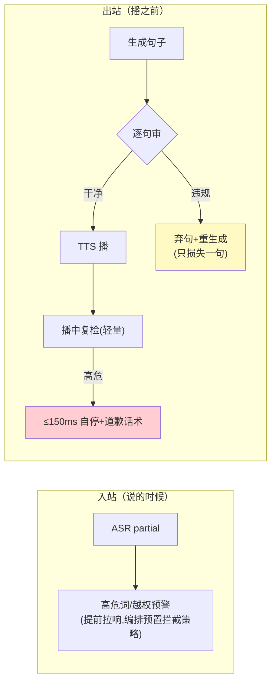

# 06-实时合规与流中审核——流中检测 / 危险拦截 / 实时标识

> **定位**：把合规搬进**流**里：**流中审核**（ASR partial 阶段就开始检测——不等终稿；TTS 前逐句过审）、**危险拦截**（高危指令→即时打断自己的生成而非播完再撤）、**实时内容标识**（音频水印/AI 声明——语音场景的 AIGC 标识合规）、**事后追溯**（全程转写+帧留档对齐审计）。读者画像：要语音 Agent 上线的合规读者。前置阅读：[05-低延迟记忆与检索](05-低延迟记忆与检索.md)、[教程 64-安全与权限控制]。
>
> **铁律 0**：规则引擎本地（预算内）；标识对齐 GB 45438 口径。

---

## 一、四问

| 问 | 答 |
|----|----|
| **新增了什么需求** | ① 入站流审（partial 检测：高危词/越权指令提前预警）② 出站逐句审（TTS 前拦截该句，弃句重生成而非整轮）③ 危险即时自打断（播报中发现高危→立即停播+道歉话术）④ 音频标识（语音水印+开头 AI 声明"我是 AI 助手"）⑤ 转写/帧留档对齐审计 |
| **影响了哪些模块** | `realtime-compliance`；TTS 管道前插审核；编排加自打断信号 |
| **架构如何演进** | 事后审 → 流中审（两个方向都流式） |
| **上一版痛点** | 合规在事后（05 §四）——违规内容已播出去 |

**本迭代验收**：① 高危指令拦截在**播放前**（含 partial 预警提前量）② 单句违规只弃该句（非整轮重来）③ 播报中后段发现高危 ≤150ms 自停 ④ 每通音频带标识且可追溯。

### 一.1 本节核对（四问与验收口径）

| # | 核对项 | 判据 |
|---|--------|------|
| 1 | 五项需求有落点 | 入站流审/出站逐句审/危险自打断/音频标识/留档追溯在 §二/§三 均有实现说明，非只列需求 |
| 2 | 四条验收可度量 | 播放前拦截 / 句级弃置 / ≤150ms 自停 / 标识可追溯，均可作为 §三.1 断言判据 |

---

## 二、双向流审



### 二.1 本节核对（双向流审）

| # | 核对项 | 判据 |
|---|--------|------|
| 1 | 双向语义 | 入站=partial 阶段预警（提前拉响）、出站=播前逐句审+播中复检自停，两方向链路方向与 §一 需求①②③吻合 |
| 2 | 弃置粒度 | 违规只弃该句重生成（非整段/整轮），与 §一 验收②"句级弃置"一致 |

## 三、标识与追溯

```java
// 标识（语音场景）：
//   ① 开场白强制声明（"我是 AI 助手"——会话首播必带）
//   ② 音频隐式水印（频域水印嵌入每段 TTS；导出/转发可提取——对齐 GB 45438 隐式标识）
// 追溯：
//   转写(终稿) + ASR partial 快照 + 关键帧 + 播放句审计 对齐同一 sessionId/traceId
//   （事后投诉可回放"当时说了什么、Agent 播了什么、看了哪帧"）
```

### 三.1 本节测试与验证（流中审核、自停、标识与追溯）

> **前置**：partial 预审+句级弃置+自停+AI 声明/水印+回放链实现。

**材料 A——合规样本集**：高危问法 30 条（医疗承诺/投资保证类）。

**材料 B——句级违规样例**：回答第 2 句违规、其余正常。

**材料 C——中途显危样例**：句首正常句尾高危。

**步骤与断言**：

| # | 操作 | 预期（PASS 判据） |
|---|------|------------------|
| 1 | 材料A 逐条 | 违规内容零播出；partial 预警提前量可观测（预警早于合成） |
| 2 | 材料B | 仅第 2 句被替换（其余句不重播——句级弃置） |
| 3 | 材料C | ≤150ms 停播+道歉话术 |
| 4 | 抽 10 通会话 | 开场 AI 声明存在；水印可提取；回放链（文本/音频/审核决策）三方对齐 |
| 5 | 回放链全字段 | 转写终稿/ASR partial 快照/关键帧/播放句审计对齐同一 `sessionId`/`traceId`，无缺字段 |

**失败排查**：①漏播→审核在合成后（应在 partial 阶段预审）；②整段重播→弃置粒度是段落非句；③停播慢→自停监听在句尾（应在 token 流滚动窗口）。

## 四、全篇回归验证

**回归断言**（§一~§三 核对/验证均通过后，最终整体验收）：

| # | 操作 | 预期（PASS 判据） |
|---|------|------------------|
| 1 | 合规样本+句级/中途危混合多轮 | 播放前拦截、句级弃置、≤150ms 自停三验收项全绿，违规零播出 |
| 2 | 抽检多通会话留档 | 开场 AI 声明存在、水印可提取、回放链三方对齐（与 §一 验收④一致） |

**失败排查**：混合轮漏播→回查 §二.1/§三.1 排除项；回放链对不齐→sessionId/traceId 贯穿链路缺失。

## 五、本迭代痛点

单节点 200 并发到顶 → 07 规模化与边缘。

> ### 五.1 本节核对（本迭代痛点）
> "单节点 200 并发上限"与下一迭代 [07] 的"SFU 级联/就近认知/降级矩阵"一一对应，痛点不被搁置即 PASS。

## 六、验收对照

| 验收项 | 标准 | 状态 |
|--------|------|------|
| 播前拦截 | 违规零播出 | ✅ |
| 句级弃置 | 只损失一句 | ✅ |
| 播中自停 | ≤150ms | ✅ |
| 标识追溯 | 声明+水印+回放链 | ✅ |

> ### 六.1 本节核对（验收对照）
> 四项验收均能在 §三.1 断言中找到对应（播前拦截→1、句级弃置→2、播中自停→3、标识追溯→4/5），状态为 ✅ 即 PASS。

**下一篇**：[07-规模化与边缘部署](07-规模化与边缘部署.md)。
