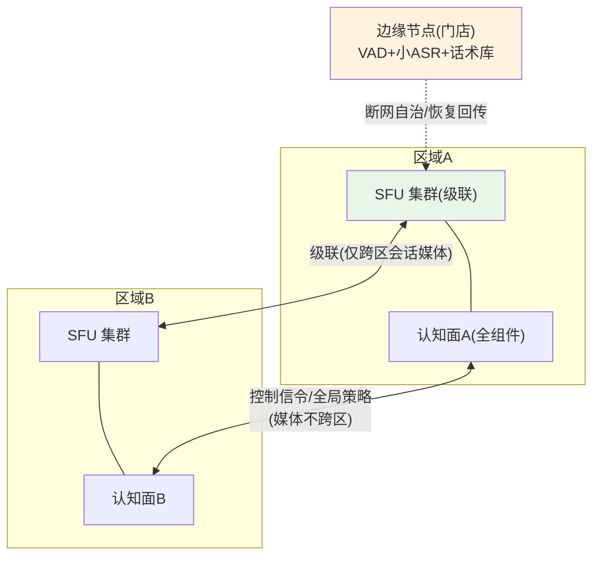

# 07-迭代六：规模化与边缘部署——SFU 集群 / 就近认知 / 全链降级

> **定位**：平台规模化收官：**SFU 集群**（级联/Cascading 扩容媒体面）、**就近认知**（多区域认知面——媒体面接哪、认知面就在哪，跨区只走控制信令）、**全链降级矩阵**（每环节故障的降级路径成表——ASR 挂→按键+文字；编排挂→话术库；TTS 挂→文字；网络抖→自适应码率）、**边缘轻量版**（门店/网点侧小形态部署）。读者画像：要上万路并发的读者。前置阅读：[06-迭代五-实时合规与流中审核](06-迭代五-实时合规与流中审核.md)、[教程 33-部署与运维]。
>
> **铁律 0**：机制自研/部署层（SFU 级联为标准做法，概念+真实开源坐标 mediasoup/janus 标注）。

---

## 一、四问

| 问 | 答 |
|----|----|
| **新增了什么需求** | ① SFU 级联扩容（媒体面水平扩展+区域间级联转发）② 认知面多区域就近（会话粘滞到区域；区域认知面全组件齐全）③ 全链降级矩阵（逐环节降级路径+自动演练验证）④ 边缘轻量版（VAD+小 ASR+话术库离线兜底，断网可用） |
| **影响了哪些模块** | 部署层全部；降级矩阵入 SRE 手册 |
| **架构如何演进** | 单区域 → 多区域就近 + 边缘形态 |
| **上一版痛点** | 单节点 200 并发上限（06 §五） |

**本迭代验收**：① SFU 级联压测 5000 路并发媒体无损 ② 跨区会话媒体流量零跨区（只有信令）③ 降级矩阵逐项演练通过（拔 ASR/TTS/编排各自降级生效）④ 边缘断网版核心问法可用（本地兜底）。

---

## 二、多区域就近 + 级联



## 三、全链降级矩阵（SRE 联动）

| 环节故障 | 降级路径 | 用户感受 |
|---------|---------|---------|
| 流式 ASR | 保守 VAD+整句 ASR / 按键+文字 | 略慢仍可说 |
| 编排(LLM) | 本地话术库 FAQ 兜底 | 常见问题照答 |
| 流式 TTS | 预合成提示音+文字通道 | 变"看"模式 |
| 检索(05) | 空上下文+声明"信息可能不全" | 诚实降级 |
| 打断检测 | 全双工→按键轮替 | 退半双工 |
| 区域整体 | DNS 切邻区（会话重建 ≤500ms 恢复） | 短暂重连 |

```bash
# 演练：每月按矩阵逐项"拔插头"（复用平台混沌纪律）——降级路径不演练=不存在
```

## 四、测试与验证

```bash
# 1. 压测：两区域 SFU 级联 5000 路（音频收发无损，P99 抖动 ≤50ms）
# 2. 就近：跨区用户接入 → 抓包确认媒体仅本区、信令跨区
# 3. 降级：按矩阵拔 ASR/编排/TTS → 各自路径生效（自动演练脚本断言）
# 4. 边缘：断网门店版 → Top100 FAQ 本地可答；恢复后对账回传
```

## 五、本迭代痛点

六迭代+进阶齐备但代码散 → 11 核心代码讲解统一复盘。

## 六、验收对照

| 验收项 | 标准 | 状态 |
|--------|------|------|
| 级联扩容 | 5000 路无损 | ✅ |
| 媒体就近 | 零跨区媒体 | ✅ |
| 降级矩阵 | 逐项演练 | ✅ |
| 边缘自治 | 断网可答 | ✅ |

**下一篇**：[11-核心代码讲解](11-核心代码讲解.md)。
