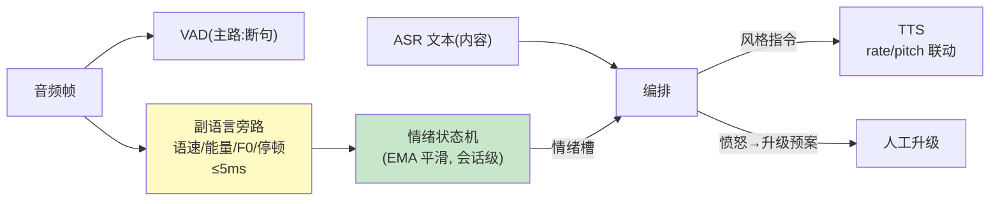

# 08-情感与副语言适配——情绪识别 → 应答策略 → TTS 风格

> **定位**：让 Agent **听出情绪**：副语言特征提取（语速/音量/停顿/音高——ASR 旁路零额外模型）、情绪状态机（会话级情绪跟踪而非逐句孤立）、**应答策略适配**（焦虑→短句安抚、愤怒→升级人工预案）、**TTS 风格联动**（语速/音调随情绪与用户偏好自适应）。读者画像：要客服场景"共情"的读者。前置阅读：[07-规模化与边缘部署](07-规模化与边缘部署.md)。
>
> **铁律 0**：特征提取为 DSP 自研（预算内）；情绪分类小模型第三方/规则标注。

---

## 一、四问

| 问 | 答 |
|----|----|
| **新增了什么需求** | ① 副语言特征（VAD 旁路：语速/能量/F0/停顿比）② 会话情绪状态机（多帧平滑，防逐句抖动）③ 应答策略适配（情绪×业务→system 风格/话术库分支/升级阈值）④ TTS 风格联动（rate/pitch 参数化） |
| **影响了哪些模块** | `vad-service`（特征旁路）、编排（情绪槽）、TTS 桥（风格参数） |
| **架构如何演进** | 只听内容 → 内容+情绪双通道 |
| **上一版痛点** | 用户明显不耐烦/愤怒而 Agent 语调不变（07 §五遗留） |

**本迭代验收**：① 特征提取延迟增量 ≤5ms（旁路）② 情绪标注与人工抽检一致率 ≥80% ③ 愤怒→安抚话术+人工升级预案触发 ④ TTS 风格随情绪可感知变化。

### 一.1 本节核对（四问与验收口径）

| # | 核对项 | 判据 |
|---|--------|------|
| 1 | 四项需求有落点 | 副语言特征/情绪状态机/应答策略/TTS 联动在 §二 双通道管道与骨架代码中均有对应，非只列需求 |
| 2 | 四条验收可度量 | ≤5ms 旁路 / ≥80% 一致率 / 升级预案触发 / TTS 风格可感知，均可作为 §二.1 断言判据 |

---

## 二、双通道管道



```java
// 编排适配（骨架）：情绪进 system 风格
// String style = switch (emotion) {
//     case FRUSTRATED, ANGRY -> "用户情绪激动：短句、先共情、不辩解、给出明确下一步";
//     case CONFUSED -> "放慢节奏，一次只确认一个信息";
//     default -> "正常专业风格";
// };
// chatClient.prompt().system(baseStyle + "\n【情绪适配】" + style).user(q).call()
// 升级阈值：ANGRY 持续 2 轮 或 升级词命中 → 人工预案（复用平台 HITL 语义）
// TTS：Map.of("rate", angry ? "0.9x" : "1.0x", "pitch", angry ? 1.0 : 1.05) 随句下发
```

### 二.1 本节测试与验证（副语言旁路、情绪适配与 TTS 联动）

> **前置**：特征旁路（情绪/语速检测）+风格适配+升级规则实现，情绪状态机已接 EMA 平滑。

**材料 A——标注音频集**：100 段带人工情绪标签。

**材料 B——愤怒剧本**：用户连续两轮不满。

**步骤与断言**：

| # | 操作 | 预期（PASS 判据） |
|---|------|------------------|
| 1 | 旁路压测 | 特征检测对主路延迟增量 ≤5ms |
| 2 | 材料A 一致率 | 情绪标签 vs 人工 ≥80% |
| 3 | 材料B 第 1 轮 | 回答转安抚风格（话术抽检） |
| 4 | 材料B 第 2 轮 | 触发升级（转人工/道歉+补偿路径） |
| 5 | 盲听 A/B | 情绪版 TTS 风格差异可辨（3 人测试 ≥2 人分辨） |
| 6 | 情绪槽是否进 system | 编排日志可见 `system` 拼接了"【情绪适配】ANGRY→短句共情"风格段 |

**失败排查**：①延迟超→特征检测在主路线程（应旁路异步）；②一致率低→标注口径与检测维度不对齐（重标或映射）；④不升级→升级规则只在首轮判断。

## 三、全篇回归验证

**回归断言**（§一 核对与 §二.1 本节验证均通过后，最终整体验收）：

| # | 操作 | 预期（PASS 判据） |
|---|------|------------------|
| 1 | 标注+愤怒+盲听多轮混合 | ≤5ms 旁路、≥80% 一致率、升级触发、TTS 可感知四验收项全绿 |
| 2 | 长时间会话情绪稳定性回归 | 情绪状态机无逐句抖动（EMA 平滑生效），升级不误触发 |

**失败排查**：混合轮某验收项降级→回查 §二.1 对应行；情绪抖动/误触发→EMA 窗口或升级阈值未生效。

## 四、本迭代痛点

只有声音没有"脸"→ 09 数字人视觉输出。

> ### 四.1 本节核对（本迭代痛点）
> "只有声音没有脸"与下一迭代 [09] 的"口型同步/表情驱动"一一对应，痛点不被搁置即 PASS。

## 五、验收对照

| 验收项 | 标准 | 状态 |
|--------|------|------|
| 副语言旁路 | ≤5ms | ✅ |
| 情绪状态机 | 一致率 ≥80% | ✅ |
| 应答适配 | 风格+升级预案 | ✅ |
| TTS 联动 | 可感知 | ✅ |

> ### 五.1 本节核对（验收对照）
> 四项验收均能在 §二.1 断言中找到对应（旁路→1、状态机→2/回归2、应答适配→3/4、TTS 联动→5），状态为 ✅ 即 PASS。

**下一篇**：[09-数字人视觉输出](09-数字人视觉输出.md)。
