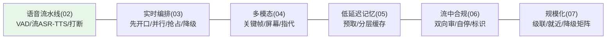
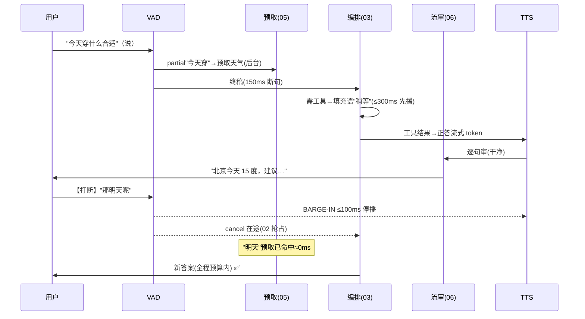

# 08-核心代码讲解：一次语音对话的实时旅程

> **定位**：复盘实时平台关键实现，并以**一次含打断与工具的语音对话旅程**串起全部迭代。前置阅读：[02-迭代一-全双工语音流水线](02-迭代一-全双工语音流水线.md) 至 [07-迭代六-规模化与边缘部署](07-迭代六-规模化与边缘部署.md)。
>
> **铁律 0**：与各迭代实证一致。

---

## 一、机制速查

## 二、完整旅程（一次被打断的天气问询）

**一句话**：用户说半句系统已预取、被打断 200ms 内闭嘴、每句播出前都过审——六个迭代在一次对话里各就各位。

## 三、关键设计复盘

| # | 设计 | 为什么 |
|---|------|--------|
| 1 | 延迟预算倒推架构 | 实时系统的第一性原理（00） |
| 2 | 媒体面/认知面分离 | 思考慢不卡音频、崩溃域隔离 |
| 3 | 填充语先开口 | 冷场是实时对话最差体验 |
| 4 | partial 预取 | 把检索移出关键路径 |
| 5 | 句级弃置+播中自停 | 合规零播出与体验的平衡 |
| 6 | 降级矩阵月演练 | 不演练的降级=不存在 |

## 四、测试与验证

按 §二旅程逐跳断言（各迭代已有用例）；全链压测脚本（打断率 30% 混合负载）回归。

**下一篇**：[09-ADR架构决策记录](09-ADR架构决策记录.md)。
