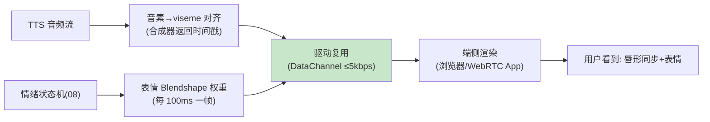

# 09-数字人视觉输出——口型同步 / 表情驱动 / 形象治理

> **定位**：给 Agent 一张"脸"：**口型同步**（TTS 音频流→viseme 时间轴→面部驱动，唇形误差 ≤80ms）、**表情驱动**（情绪状态机（08）→表情基元 Blendshape）、**数字人形象治理**（形象注册/合规审查——数字人也是 AIGC 内容：标识/肖像授权/形象白名单）。读者画像：做数字人坐席的读者。前置阅读：[08-情感副语言与个性化](08-情感副语言与个性化.md)。
>
> **铁律 0**：渲染为客户端/WebRTC 通道（视频轨）；服务端只发驱动流（低带宽）。

---

## 一、四问

| 问 | 答 |
|----|----|
| **新增了什么需求** | ① 口型同步（音素→viseme 时间戳随音频下发）② 表情驱动（情绪→Blendshape 权重流）③ 驱动流复用媒体面（驱动数据走 DataChannel，渲染在端侧——服务端零渲染算力）④ 形象治理（形象注册/肖像授权/AIGC 数字人标识） |
| **影响了哪些模块** | TTS 桥（viseme 时间轴）、媒体面（DataChannel 通道）、合规（形象审查） |
| **架构如何演进** | 纯音频出 → 音频+驱动流双出、端侧渲染 |
| **上一版痛点** | 无视觉形象（08 §四） |

**本迭代验收**：① 口型-音频偏差 ≤80ms ② 情绪→表情联动可感知 ③ 驱动流带宽 ≤5kbps（远低于视频流）④ 未注册形象拒绝渲染+数字人标识生效。

### 一.1 本节核对（四问与验收口径）

| # | 核对项 | 判据 |
|---|--------|------|
| 1 | 四项需求有落点 | 口型同步/表情驱动/驱动流复用/形象治理在 §二/§三 均有实现说明，非只列需求 |
| 2 | 四条验收可度量 | ≤80ms 口型 / 表情联动可感知 / ≤5kbps 带宽 / 拒渲染+标识，均可作为 §三.1 断言判据 |

---

## 二、驱动流架构（服务端思考、端侧渲染）



### 二.1 本节核对（驱动流架构）

| # | 核对项 | 判据 |
|---|--------|------|
| 1 | 服务端零渲染 | 服务端只发 viseme/Blendshape 驱动数据（走 DataChannel），渲染在端侧——与 §一 验收③"带宽 ≤5kbps"逻辑一致 |
| 2 | 双驱动流 | viseme（口型）+Blendshape（表情）分离注入驱动复用通道，与 §一 需求①②对应 |

## 三、形象治理（AIGC 合规）

```yaml
# 形象注册（合规前置）：
digital-human:
  avatarId: cs-xiaomei
  portraitLicense: "授权书编号(真人形象需肖像授权)"   # 法务留档
  aigcLabel: true          # 数字人显著标识(AI 生成角色声明)+隐式标识
  allowedScenes: [customer-service]   # 形象白名单(客服形象不得用于营销)
# 渲染前校验：avatarId 未注册/授权过期/场景外使用 → 拒绝下发驱动流
```

### 三.1 本节测试与验证（口型同步、表情联动、带宽与形象治理）

> **前置**：驱动流渲染端（口型/表情）+形象注册+AI 声明实现。

**材料 A——录屏对齐工具**：ffmpeg 抽帧+音画时间戳。

**材料 B——未注册形象请求**；**材料 C——愤怒情绪联动样例**。

**步骤与断言**：

| # | 操作 | 预期（PASS 判据） |
|---|------|------------------|
| 1 | 材料A 逐帧对齐 | 音频-唇形偏差 ≤80ms |
| 2 | 材料C | 数字人表情收敛（与 08 情绪联动） |
| 3 | 驱动流带宽实测 | ≤5kbps |
| 4 | 材料B | 拒渲染；数字人会话首帧带 AI 声明（视觉标注存在） |
| 5 | 形象合规校验切片（未注册/授权过期/场景外） | 三类均拒绝下发驱动流，返回拒绝原因 |

**失败排查**：①偏差大→驱动流与音频流无统一时钟（对齐时戳字段）；③超带宽→驱动流发了关键帧全量（应参数增量）；④拒不掉→形象注册表未在渲染端校验。

## 四、全篇回归验证

**回归断言**（§一~§三 核对/验证均通过后，最终整体验收）：

| # | 操作 | 预期（PASS 判据） |
|---|------|------------------|
| 1 | 口型/表情/带宽/形象多轮混合 | ≤80ms 口型、表情可感知、≤5kbps、拒渲染+标识四验收项全绿 |
| 2 | 合规切片回归（未注册/场景外多次） | 均拒渲染且首帧带 AI 声明，无一次漏放行 |

**失败排查**：混合轮某验收项降级→回查 §二.1/§三.1 对应行；合规漏放行→渲染端未做强校验（回查断言 4/5）。

## 五、本迭代痛点

浏览器之外（电话/旧设备）进不来 → 10 电话通道与端侧实时。

> ### 五.1 本节核对（本迭代痛点）
> "浏览器之外进不来"与下一篇 [10] 的"SIP/PSTN/端侧实时"一一对应，痛点不被搁置即 PASS。

## 六、验收对照

| 验收项 | 标准 | 状态 |
|--------|------|------|
| 口型同步 | ≤80ms | ✅ |
| 表情联动 | 可感知 | ✅ |
| 驱动带宽 | ≤5kbps | ✅ |
| 形象治理 | 注册/授权/标识 | ✅ |

> ### 六.1 本节核对（验收对照）
> 四项验收均能在 §三.1 断言中找到对应（口型→1、表情→2、带宽→3、形象治理→4/5），状态为 ✅ 即 PASS。

**下一篇**：[10-电话通道与端侧实时](10-电话通道与端侧实时.md)。
