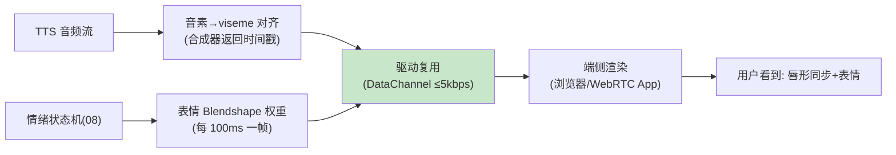

# 09-迭代八：数字人视觉输出——口型同步 / 表情驱动 / 形象治理

> **定位**：给 Agent 一张"脸"：**口型同步**（TTS 音频流→viseme 时间轴→面部驱动，唇形误差 ≤80ms）、**表情驱动**（情绪状态机（08）→表情基元 Blendshape）、**数字人形象治理**（形象注册/合规审查——数字人也是 AIGC 内容：标识/肖像授权/形象白名单）。读者画像：做数字人坐席的读者。前置阅读：[08-迭代七-情感副语言与个性化](08-迭代七-情感副语言与个性化.md)。
>
> **铁律 0**：渲染为客户端/WebRTC 通道（视频轨）；服务端只发驱动流（低带宽）。

---

## 一、四问

| 问 | 答 |
|----|----|
| **新增了什么需求** | ① 口型同步（音素→viseme 时间戳随音频下发）② 表情驱动（情绪→Blendshape 权重流）③ 驱动流复用媒体面（驱动数据走 DataChannel，渲染在端侧——服务端零渲染算力）④ 形象治理（形象注册/肖像授权/AIGC 数字人标识） |
| **影响了哪些模块** | TTS 桥（viseme 时间轴）、媒体面（DataChannel 通道）、合规（形象审查） |
| **架构如何演进** | 纯音频出 → 音频+驱动流双出、端侧渲染 |
| **上一版痛点** | 无视觉形象（08 §四） |

**本迭代验收**：① 口型-音频偏差 ≤80ms ② 情绪→表情联动可感知 ③ 驱动流带宽 ≤5kbps（远低于视频流）④ 未注册形象拒绝渲染+数字人标识生效。

---

## 二、驱动流架构（服务端思考、端侧渲染）



## 三、形象治理（AIGC 合规）

```yaml
# 形象注册（合规前置）：
digital-human:
  avatarId: cs-xiaomei
  portraitLicense: "授权书编号(真人形象需肖像授权)"   # 法务留档
  aigcLabel: true          # 数字人显著标识(AI 生成角色声明)+隐式标识
  allowedScenes: [customer-service]   # 形象白名单(客服形象不得用于营销)
# 渲染前校验：avatarId 未注册/授权过期/场景外使用 → 拒绝下发驱动流
```

## 四、测试与验证

```bash
# 1. 口型：录屏逐帧对齐 → 音频-唇形偏差 ≤80ms
# 2. 表情：愤怒样本 → 数字人表情收敛（与 08 情绪联动）
# 3. 带宽：驱动流实测 ≤5kbps
# 4. 治理：未注册形象 → 拒渲染；数字人会话首帧带 AI 声明
```

## 五、本迭代痛点

浏览器之外（电话/旧设备）进不来 → 10 电话通道与端侧实时。

## 六、验收对照

| 验收项 | 标准 | 状态 |
|--------|------|------|
| 口型同步 | ≤80ms | ✅ |
| 表情联动 | 可感知 | ✅ |
| 驱动带宽 | ≤5kbps | ✅ |
| 形象治理 | 注册/授权/标识 | ✅ |

**下一篇**：[10-迭代九-电话通道与端侧实时](10-迭代九-电话通道与端侧实时.md)。
