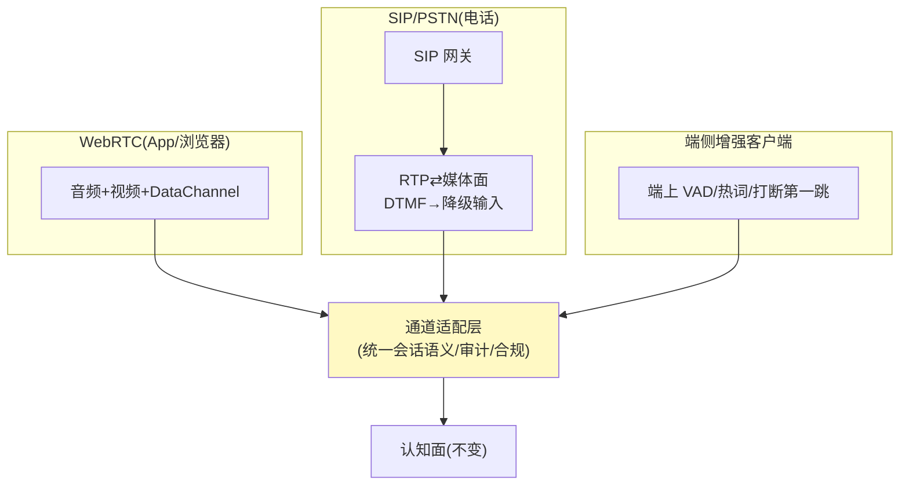

# 10-电话通道与端侧实时——SIP/PSTN / 端侧 VAD / 削往返

> **定位**：把平台开到**电话**与**端侧**：**SIP/PSTN 接入**（传统电话→平台会话——IVR 平替）、**端侧实时预处理**（VAD/热词/打断第一跳移到端上——削往返 ~100ms）、**通道适配层**（WebRTC/SIP/端侧三通道统一会话语义）。读者画像：要替代企业 IVR 的读者。前置阅读：[09-数字人视觉输出](09-数字人视觉输出.md)。
>
> **铁律 0**：SIP/PSTN 为电信标准（第三方网关概念标注）；端侧预处理为客户端能力。

---

## 一、四问

| 问 | 答 |
|----|----|
| **新增了什么需求** | ① SIP/PSTN 通道（电话呼入→会话；回铃/DTMF 按键→降级输入）② 端侧 VAD+热词（打断第一跳端上判——省云往返）③ 通道适配层（三通道统一会话语义与审计）④ 电话合规（录音告知/双声道留档） |
| **影响了哪些模块** | 媒体面加 SIP 网关；客户端 SDK；会话层通道抽象 |
| **架构如何演进** | WebRTC 单通道 → 三通道（WebRTC/SIP/端侧增强） |
| **上一版痛点** | 电话用户进不来、云上 VAD 白耗 100ms 往返（09 §五） |

**本迭代验收**：① 电话呼入全流程跑通（说→答→按键降级）② 端侧 VAD 打断感知 ≤120ms（原 200ms）③ 三通道同一会话语义/审计一致 ④ 录音告知与双声道留档生效。

### 一.1 本节核对（四问与验收口径）

| # | 核对项 | 判据 |
|---|--------|------|
| 1 | 四项需求有落点 | SIP/PSTN 接入/端侧 VAD+热词/通道适配层/电话合规在 §二~§四 均有实现说明，非只列需求 |
| 2 | 四条验收可度量 | 全流程 / ≤120ms 端侧打断 / 会话一致 / 告知+双声道，均可作为 §三.1 断言判据 |

---

## 二、三通道统一



### 二.1 本节核对（三通道统一）

| # | 核对项 | 判据 |
|---|--------|------|
| 1 | 三通道汇入适配层 | WebRTC/SIP(PSTN)/端侧增强三通道均经通道适配层统一语义/审计/合规，认知面不变——与 §一 验收③一致 |
| 2 | DTMF 降级 | SIP 通道 DTMF 按键→降级输入，纳入降级矩阵（07），口径一致 |

## 三、端侧削往返

```java
// 端侧预处理（客户端 SDK，骨架）：
//   本地 VAD（Web VAD API/端上模型）→ 打断第一跳本地判（能量+方向）
//   判定即本地静音播放 + 上报打断事件（云只做确认与语义判断）
//   收益：打断感知 200ms → ≤120ms（省云上检测往返 ~100ms）
// 热词：端上唤醒/确认词本地识别（"对/不是/停"）——高频短交互零上云
```

### 三.1 本节核对（端侧削往返）

| # | 核对项 | 判据 |
|---|--------|------|
| 1 | 削往返逻辑 | 打断第一跳本地判（VAD/能量+方向）→ 收益 200ms→≤120ms（省 ~100ms 云往返），与 §一 验收②一致 |
| 2 | 热词零上云 | "对/不是/停"等 50 热词本地识别，云端日志无对应请求——作为 §四.1 断言 3 判据 |

## 四、电话合规

```bash
# 呼入即播告知："本次通话由 AI 助手接听并将录音"（法定+平台标识）
# 留档：双声道（用户/Agent 分离）→ 审计链（06 的对齐追溯复用）
# DTMF：ASR 不可用/用户偏好按键时的降级输入通道（进降级矩阵）
```

### 四.1 本节测试与验证（电话全流程、端侧打断与三通道一致）

> **前置**：SIP/PSTN 接入+DTMF 降级+端侧运行时（热词/本地模型）+三通道一致性实现。

**材料 A——测试手机号**；**材料 B——弱网模拟**（丢包 30%）；**材料 C——端侧热词表**（50 词）；**材料 D——同一账号**。

**步骤与断言**：

| # | 操作 | 预期（PASS 判据） |
|---|------|------------------|
| 1 | 材料A 呼入 | 语音问答全流程；开场告知播报存在 |
| 2 | 材料B 弱网 | DTMF 降级可用（按键交互完成意图） |
| 3 | 端侧打断实测 | ≤120ms；热词问法本地命中（云日志无对应请求） |
| 4 | 材料D 在 App/网页/电话三通道做同一会话测试 | 记忆/审计/合规口径一致 |
| 5 | 电话会话留档 | 双声道（用户/Agent 分离）可回放 |
| 6 | 告知与双声道核对 | 呼入即播"AI 接听并录音"告知；留档双声道可分离回放 |

**失败排查**：②DTMF 不达→DTMF 事件被弱网丢弃（改带内冗余）；③云日志有请求→热词匹配没前置拦截（走了云端路由）；④口径不一致→电话通道记忆走独立存储（未接统一会话库）。

## 五、全篇回归验证

**回归断言**（§一~§四 核对/验证均通过后，最终整体验收）：

| # | 操作 | 预期（PASS 判据） |
|---|------|------------------|
| 1 | 三通道（App/网页/电话）+多轮混合 | 全流程、≤120ms 端侧打断、会话语义/审计一致、告知+双声道四验收项全绿 |
| 2 | 弱网+断网端侧回归 | DTMF 降级可用；端侧热词离线直达（云网络断不开） |

**失败排查**：混合轮某验收项降级→回查 §三.1/§四.1 对应行；断网热词失效→端上模型/热词表未打包。

## 六、本迭代痛点

九迭代+进阶齐备 → 11 核心代码讲解统一复盘。

> ### 六.1 本节核对（本迭代痛点）
> "九迭代+进阶代码散、缺统一复盘"与下一篇 [11] 的"一次对话实时旅程复盘"一一对应，痛点不被搁置即 PASS。

## 七、验收对照

| 验收项 | 标准 | 状态 |
|--------|------|------|
| 电话通道 | 全流程+DTMF 降级 | ✅ |
| 端侧打断 | ≤120ms | ✅ |
| 通道一致 | 语义/审计统一 | ✅ |
| 电话合规 | 告知+双声道 | ✅ |

> ### 七.1 本节核对（验收对照）
> 四项验收均能在 §四.1 断言中找到对应（电话通道→1/2、端侧打断→3、通道一致→4、电话合规→5/6），状态为 ✅ 即 PASS。

**下一篇**：[11-核心代码讲解](11-核心代码讲解.md)。
