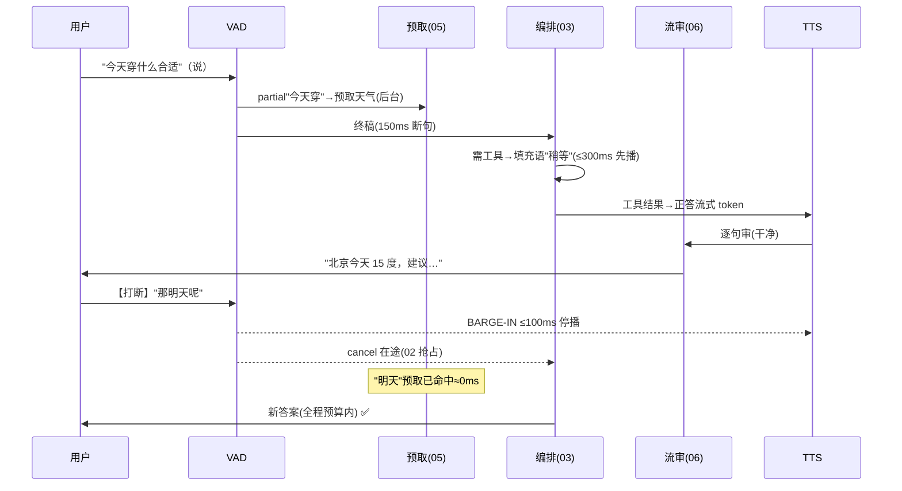

# 11-核心代码讲解：一次语音对话的实时旅程

> **定位**：复盘实时平台关键实现，并以**一次含打断与工具的语音对话旅程**串起全部迭代。前置阅读：[02-全双工语音流水线](02-全双工语音流水线.md) 至 [07-规模化与边缘部署](07-规模化与边缘部署.md)。
>
> **铁律 0**：与各迭代实证一致。

---

## 一、机制速查

### 一.1 本节核对（机制速查）

| # | 核对项 | 判据 |
|---|--------|------|
| 1 | 六机制齐备无遗漏 | 语音流水线/实时编排/多模态/低延迟记忆/流中合规/规模化六机制按键与迭代篇 02-07 一一对应，无缺漏 |
| 2 | 链路衔接 | 六机制在图上一链条式（A—B—C—D—E—F）贯通，与"一次对话旅程"主体结构呼应，非孤立列表 |

## 二、完整旅程（一次被打断的天气问询）

**一句话**：用户说半句系统已预取、被打断 200ms 内闭嘴、每句播出前都过审——六个迭代在一次对话里各就各位。

### 二.1 本节核对（完整旅程）

| # | 核对项 | 判据 |
|---|--------|------|
| 1 | 旅程含全部关键跳 | 预取(05)/填充语+抢占(03)/流审(06)/打断(02)各就各位，Actor 交互按序可复述，无跳读迭代 |
| 2 | 预算兑现 | "用户说半句已预取≈0ms""被打断 200ms 内闭嘴""每句播出前过审"与各迭代验收目标数字一致 |

## 三、关键设计复盘

| # | 设计 | 为什么 |
|---|------|--------|
| 1 | 延迟预算倒推架构 | 实时系统的第一性原理（00） |
| 2 | 媒体面/认知面分离 | 思考慢不卡音频、崩溃域隔离 |
| 3 | 填充语先开口 | 冷场是实时对话最差体验 |
| 4 | partial 预取 | 把检索移出关键路径 |
| 5 | 句级弃置+播中自停 | 合规零播出与体验的平衡 |
| 6 | 降级矩阵月演练 | 不演练的降级=不存在 |

### 三.1 本节核对（关键设计复盘）

| # | 核对项 | 判据 |
|---|--------|------|
| 1 | 六设计对应迭代 | 延迟预算倒推(00)/双面分离(00)/填充语(03)/partial 预取(05)/句级弃置+自停(06)/降级矩阵演练(07)均能在对应篇目找到落地，无悬空设计 |
| 2 | 与 12-ADR 对齐 | 六设计与 12-ADR 的 ADR 17-00~17-09 决策编号对应，口径不矛盾 |

## 四、全篇回归验证

**回归断言**（§一~§三 核对均通过后，最终整体旅程验收）：

| # | 操作 | 预期（PASS 判据） |
|---|------|------------------|
| 1 | 按 §二 旅程逐跳回放一次含打断+工具的天气问询 | 六机制（预取/填充语/工具/抢占/流审/打断）在旅程中各有一次命中，无机制休眠 |
| 2 | 全链压测（打断率 30% 混合负载）回归 | 各迭代验收数字（200ms 停播/≤400ms 首句/字句弃置等）在混合负载下不退化 |

**失败排查**：旅程某一机制未命中→对应迭代篇的验证回退；混合负载某验收项退化→按该迭代篇失败排查定位。

**下一篇**：[12-ADR架构决策记录](12-ADR架构决策记录.md)。
