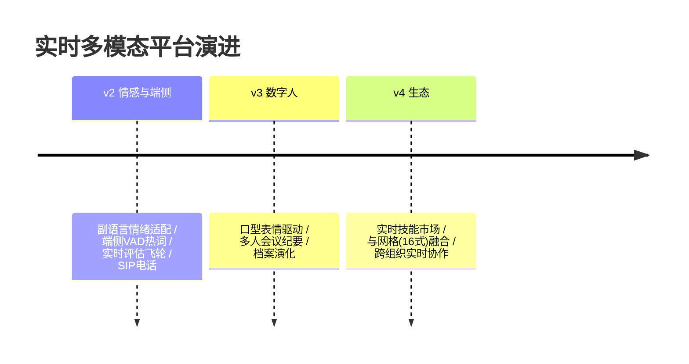

# 13-工业前沿与演进方向：实时多模态的 2026 校准与收官

> **定位**：用 2026 真实工业实践校准方向，给缺口与 v2-v4 演进，项目收官。前置阅读：[12-ADR架构决策记录](12-ADR架构决策记录.md)。
>
> **来源**：真实外部资料（链接文内）。

---

## 一、行业信号

- **Google**（[五指南](https://cloud.google.com/blog/topics/developers-practitioners/five-guides-to-building-and-scaling-production-ready-ai-agents)）："Prototype to Production" 篇强调**会话管理与实时日志**；**多模态输入**列为生产关键——本项目 02/06 的全双工会话状态与流中审计正是该路线。
- **Nebius**（[Blueprint](https://nebius.com/blog/posts/introducing-the-nebius-agents-blueprint)）：Observability"全记录"在实时域=转写/帧/播放句对齐留档（06 已落地）；其 Grounding 对应本项目屏幕索引（04）。
- **AWS**（[生产级指南](https://cloud.it168.com/a2026/0708/6939/000006939041.shtml)）：评估驱动——实时域的评估=**对话级延迟/打断率/降级触发率**指标体系（07 降级演练即评估闭环）。
- **多模态实时化趋势**（2026 业界共识）：语音全双工+视觉指代是数字人/远程协助的标配；端侧小模型承担 VAD/热词（本项目边缘版 v2 方向）。

---

## 二、现状对照（N1-N6）

| # | 前沿能力 | 现状 | 缺口/演进 |
|---|---------|------|----------|
| N1 | 全双工语音生态（电话/客户端双通道） | ✅ WebRTC | 🔶 PSTN 电话接入（SIP 网关） |
| N2 | 情感与副语言（语调/情绪识别→应答适配） | ❌ | 🔷 v2：ASR 副语言特征→编排情绪策略 |
| N3 | 数字人视觉输出（口型/表情） | ❌（纯语音+文字） | 🔷 v2/v3：TTS→驱动数字人口型 |
| N4 | 端侧实时小模型（VAD/热词端上跑） | 🔶 云端 VAD | 🔷 v2：端侧 VAD+热词（削往返 100ms） |
| N5 | 实时评估体系（对话级指标） | 🔶 降级演练 | 🔷 v2：延迟/打断率/降级率进飞轮 |
| N6 | 记忆 TTL/失效（实时档案） | 🔶 档案无 TTL | 🔷 v3：偏好档案失效与演化 |

---

## 三、演进路线



## 四、四旗舰对照收官（14/15/16/17）

| 视角 | 14 平台 | 15 内核 | 16 网格 | **17 实时** |
|------|--------|--------|--------|------------|
| 第一性 | 治理全景 | 资源托管 | 零改造 | **延迟预算** |
| 时间单位 | 秒~天 | 进程生命周期 | 策略周期 | **毫秒** |
| 一句话 | 什么都能治 | 像 OS 一样跑 | 像网格一样罩 | **像真人一样聊** |

## 五、检验方式

```bash
# 对照：本项目 200ms 打断 vs 行业"实时感"阈值（普遍 200-300ms）自查达标
# v2 PoC：端侧 VAD 演进削往返实测
```

## 六、项目收官

| 阶段 | 篇目 | 交付 |
|------|------|------|
| 基础（00-01） | 预算架构/整句闭环 | 双面分离+预算表 |
| 六迭代（02-07） | 流水线/编排/多模态/记忆/合规/规模 | 完整实时平台 |
| 资产（08-10） | 讲解/ADR/前沿 | 旅程复盘+10 条决策+v2-v4 |

项目 17 到此收官：**延迟预算倒推、全双工打断一等公民、双向流审、降级矩阵演练**的工业级实时多模态平台蓝图。独立项目，无后续依赖。
