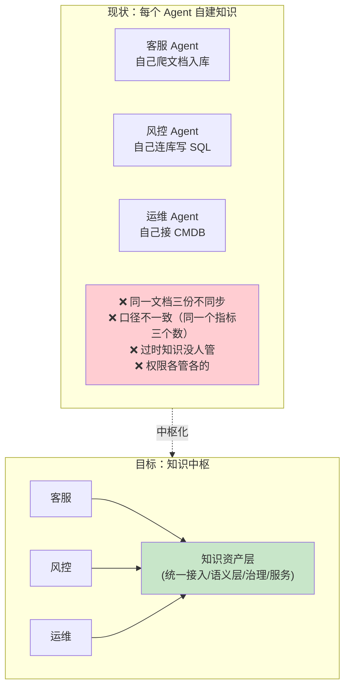
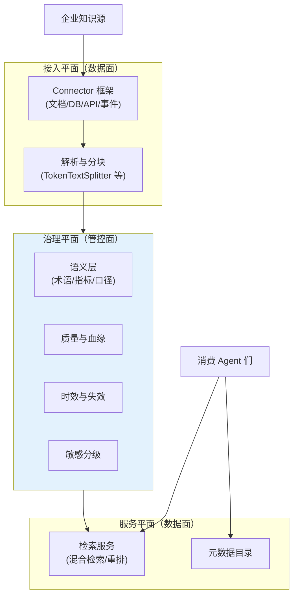
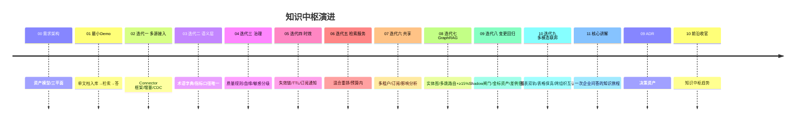

# 00-需求分析与架构设计：企业级 Agent 数据与知识中枢

> **定位**：第五旗舰·**数据与知识视角**——把企业散落的知识（文档/数据库/API/事件流）变成 Agent 可用的**受治理知识资产**：统一知识接入（多源Connector）、语义层（术语/指标/口径）、知识治理（质量/血缘/时效）、检索服务化（供 14 式平台/多 Agent 共享）。它回答"Agent 的知识从哪来、可信吗、过时了吗、谁在用"。读者画像：要做企业知识底座的架构师。前置阅读：[教程 05-RAG检索增强生成]、[教程 06-向量数据库选型]、[教程 78-高级RAG与AgenticRAG]。
>
> **铁律 0**：Spring AI 2.0 API 与基准一致（VectorStore/SearchRequest/TokenTextSplitter/MarkdownDocumentReader 等）。独立项目（与 14-17 四旗舰互补，互不引用）。

---

## ★ 阅读顺序总览（序号 = 阅读顺序）

> 本子文件夹 14 个文件（00-13，08-10 为进阶迭代，11-13 为讲解/ADR/前沿）：

| 阶段 | 文件 | 读者定位 |
|------|------|---------|
| ① 全貌 | 00-需求分析与架构设计 | **先读**：知识资产模型、接入/治理/服务三平面 |
| ② 起步 | 01-最小Demo | **动手**：单文档入库→检索→答 |
| ③ 主体迭代 | 02~07（多源接入/语义层/知识治理/时效失效/检索服务/多租户共享） | **严格顺序** |
| ③+ 进阶迭代 | 08~10（GraphRAG多跳/变更回归飞轮/多模态联邦） | **进阶**：多跳+≥15%、Shadow 变更闸门、图表双轨、跨组织互认 |
| ④ 讲解 | 11-核心代码讲解 | **回顾** |
| ⑤ 资产 | 12-ADR / 13-前沿 | **按需/收官** |

---

## 一、为什么知识是独立问题域

### 一.1 本节核对（知识为何独立成域）

| # | 核对项 | 判据 |
|---|--------|------|
| 1 | 痛点成立 | 能数出"同一文档三份不同步 / 口径不一致 / 过时没人管 / 权限各管各"四个现状痛点，且与中枢四类资产一一对应 |
| 2 | 目标对应 | 目标立方（知识资产层）能解释它如何逐个消除四个痛点 |

## 二、知识资产模型

| 资产类型 | 形态 | 治理重点 |
|---------|------|---------|
| 文档知识 | 文档→分块→向量 | 版本/时效/敏感级 |
| 结构化知识 | 表/指标/口径（语义层） | 口径唯一/血缘 |
| API 知识 | 企业 API 描述（工具即知识） | 契约/权限 |
| 事件知识 | 流式事实（变更/告警） | 时效窗口/失效 |

**核心抽象**：一切知识是带**元数据契约**（owner/血缘/时效/敏感级/版本）的资产——没有契约的数据不进中枢。

### 二.1 本节核对（资产模型）

| # | 核对项 | 判据 |
|---|--------|------|
| 1 | 四类资产全覆盖 | 各类知识源（文档/表/API/事件）都能归入四类之一，无遗漏 |
| 2 | 核心抽象落实 | "无契约不入库"用一句话说清，且与四类资产的治理重点列都能挂上钩 |

## 三、总体架构：三平面

### 三.1 本节核对（三平面）

| # | 核对项 | 判据 |
|---|--------|------|
| 1 | 平面划分可复述 | 接入（数据面）/治理（管控面）/服务（数据面）三平面的职责与典型组件能不看图复述 |
| 2 | 边界清晰 | 能指出"检索服务"为何归服务平面而非治理平面（治理是被服务消费的能力，不直接对 Agent） |

## 四、微服务清单与迭代路线

| 服务 | 平面 | 职责 | 迭代 |
|------|------|------|------|
| `connector-hub` | 接入 | 多源 Connector/增量同步 | 02 |
| `semantic-layer` | 治理 | 术语/指标/口径注册 | 03 |
| `knowledge-gov` | 治理 | 质量/血缘/敏感分级 | 04 |
| `freshness-engine` | 治理 | 时效窗口/失效链/通知 | 05 |
| `retrieval-svc` | 服务 | 混合检索/重排/低延迟 | 06 |
| `knowledge-catalog` | 服务 | 资产目录/订阅/影响分析 | 07 |

### 四.1 本节核对（微服务清单与迭代路线）

| # | 核对项 | 判据 |
|---|--------|------|
| 1 | 服务↔迭代映射 | 六个服务（connector-hub/semantic-layer/…/knowledge-catalog）与迭代号（02-07）一一对应，无错位 |
| 2 | timeline 版本对齐 | timeline 每行与后续 01-10 各篇标题能对上，无缺漏跳号 |

## 五、量化验收（项目级）

| 指标 | 目标 |
|------|------|
| 知识源接入周期 | 新源 ≤1 天（Connector 框架） |
| 口径唯一 | 同名指标全局 1 个定义（语义层强制） |
| 过时知识 | 失效链触发→检索降权 ≤1min |
| 检索延迟 | 服务平面 P99 ≤80ms（缓存命中 ≈0） |
| 血缘 | 任一答案可回溯到源（文档版本/表/查询） |

### 五.1 本节核对（量化验收）

- [ ] 五条指标都给出可度量目标（≤1 天/全局 1 个/≤1min/≤80ms/可回溯），无一空话
- [ ] 每条指标都能在后续某迭代篇找到落地位置（口径唯一→03；时效→05；延迟→06；血缘→04）

## 六、与教程体系的锚点

[教程 05-RAG]、[教程 06-向量库]、[教程 78-高级RAG与AgenticRAG]（检索深化）、[教程 77-上下文工程]（知识注入预算）、[教程 25-历史持久化]（敏感留存）、[教程 26-多租户]（共享隔离）。

> 一.1 本节核对（一句话）：六条教程锚点各能指出它服务哪个平面/迭代（如"知识注入预算"→服务平面 06），与正文用途标注一致即 PASS。

## 七、五旗舰对照

| 视角 | 14 平台 | 15 内核 | 16 网格 | 17 实时 | **18 知识** |
|------|--------|--------|--------|--------|------------|
| 第一性 | 治理全景 | 资源托管 | 零改造 | 延迟预算 | **知识可信** |
| 一句话 | 什么都能治 | 像 OS 跑 | 像网格罩 | 像真人聊 | **答得有据** |

### 七.1 本节核对（五旗舰对照）

- [ ] 18 的第一性（知识可信）与一句话（答得有据）与 14-17 四旗舰不重叠（各守住一个独有视角）
- [ ] 能解释 18 与其他旗舰如何互补组合（本中枢知识供平台检索/内核引用/网格共享）

## 八、总结

知识中枢把"Agent 的知识"当**资产**治理：有主、有版本、有血缘、有时效、有敏感级——检索只是它的服务面。下一篇从单文档跑起。

> 八.1 本节核对（一句话）：总结六要素（有主/版本/血缘/时效/敏感级 + 检索仅服务面）与本篇二-四各节口径一致即 PASS。

**下一篇**：[01-最小Demo](01-最小Demo.md)。
