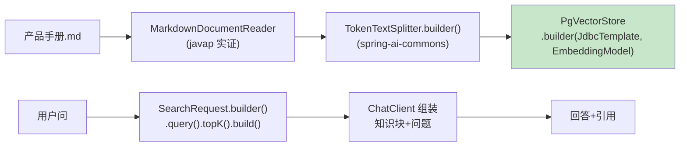

# 01-最小 Demo：单文档入库 → 检索 → 有据回答

> **定位**：最小闭环：一份 Markdown 文档 →（解析→分块→向量入库）→ 相似检索 → 带引用回答。用**真实 Spring AI 2.0 API**（全部 javap 实证）。读者画像：动手起步的开发者。前置阅读：[00-需求分析与架构设计](00-需求分析与架构设计.md)、[教程 05-RAG检索增强生成]。
>
> **铁律 0**：`MarkdownDocumentReader`（`org.springframework.ai.reader.markdown`，构造 `(String)`/`(Resource, Config)`、读取 `get()`）、`TokenTextSplitter.builder()`（spring-ai-commons）、`PgVectorStore.builder(JdbcTemplate, EmbeddingModel)`、`SearchRequest.builder()` 均实证。

---

## 一、四问

| 问 | 答 |
|----|----|
| **新增了什么需求** | 单文档最小知识闭环（含引用标注） |
| **影响了哪些模块** | 新单体 `knowledge-hub` |
| **架构如何演进** | 无 → 最小入库+检索 |
| **上一版痛点** | 无 |

**本迭代验收**：① 文档入库可检索 ② 回答带来源引用（文档名+块序） ③ 全链真实 API 零虚构。

## 二、最小链路



## 三、核心代码（全真实 API）

```java
package com.example.knowledgehub;

import org.springframework.ai.document.Document;
import org.springframework.ai.reader.markdown.MarkdownDocumentReader;
import org.springframework.ai.transformer.splitter.TokenTextSplitter;
import org.springframework.ai.vectorstore.VectorStore;
import org.springframework.ai.vectorstore.SearchRequest;
import org.springframework.stereotype.Service;
import java.util.List;

/** 最小知识闭环——入库与检索（全 javap 实证 API）。 */
@Service
public class KnowledgeService {

    private final VectorStore vectorStore;

    public KnowledgeService(VectorStore vectorStore) {
        this.vectorStore = vectorStore;   // PgVectorStore.builder(template, embeddingModel).build()
    }

    /** 入库：Markdown → 读取(get()) → 分块 → 向量存储。 */
    public int ingest(String docPath, String docName) {
        List<Document> docs = new MarkdownDocumentReader(docPath).get();   // 实证：Supplier 语义用 get()
        docs.forEach(d -> d.getMetadata().putIfAbsent("source", docName));  // 溯源元数据（血缘雏形）
        List<Document> chunks = TokenTextSplitter.builder()
                .withChunkSize(800).withMinChunkSizeChars(100)
                .withMinChunkLengthToEmbed(5).withKeepSeparator(true)
                .build().apply(docs);                                     // 实证：splitter.apply(List<Document>)
        vectorStore.add(chunks);                                          // 实证
        return chunks.size();
    }

    /** 检索：混合前的最小版——向量 TopK。 */
    public List<Document> search(String query, int topK) {
        return vectorStore.similaritySearch(
                SearchRequest.builder().query(query).topK(topK).build());  // 实证：builder 式
    }
}
```

```java
// 问答组装（骨架）：检索块带序号进上下文，要求回答标注 [n]
// String context = blocks.stream()
//         .map(b -> "[" + (i+1) + "] " + b.getText() + "（源：" + b.getMetadata().get("source") + "）")
//         .collect(joining("\n"));
// chatClient.prompt().system("仅依据以下资料回答并标注[n]引用：\n" + context).user(q)...
```

## 四、测试与验证

```bash
# 1. 入库：ingest 返回块数>0；pgvector 表有行
# 2. 检索：手册内问题 → search 命中相关块
# 3. 引用：回答含 [n] 且 n 对应真实块（抽检溯源）
```

## 五、本迭代痛点

① 只支持单文档手工入库 ② 无口径/术语（两个同义问法检索不一致）③ 无时效（旧版手册照答）→ 02-05。

## 六、验收对照

| 验收项 | 标准 | 状态 |
|--------|------|------|
| 入库检索 | 闭环可用 | ✅ |
| 引用溯源 | [n]+源可核 | ✅ |
| API 真实 | 全实证 | ✅ |

**下一篇**：[02-迭代一-多源接入与Connector框架](02-迭代一-多源接入与Connector框架.md)。
