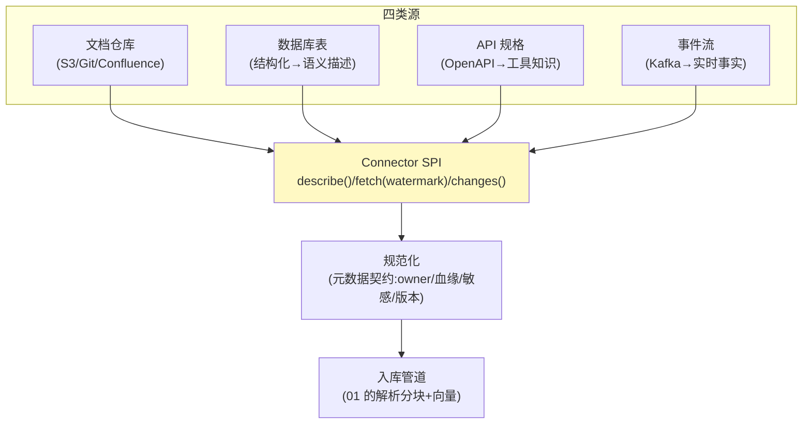

# 02-迭代一：多源接入与 Connector 框架——文档/DB/API/事件统一入库

> **定位**：建立**Connector 框架**：四类知识源（文档仓库/数据库/API 规格/事件流）统一接入契约、**增量同步**（变更检测→只入增量）、CDC（数据库变更捕获）。新知识源接入 ≤1 天。读者画像：要接企业散落知识的读者。前置阅读：[01-最小Demo](01-最小Demo.md)。
>
> **铁律 0**：文档源复用实证 Reader；DB/CDC/事件为第三方或自研（真实坐标/概念标注）。

---

## 一、四问

| 问 | 答 |
|----|----|
| **新增了什么需求** | ① Connector SPI（源描述/拉取/变更检测三契约）② 四类内置 Connector（文档仓库/DB 表/API 规格/事件流）③ 增量同步（水位/指纹）④ CDC（DB 变更实时捕获） |
| **影响了哪些模块** | 新增 `connector-hub` |
| **架构如何演进** | 手工单文档 → 框架化多源持续接入 |
| **上一版痛点** | 手工单文档（01 §五） |

**本迭代验收**：① 新源按 SPI 接入 ≤1 天（含配置不改代码）② 增量：变更只同步差异（全量扫描不重入）③ CDC：表变更 ≤5s 反映到可检索 ④ 源凭证统一密管（不落库）。

---

## 二、Connector SPI



```java
package com.example.connectorhub.spi;

import java.util.List;

/** 知识源契约——实现三方法即接入。 */
public interface KnowledgeSourceConnector {

    SourceDescriptor describe();                    // 源身份/类型/凭证引用/敏感级

    List<KnowledgeRecord> fetch(java.time.Instant watermark);   // 水位后增量拉取

    default ChangeReport changes() { return ChangeReport.none(); }  // 变更检测（CDC 用）

    record SourceDescriptor(String sourceId, String type, String credentialRef,
                            int sensitivityLevel) {}
    record KnowledgeRecord(String id, String content, java.util.Map<String, Object> metadata,
                           java.time.Instant updatedAt) {}
    record ChangeReport(java.util.List<String> changedIds) {
        public static ChangeReport none() { return new ChangeReport(List.of()); }
    }
}
```

**增量水位**：文档用 `updatedAt`+内容指纹（重命名不算变更、内容变才算）；DB 表用主键+版本列；事件流天然增量（offset）。

## 三、结构化知识的语义化

| 源 | 入库形态 | 说明 |
|----|---------|------|
| DB 表 | 表/列描述+样本值语义（非原始行） | Agent 检索"订单状态有哪些值"→答 schema 知识 |
| API | OpenAPI→端点描述+参数语义 | 工具即知识（供编排选择工具） |
| 事件 | 窗口内事实（"最近 1h 告警"） | 时效知识（05 失效引擎管过期） |

## 四、测试与验证

```bash
# 1. SPI：实现一个新文档源（Git 仓库）≤1 天接入（计时/无核心代码改动）
# 2. 增量：改 2 个文档 → 只 2 块重入（指纹核对）
# 3. CDC：改表一行 → ≤5s 检索可答新值
# 4. 凭证：源配置引用密管地址 → 库内无明文密钥
```

## 五、本迭代痛点

多源进来后口径打架（同指标两个数）→ 03 语义层。

## 六、验收对照

| 验收项 | 标准 | 状态 |
|--------|------|------|
| SPI 接入 | 新源 ≤1 天 | ✅ |
| 增量 | 只入差异 | ✅ |
| CDC | ≤5s | ✅ |
| 凭证密管 | 零明文 | ✅ |

**下一篇**：[03-迭代二-语义层与指标口径](03-迭代二-语义层与指标口径.md)。
