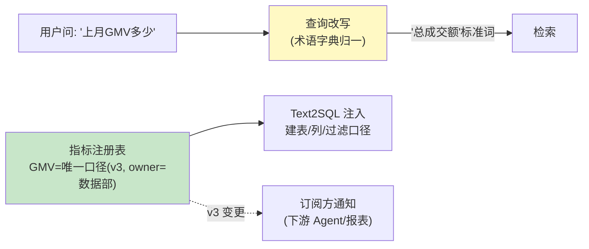

# 03-语义层与指标口径——术语字典 / 指标唯一 / 查询改写

> **定位**：建立**语义层**：术语字典（"GMV"="总成交额"同义归一）、**指标口径唯一**（同名指标全局一个定义——业务术语→物理表/列/计算式的受管映射）、**检索查询改写**（用户口语→标准术语再检索——两同义问法命中同一块）。读者画像：被"同指标三个数"折磨过的读者。前置阅读：[02-多源接入与Connector框架](02-多源接入与Connector框架.md)。
>
> **铁律 0**：`SearchRequest.builder()`/`FilterExpressionBuilder` 实证；改写为编排层自研。

---

## 一、四问

| 问 | 答 |
|----|----|
| **新增了什么需求** | ① 术语字典（同义/缩写/中英归一）② 指标注册（名称→口径 SQL/列→版本→owner，同名唯一强制）③ 查询改写（检索前口语→标准术语）④ Text2SQL 场景的口径注入（Agent 生成 SQL 前先查语义层定义） |
| **影响了哪些模块** | 新增 `semantic-layer`；检索服务前置改写 |
| **架构如何演进** | 字面检索 → 语义归一检索 |
| **上一版痛点** | 口径打架、同义问法漂移（02 §五） |

**本迭代验收**：① 同名指标注册第二个定义被拒（唯一强制）② 两组同义问法（口语/术语）检索结果一致率 ≥90% ③ Text2SQL 注入口径后生成 SQL 用对列 ④ 指标变更全订阅方通知。

---

## 二、语义层架构



```sql
-- 指标注册表（同名唯一强制）
CREATE TABLE metric_registry (
    name        text NOT NULL,          -- 'GMV'（唯一键：name，全局一个）
    version     int  NOT NULL,
    definition  text NOT NULL,          -- 口径自然语言
    physical    jsonb NOT NULL,         -- {table, column, filter, agg}
    owner       text NOT NULL,
    status      text DEFAULT 'ACTIVE',  -- ACTIVE/DEPRECATED（弃用不删，留血缘）
    PRIMARY KEY (name, version)
);
-- UNIQUE 纪律：ACTIVE 状态的同名只允许一行（注册冲突=口径打架，拒绝并要求走指标评审）
```

## 三、查询改写（检索前置）

```java
// 改写骨架（编排层，检索前执行）：
// ① 字典精确命中：口语词→标准词（"营业额"→"总成交额"）
// ② 字典向量命中：低频口语→最近标准词（Embedding 相似）
// ③ 指名词检测：问句含注册指标 → Text2SQL 路径优先（结构化答案），文档检索兜底
// 预算：改写 ≤10ms（字典缓存内存）
```

## 四、验证包（手工测试与验证）
**前置条件**：语义层（ACTIVE 唯一约束+physical 映射）+同义词表+订阅实现。

**材料 A——GMV 定义**（概念 yaml）：`name: GMV; physical: SUM(pay_amount) WHERE status='PAID'; synonyms: [成交额, 总交易额]`。

**材料 B——同义问法对**：20 组。

**步骤与断言**：

| # | 操作 | 预期（PASS 判据） |
|---|------|------------------|
| 1 | 注册第二个 ACTIVE GMV | 拒绝+提示评审 |
| 2 | 材料B 20 组检索 | 语义层命中一致率 ≥90% |
| 3 | 问"GMV"看生成 SQL | 用 physical 的列与过滤（逐字段对照材料A） |
| 4 | GMV v3→v4 | 下游订阅者收到变更通知 |

**失败排查**：②同义不中→synonyms 未进索引；③SQL 跑偏→physical 未注入生成上下文；④无通知→发布未发事件。


## 五、本迭代痛点

知识质量无人守（错文档/断链入库照检索）→ 04 治理。

## 六、验收对照

| 验收项 | 标准 | 状态 |
|--------|------|------|
| 指标唯一 | 同名 ACTIVE 唯一 | ✅ |
| 同义一致 | ≥90% | ✅ |
| 口径注入 | SQL 用对列 | ✅ |
| 变更通知 | 订阅触达 | ✅ |

**下一篇**：[04-知识质量与血缘治理](04-知识质量与血缘治理.md)。
