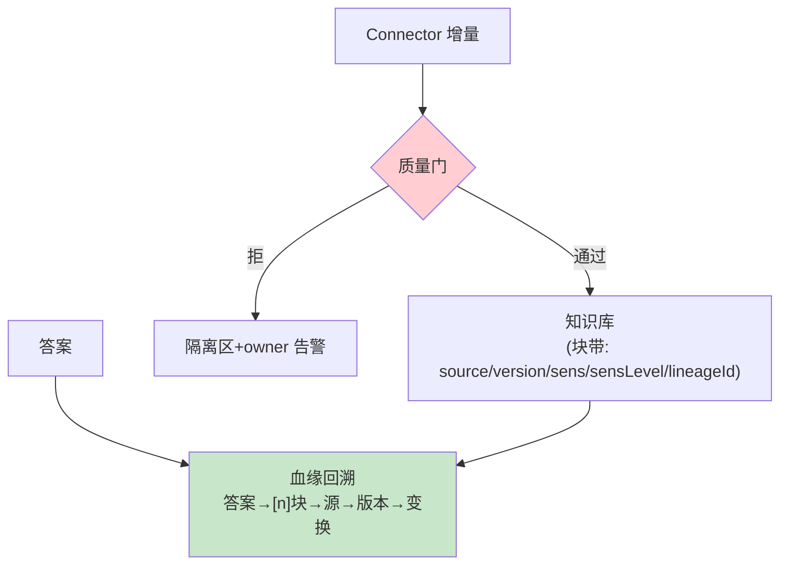

# 04-知识质量与血缘治理——质量规则 / 血缘链 / 敏感分级

> **定位**：建立**治理平面**：质量规则引擎（入库前校验——完整性/断链/矛盾检测）、**血缘**（块级：源→版本→变换→消费答案的全链，答案可回溯）、**敏感分级**（公开/内部/机密——检索时按调用方身份过滤）。读者画像：要"知识可信可审"的读者。前置阅读：[03-语义层与指标口径](03-语义层与指标口径.md)。
>
> **铁律 0**：`Filter.Expression` 检索过滤实证；治理自研。

---

## 一、四问

| 问 | 答 |
|----|----|
| **新增了什么需求** | ① 质量规则（入库门：空块率/断链/超期/矛盾对检测）② 块级血缘（答案→块→源→版本全链）③ 敏感分级（三级+按身份检索过滤）④ 质量看板（源健康分/规则违规率） |
| **影响了哪些模块** | 新增 `knowledge-gov`；入库管道加质量门；检索加敏感过滤 |
| **架构如何演进** | 有入必检、有答必溯、有级必滤 |
| **上一版痛点** | 质量无人守（03 §五） |

**本迭代验收**：① 断链/超期源入库被拦 ② 任一答案可一键回溯到源文件版本 ③ 机密块对无权调用方不可见 ④ 源健康分看板可用。

---

## 二、质量门与血缘



| 质量规则 | 判定 | 动作 |
|---------|------|------|
| 空块率 | 块>阈值比例过短 | 拦+告警 |
| 断链 | URL/引用源不可达 | 拦该源 |
| 超期 | 超 freshness 窗口（05 详述） | 降权/拦 |
| 矛盾对 | 新块与既有 ACTIVE 块语义相悖（向量近+数值冲突） | 进人工仲裁（不静默覆盖） |

## 三、敏感分级与检索过滤

```java
// 检索时按调用方身份过滤（javap 实证：SearchRequest.builder().filterExpression()）
// FilterExpressionBuilder b = new FilterExpressionBuilder();   // 实证：需 new，eq 非静态
// vectorStore.similaritySearch(SearchRequest.builder()
//         .query(q).topK(5)
//         .filterExpression(b.in("sensLevel",
//                 allowedLevelsFor(callerIdentity)).build())   // 身份→可见级集合
//         .build());
// 纪律：分级在元数据（入库时打），过滤在检索（不改块内容）——越权检索零命中而非零报错（防探测）
```

## 四、验证包（手工测试与验证）
**前置条件**：质量规则+血缘图谱+敏感分级可见性实现。

**材料 A——断链源**（mock 404）；**材料 B——矛盾数值**（两文档价格不一致）；**材料 C——机密块**（secret 级）。

**步骤与断言**：

| # | 操作 | 预期（PASS 判据） |
|---|------|------------------|
| 1 | 材料A 同步 | 拦截+owner 告警（0 死链块） |
| 2 | 材料B 入库 | 进仲裁队列（双源并列人工裁决） |
| 3 | 材料C：普通身份/授权身份各检索 | 普通 0 命中；授权可见 |
| 4 | 抽 10 个线上答案血缘回溯 | 到源文件+版本 10/10 全通 |
| 5 | 质量看板 | 健康分/违规率随注入变化 |

**失败排查**：③普通命中→过滤在检索后（应 pre-filter）；④回溯断→血缘边异步补建延迟；⑤看板不动→质量事件未接指标管道。


## 五、本迭代痛点

静态质量有了，但"事实变了旧知识还在"→ 05 时效与失效。

## 六、验收对照

| 验收项 | 标准 | 状态 |
|--------|------|------|
| 质量门 | 拦+告警+仲裁 | ✅ |
| 血缘 | 答案→源全链 | ✅ |
| 敏感过滤 | 越权 0 命中 | ✅ |
| 质量看板 | 健康分 | ✅ |

**下一篇**：[05-时效与失效引擎](05-时效与失效引擎.md)。
