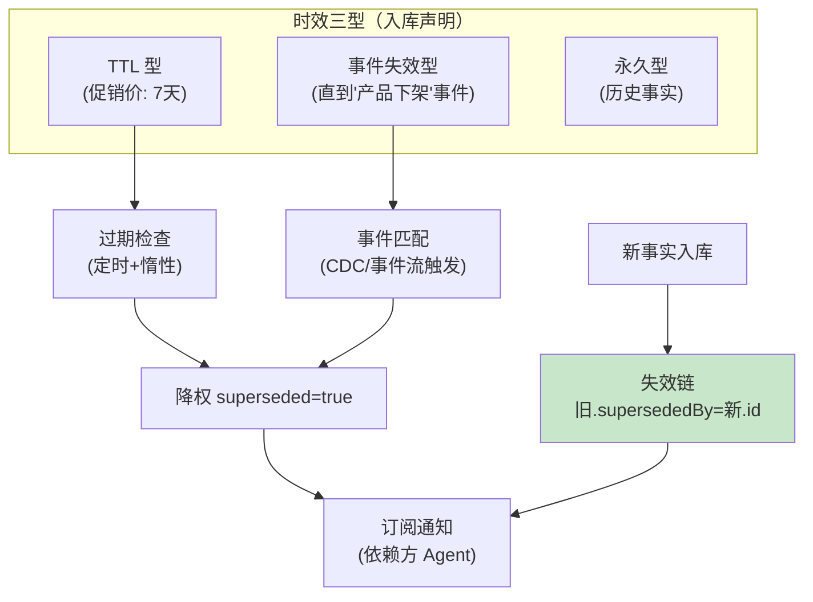

# 05-迭代四：时效与失效引擎——TTL / 失效链 / 订阅通知

> **定位**：让知识"**会过期**"：每块知识带**时效契约**（TTL 窗口/事件驱动失效/永久），**失效链**（新事实入库→旧知识标记 supersededBy 而非删除——Agent 引用时知其被取代）、**订阅通知**（依赖某知识的下游 Agent 在失效时收到通知）。呼应 Google/PagerDuty 2026 共识"共享事实失效是 RAG 最大坑"。读者画像：被旧知识坑过的读者。前置阅读：[04-迭代三-知识质量与血缘治理](04-迭代三-知识质量与血缘治理.md)。
>
> **铁律 0**：失效为元数据/治理层自研。

---

## 一、四问

| 问 | 答 |
|----|----|
| **新增了什么需求** | ① 时效契约（块级：TTL/事件失效/永久三型，入库声明）② 失效链（supersededBy 指针——矛盾对仲裁（04）的顺延产物）③ 检索时效过滤（过期块降权/可选剔除）④ 订阅通知（失效→依赖方 Agent 告知） |
| **影响了哪些模块** | 新增 `freshness-engine`；检索加时效维度；目录订阅（07 前置雏形） |
| **架构如何演进** | 静态知识 → 会呼吸的知识（生老病死） |
| **上一版痛点** | 事实变了旧知识照答（04 §五） |

**本迭代验收**：① 过 TTL 块自动降权（检索可验证）② 事件触发失效 ≤1min 生效 ③ supersededBy 引用可循（Agent 回答可声明"已被 X 取代"）④ 失效通知到达依赖方。

---

## 二、时效模型



```java
// 检索时效处理（骨架）：
// ① 过滤：可选硬剔除（filterExpression 加 fresh 约束）或软降权（rerank 时 superseded×0.1）
// ② 引用声明：命中 supersededBy 非空的块 → 回答附注"该信息已被 [新版本] 取代，以新为准"
// ③ 惰性检查：检索时顺带校验 TTL（补定时漏网），发现过期即标记+通知
// 通知：{knowledgeId, reason: TTL_EXPIRED|EVENT|SUPERSEDED, subscribers} → 事件总线
```

## 三、测试与验证

```bash
# 1. TTL：入一块 7 天 TTL 知识 → 改时钟/等过期 → 检索降权可测
# 2. 事件：'产品下架'事件 → 关联知识 ≤1min 标记失效
# 3. 失效链：新价入库 → 旧价块 supersededBy 指向新块；答案含取代声明
# 4. 通知：依赖该知识的 Agent 订阅者收到失效事件
```

## 四、本迭代痛点

治理齐了但检索服务还是朴素向量 → 06 检索服务化（混合/重排/预算）。

## 五、验收对照

| 验收项 | 标准 | 状态 |
|--------|------|------|
| TTL | 自动降权 | ✅ |
| 事件失效 | ≤1min | ✅ |
| 失效链 | supersededBy 可循 | ✅ |
| 订阅通知 | 依赖方触达 | ✅ |

**下一篇**：[06-迭代五-检索服务化](06-迭代五-检索服务化.md)。
