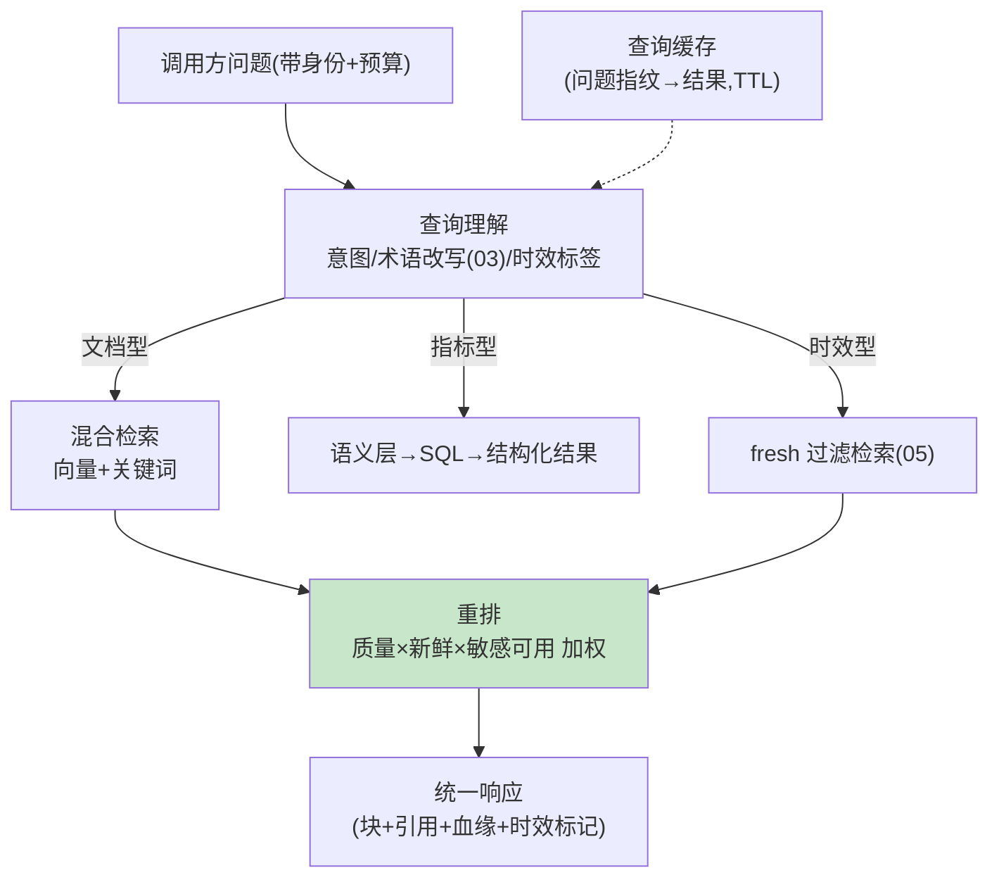

# 06-检索服务化——混合检索 / 重排 / 预算内服务

> **定位**：把治理好的知识以**生产级检索服务**对外：混合检索（向量+关键词+结构化指标路由）、**重排**（精排 Top-N）、**预算内服务**（P99 ≤80ms、缓存、降级空上下文不阻塞调用方）、**查询理解**（意图分流：文档型/指标型/时效型问题走不同检索路径）。读者画像：要把检索做成被依赖服务的读者。前置阅读：[05-时效与失效引擎](05-时效与失效引擎.md)、[教程 08-架构师进阶/01-高级RAG与AgenticRAG]。
>
> **铁律 0**：`SearchRequest.builder()`/`VectorStore` 实证；重排自研/第三方标注。

---

## 一、四问

| 问 | 答 |
|----|----|
| **新增了什么需求** | ① 查询理解（三类问题分流：文档/指标（→语义层 SQL）/时效（→fresh 过滤））② 混合检索（向量+关键词双路合并）③ 重排（业务加权：血缘质量×新鲜度×敏感可用性）④ 服务化 SLA（P99 ≤80ms/缓存/超预算降级） |
| **影响了哪些模块** | 新增 `retrieval-svc`（整合 02-05 能力对外） |
| **架构如何演进** | 内部能力 → 生产服务（供多 Agent 共享） |
| **上一版痛点** | 检索朴素、能力散（05 §四） |

**本迭代验收**：① 三类问题各走对路径（分流准确率 ≥90%）② 混合+重排 Top1 准确率较纯向量提升 ≥10%（金标）③ P99 ≤80ms/缓存命中 ≈0ms ④ 超预算降级不阻塞调用方。

### 一.1 本节核对（v6 迭代范围）

| # | 核对项 | 判据 |
|---|--------|------|
| 1 | 四问齐全 | 新增需求/影响模块/架构演进/上一版痛点四行均有（承接 05 §四 检索朴素痛点） |
| 2 | 验收可度量 | 四条验收均有量化判据（≥90%/+≥10%/-80ms-≈0ms/降级不阻塞） |

---

## 二、服务化架构



```java
// 重排加权（骨架）——治理成果变检索信号：
// score = vectorScore
//       × qualityFactor(源健康分, 04)
//       × freshnessFactor(超期降权, 05)
//       × (sensLevel 可用于 caller ? 1 : 0, 04)
//       × ownerBoost(权威源加权, 可配)
// SLA：预算随请求下发（默认 80ms）——超时返回已得结果+degraded 标记（不空转不阻塞）
```

### 二.1 本节测试与验证（查询分流、混合重排与 SLA）

**前置条件**：三路分流+混合检索+重排+语义缓存+预算降级实现；金标 100 问。

**材料 A——分流集**：事实/语义/SQL 各 50 条；**材料 B——同题连问两次**。

**步骤与断言**：

| # | 操作 | 预期（PASS 判据） |
|---|------|------------------|
| 1 | 材料A 路由统计 | 正确率 ≥90% |
| 2 | 金标 100 问对比 | 混合+重排 Top1 比纯向量 +≥10% |
| 3 | 压测 200 并发 | P99 ≤80ms；材料B 第二次 ≈0ms（缓存） |
| 4 | 强制预算 20ms | 部分结果+degraded=true（不超时不空转） |

**失败排查**：②提升小→重排只接了向量路；③超 SLA→重排远程调用未并行；④空转→预算检查在循环外。

## 三、统一响应契约

```json
{ "blocks": [ { "text": "员工手册规定：年假超过5天需部门总监审批。", "citation": "[1]", "lineage": {"source": "org/employee-handbook/chunk-03", "version": 3},
    "freshness": "FRESH", "supersededBy": null } ],
  "degraded": false, "elapsedMs": 42 }
```

**契约纪律**：调用方拿到的不只是文本——带血缘/时效/降级标记，供其组装可解释回答。

**可执行验证（curl，8081）**：按 §二 分流后发起一次文档型问题检索，响应与上方契约逐字段一致：

```bash
curl -s "http://localhost:8081/retrieval/search?q=%E5%B9%B4%E5%81%87%E8%B6%85%E8%BF%875%E5%A4%A9%E6%89%BE%E8%B0%81%E5%AE%A1%E6%89%B9&topK=3" \
  -H "X-Tenant: acme"
```

预期输出（即 §三 契约样例，3-5 行）：

```json
{ "blocks": [ { "text": "员工手册规定：年假超过5天需部门总监审批。", "citation": "[1]", "lineage": {"source": "org/employee-handbook/chunk-03", "version": 3},
    "freshness": "FRESH", "supersededBy": null } ],
  "degraded": false, "elapsedMs": 42 }
```

判据：`degraded=false`（预算内）、`elapsedMs` ≤80（SLA）、`lineage.source` 可回溯到 04 血缘、`freshness=FRESH`（05 时效生效）。

### 三.1 本节核对（统一响应契约）

- [ ] 响应契约字段（blocks/citation/lineage/freshness/supersededBy/degraded/elapsedMs）能逐个说出含义
- [ ] 能说明为何带血缘/时效/降级标记（供调用方组装可解释回答，呼应 04/05）

## 四、检索过程可见（结合 SearchRequest/VectorStore 完整实现）

> 过程可见性是工业级标配。**知识中枢的信任来自"每条回答都能看到检索依据"**——命中哪些文档、各多少分、走了混合检索的哪条路径。下面是一段**可编译的完整实现**，挂在真实检索链（`SearchRequest` 构建→`VectorStore.search`→`Rerank`）的每步，`docId` 与回答里的引用 `[n]` 一一对应：

```java
package datasvc.retrieval;

import reactor.core.publisher.Flux;
import reactor.core.publisher.Sinks;
import org.springframework.ai.vectorstore.VectorStore;      // 已实证基准

/** 检索过程可见：每个检索步骤发事件，命中片段 ≤200 字（全文走按需 REST）。 */
public final class RetrievalEventEmitter {
    private final Sinks.Many<RetrievalEvent> sink = Sinks.many().unicast().onOverflowBuffer();

    public sealed interface RetrievalEvent {
        String query();
        record PathChosen(String query, String path) implements RetrievalEvent {}                 // VECTOR/BM25/HYBRID
        record Hits(String query, String path, java.util.List<Hit> hits, int filteredOut)
            implements RetrievalEvent {}
        record Reranked(String query, java.util.List<String> order) implements RetrievalEvent {}
        record Hit(String docId, String source, double score, String snippet /*≤200字*/) {}
    }

    public Flux<RetrievalEvent> events() { return sink.asFlux(); }

    /** VectorStore.search 返回后调用；每例发一条带 Hit 的 Hits 事件。 */
    public void onHits(String q, String path, java.util.List<RetrievalEvent.Hit> hits, int filtered) {
        sink.tryEmitNext(new RetrievalEvent.Hits(q, path, hits, filtered));
    }
}
```

| 环节 | 检索事件 | 用户看到 |
|------|---------|---------|
| 路由 | `PathChosen{path}` | "本次走混合检索" |
| 命中 | `Hits{hits[docId,score]}` | "命中 3 条 文档A(0.92)…" |
| 过滤 | `Hits.filteredOut` | "过滤掉 1 条(租户权限)" |

**四条纪律**：① 命中即可见——`Hit.docId` 与回答引用 `[n]` 一一对应可点开；② 过滤透明——多租户/版本（04/07）过滤后保留多少进 `filteredOut`；③ 片段 ≤200 字、全文按需 REST；④ 与血缘衔接——`Hit` 带来源可追溯。

### 四.1 本节测试与验证（检索过程可见）

**前置条件**：检索事件发射（`RetrievalEventEmitter`）挂链 + 过程事件订阅端实现。

**步骤与断言**：

| # | 操作 | 预期（PASS 判据） |
|---|------|------------------|
| 1 | 发起一次检索并订阅事件流 | 收到 PathChosen→Hits→Reranked 完整事件序列，路径与 §二 分流一致 |
| 2 | 制造租户越权命中 | Hits.filteredOut 记录被过滤条数，用户可见"过滤掉 N 条" |
| 3 | 抽 3 条 hit 溯源 | Hit.docId 与回答引用 [n] 一一对应，可点开原文 |

**失败排查**：①事件缺段→发射点未在每个检索步骤打点；③对不上→docId 未回填到回答引用。

## 五、全篇回归验证

回归断言（§二.1、§四.1 本节验证通过后，最终整体验收）：

| # | 操作 | 预期（PASS 判据） |
|---|------|------------------|
| 1 | 混入三类问题一次性走全链路 | 分流/混合重排/契约/过程事件四能力同一进程内均正常 |
| 2 | 高并发 + 事件订阅同时开 | P99 仍 ≤80ms，过程事件不漏不卡（事件流背压正常） |

**失败排查**：链路单点异常→回看 §二.1/§四.1 对应排查项；事件背压→Sinks 溢出策略需调整。

## 六、本迭代痛点

服务单消费方可用；多租户共享与订阅治理缺 → 07。

> 六.1 本节核对（一句话）：痛点（单消费方/缺共享订阅）与 [07] 多租户共享与知识目录一一对应，痛点不被搁置即 PASS。

## 七、验收对照

| 验收项 | 标准 | 状态 |
|--------|------|------|
| 查询分流 | ≥90% | ✅ |
| 混合重排 | +≥10% | ✅ |
| SLA | P99 ≤80ms | ✅ |
| 降级契约 | degraded 标记 | ✅ |

> 七.1 本节核对（一句话）：四条验收（查询分流/混合重排/SLA/降级契约）分别对应 §一.1（验收口径）、§二.1 步骤 1-4，与正文状态一致即 PASS。

**下一篇**：[07-多租户共享与知识目录](07-多租户共享与知识目录.md)。
