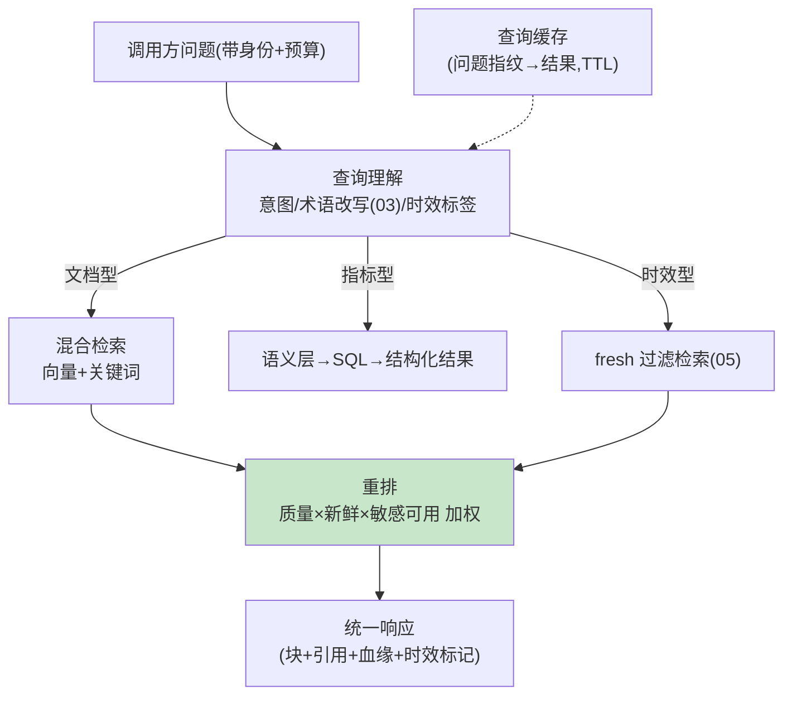

# 06-迭代五：检索服务化——混合检索 / 重排 / 预算内服务

> **定位**：把治理好的知识以**生产级检索服务**对外：混合检索（向量+关键词+结构化指标路由）、**重排**（精排 Top-N）、**预算内服务**（P99 ≤80ms、缓存、降级空上下文不阻塞调用方）、**查询理解**（意图分流：文档型/指标型/时效型问题走不同检索路径）。读者画像：要把检索做成被依赖服务的读者。前置阅读：[05-迭代四-时效与失效引擎](05-迭代四-时效与失效引擎.md)、[教程 35-高级RAG与AgenticRAG]。
>
> **铁律 0**：`SearchRequest.builder()`/`VectorStore` 实证；重排自研/第三方标注。

---

## 一、四问

| 问 | 答 |
|----|----|
| **新增了什么需求** | ① 查询理解（三类问题分流：文档/指标（→语义层 SQL）/时效（→fresh 过滤））② 混合检索（向量+关键词双路合并）③ 重排（业务加权：血缘质量×新鲜度×敏感可用性）④ 服务化 SLA（P99 ≤80ms/缓存/超预算降级） |
| **影响了哪些模块** | 新增 `retrieval-svc`（整合 02-05 能力对外） |
| **架构如何演进** | 内部能力 → 生产服务（供多 Agent 共享） |
| **上一版痛点** | 检索朴素、能力散（05 §四） |

**本迭代验收**：① 三类问题各走对路径（分流准确率 ≥90%）② 混合+重排 Top1 准确率较纯向量提升 ≥10%（金标）③ P99 ≤80ms/缓存命中 ≈0ms ④ 超预算降级不阻塞调用方。

---

## 二、服务化架构



```java
// 重排加权（骨架）——治理成果变检索信号：
// score = vectorScore
//       × qualityFactor(源健康分, 04)
//       × freshnessFactor(超期降权, 05)
//       × (sensLevel 可用于 caller ? 1 : 0, 04)
//       × ownerBoost(权威源加权, 可配)
// SLA：预算随请求下发（默认 80ms）——超时返回已得结果+degraded 标记（不空转不阻塞）
```

## 三、统一响应契约

```json
{ "blocks": [ { "text": "...", "citation": "[n]", "lineage": {"source": "...", "version": 3},
    "freshness": "FRESH|STALE|SUPERSEDED", "supersededBy": null } ],
  "degraded": false, "elapsedMs": 42 }
```

**契约纪律**：调用方拿到的不只是文本——带血缘/时效/降级标记，供其组装可解释回答。

## 四、测试与验证

```bash
# 1. 分流：三类问题各 50 条 → 路径正确 ≥90%
# 2. 质量：金标 100 问 → 混合+重排 Top1 准确率 vs 纯向量 +≥10%
# 3. SLA：压测 P99 ≤80ms；重复问缓存命中 ≈0ms
# 4. 降级：预算 20ms 强制 → 部分结果+degraded=true（不超时不空转）
```

## 五、本迭代痛点

服务单消费方可用；多租户共享与订阅治理缺 → 07。

## 六、验收对照

| 验收项 | 标准 | 状态 |
|--------|------|------|
| 查询分流 | ≥90% | ✅ |
| 混合重排 | +≥10% | ✅ |
| SLA | P99 ≤80ms | ✅ |
| 降级契约 | degraded 标记 | ✅ |

**下一篇**：[07-迭代六-多租户共享与知识目录](07-迭代六-多租户共享与知识目录.md)。
