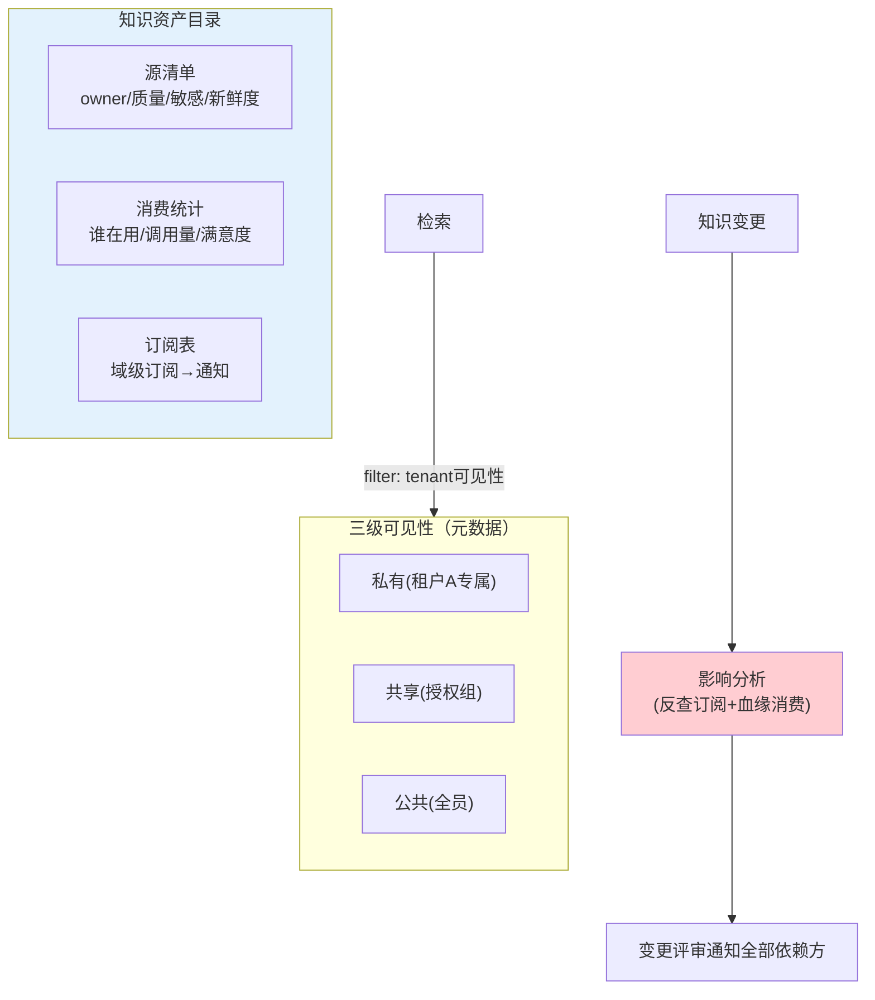

# 07-迭代六：多租户共享与知识目录——资产目录 / 订阅 / 影响分析

> **定位**：收官治理：**知识资产目录**（全企业知识可发现——源/owner/质量/敏感/消费统计）、**租户共享**（私有/共享/公共知识三级可见性——多 Agent/多部门共享一套中枢）、**订阅与影响分析**（谁依赖什么知识；知识变更前评估影响面——"改这个口径会坏哪些 Agent"）。读者画像：知识资产要规模化运营的读者。前置阅读：[06-迭代五-检索服务化](06-迭代五-检索服务化.md)、[教程 26-多租户隔离与资源治理]。
>
> **铁律 0**：租户过滤复用 `Filter.Expression` 实证模式；目录/订阅自研。

---

## 一、四问

| 问 | 答 |
|----|----|
| **新增了什么需求** | ① 资产目录（可发现：源/owner/质量分/敏感级/消费量/新鲜度）② 三级可见性（私有=单租户/共享=授权组/公共=全员）③ 订阅模型（Agent/人订阅知识域——变更/失效通知，05 的消费端成型）④ 影响分析（变更前反查依赖方） |
| **影响了哪些模块** | 新增 `knowledge-catalog`；检索加租户可见性过滤 |
| **架构如何演进** | 单消费 → 资产化运营（目录+订阅+影响面） |
| **上一版痛点** | 服务单消费方、变更不知影响谁（06 §五） |

**本迭代验收**：① 私有知识跨租户检索 0 命中 ② 订阅方在知识变更/失效收通知 ③ 影响分析：改指标前列出全部依赖 Agent ④ 目录按质量/消费可排序运营。

---

## 二、可见性与目录



```java
// 影响分析（变更前必走）：
// 输入：拟变更的源/指标 ID
// 反查：血缘消费表（哪些答案引用过）+ 订阅表（哪些 Agent 订阅域）+ 下游报表
// 输出：影响面报告 → 变更评审（高危变更需依赖方会签——呼应平台 LegalHold 式"变更不伤依赖"纪律）
```

## 三、验证包（手工测试与验证）
**前置条件**：三级可见性+共享组+订阅+影响分析会签+目录视图实现。

**材料 A——权限矩阵**（私有/共享组/公开块）；**材料 B——GMV 口径变更单**。

**步骤与断言**：

| # | 操作 | 预期（PASS 判据） |
|---|------|------------------|
| 1 | 租户B 检索私有块 | 0 命中；共享组（在组内）命中 |
| 2 | 域知识失效事件 | 组内全部订阅 Agent 收到 |
| 3 | 材料B → 影响分析 | 列出全部依赖 Agent+报表；会签流程可走完 |
| 4 | 目录视图 | 质量分/消费量排序可用 |

**失败排查**：①私有命中→过滤 post-filter；③清单不全→血缘未含语义层依赖；④空→消费埋点缺失。


## 四、本迭代痛点

六迭代齐备但代码散 → 11 核心代码讲解统一复盘。

## 五、验收对照

| 验收项 | 标准 | 状态 |
|--------|------|------|
| 三级可见性 | 越权 0 命中 | ✅ |
| 订阅通知 | 变更/失效触达 | ✅ |
| 影响分析 | 依赖面全列 | ✅ |
| 目录运营 | 排序视图 | ✅ |

**下一篇**：[11-核心代码讲解](11-核心代码讲解.md)。
