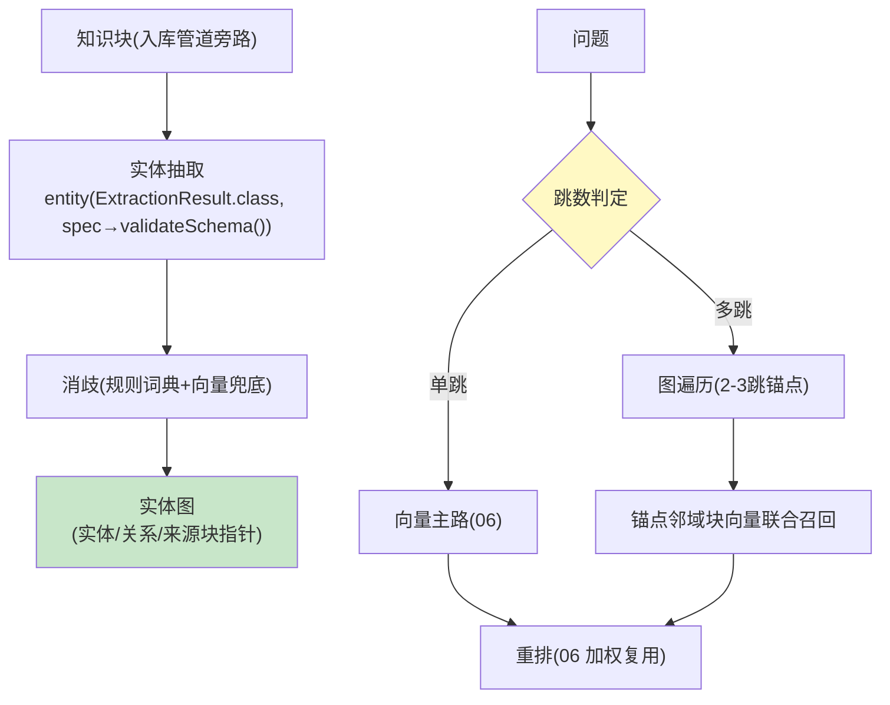

# 08-GraphRAG 与多跳推理——实体图 / 图向量混合

> **定位**：进阶检索能力：**知识图谱层**（文档实体抽取→图——复用 18 前置的 LLM 抽取；实体/关系入库 Neo4j 或轻量邻接表）、**图向量混合路由**（单跳问题走向量、多跳问题走图遍历+向量联合）、**增量图更新**（文档变更→局部子图重建，02 的图谱版）。读者画像：被"多跳问题检索不准"困扰的读者。前置阅读：[07-多租户共享与知识目录](07-多租户共享与知识目录.md)、[附录 10-知识图谱工程]。
>
> **铁律 0**：实体抽取用 `entity(Class, spec→validateSchema)`（实证）；图存储 Neo4j 第三方（真实坐标）/轻量邻接表自研二选一。

---

## 一、四问

| 问 | 答 |
|----|----|
| **新增了什么需求** | ① 实体图构建（抽取→消歧→MERGE 幂等入图）② 查询路由（单跳/多跳判定）③ 图向量联合检索（图遍历锚点→邻域块向量召回）④ 增量图更新（变更→局部重建，引用计数防孤儿） |
| **影响了哪些模块** | 新增 `graph-layer`；检索服务（06）加路由 |
| **架构如何演进** | 平面检索 → 图增强检索（多跳问题的正解） |
| **上一版痛点** | "A 的供应商的竞品是谁"这类两跳问题向量检索命中率低（07 §四遗留） |

**本迭代验收**：① 多跳金标（50 问）图增强 vs 纯向量准确率 +≥15% ② 单跳不受损（回归 ≤-2% 容差）③ 文档变更→图局部重建 ≤2min ④ 抽取成本受控（增量只抽变更块）。

### 一.1 本节核对（v8 迭代范围）

| # | 核对项 | 判据 |
|---|--------|------|
| 1 | 四问齐全 | 新增需求/影响模块/架构演进/上一版痛点四行均有（承接 07 §四 两跳检索不准痛点） |
| 2 | 验收可度量 | 四条验收均有量化判据（+≥15%/-2% 容差/≤2min/只抽增量） |

---

## 二、图增强架构



```java
// 抽取（真实 API 骨架）：
// ExtractionResult r = chatClient.prompt()
//         .system("抽取实体与关系，只允许类型: Person/Org/Product/Event")
//         .user(chunkText)
//         .call().entity(ExtractionResult.class,
//                 spec -> spec.useProviderStructuredOutput().validateSchema());  // javap 实证
// 增量纪律：块变更→仅该块实体重抽；块删除→引用计数-1，归零才删实体（防孤儿/防误删共享实体）
```

### 二.1 本节测试与验证（图增强检索与增量重建）

**前置条件**：实体抽取+图存储+图增强检索+增量重建实现；多跳金标 50 问。

**材料 A——多跳金标**（两跳/三跳各 25）；**材料 B——单跳回归集** 100 问。

**步骤与断言**：

| # | 操作 | 预期（PASS 判据） |
|---|------|------------------|
| 1 | 材料A 对比 | 图增强 vs 纯向量 +≥15% |
| 2 | 材料B 回归 | 单跳波动 ≥-2% 容差内 |
| 3 | 改 1 文档 | 图局部重建 ≤2min；共享实体未被误删 |
| 4 | 成本核对 | 抽取调用数 == 变更块数 |

**失败排查**：①提升小→图结果未融合进最终上下文；③共享实体被删→删除按文档未按引用计数；④全量重抽→指纹未传给图构建器。

## 三、全篇回归验证

回归断言（§二.1 本节验证通过后，最终整体验收）：

| # | 操作 | 预期（PASS 判据） |
|---|------|------------------|
| 1 | 多跳+单跳混在一起跑一遍金标 | 多跳 +≥15% 且 单跳 落在 -2% 容差内，无此消彼长 |
| 2 | 连续两次增量重建再核对 | 图与索引一致（无残留孤儿边），抽取次数仍等于变更块数 |

**失败排查**：此消彼长→路由对单/多跳误判（回看 §二.1 ①②）；残留边→删除引用计数未归零清理。

## 四、本迭代痛点

知识变更直接影响下游答案，但"变更后是否变差"无回归 → 09 变更金标回归。

> 四.1 本节核对（一句话）：痛点（变更是否变差无度量）与 [09] 变更金标回归一一对应，痛点不被搁置即 PASS。

## 五、验收对照

| 验收项 | 标准 | 状态 |
|--------|------|------|
| 多跳提升 | +≥15% | ✅ |
| 单跳无损 | ≥-2% | ✅ |
| 增量重建 | ≤2min | ✅ |
| 抽取成本 | 只抽增量 | ✅ |

> 五.1 本节核对（一句话）：四条验收（多跳提升/单跳无损/增量重建/抽取成本）分别对应 §一.1（验收口径）、§二.1 步骤 1-4，与正文状态一致即 PASS。

**下一篇**：[09-知识变更回归与飞轮](09-知识变更回归与飞轮.md)。
