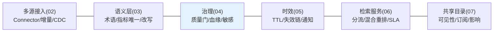
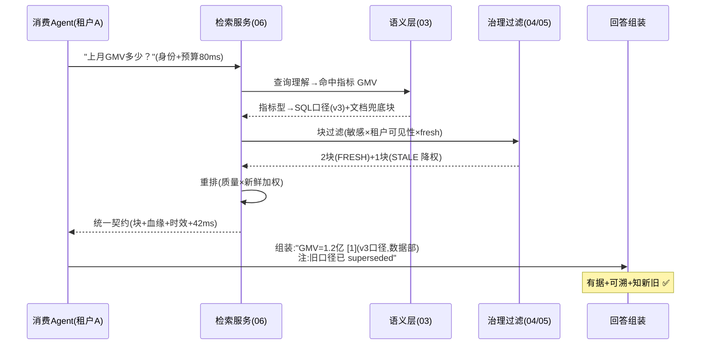

# 08-核心代码讲解：一次企业问答的知识旅程

> **定位**：复盘中枢关键实现，并以**一次"上月 GMV 多少"的问答旅程**串起六迭代。前置阅读：[02-迭代一-多源接入与Connector框架](02-迭代一-多源接入与Connector框架.md) 至 [07-迭代六-多租户共享与知识目录](07-迭代六-多租户共享与知识目录.md)。
>
> **铁律 0**：与各迭代实证一致。

---

## 一、机制速查

## 二、完整旅程（一次有据回答）

**一句话**：一句口语问题经过 术语归一→口径唯一→敏感/租户/时效三滤→质量重排→带血缘与取代链返回——六迭代在一条路径各就各位。

## 三、关键设计复盘

| # | 设计 | 为什么 |
|---|------|--------|
| 1 | 知识=带契约的资产（无契约不入库） | 治理前置，事后治理不可能 |
| 2 | 指标同名 ACTIVE 唯一 | 口径打架是数据域第一大坑 |
| 3 | supersededBy 而非删除 | 历史可溯+Agent 可声明新旧 |
| 4 | 治理结果变检索信号（质量/新鲜加权） | 治理不只拦，还排序 |
| 5 | 响应带血缘/时效/降级契约 | 可解释性由服务面下发 |
| 6 | 变更前影响分析+会签 | 不伤依赖的变更纪律 |

## 四、测试与验证

按 §二旅程逐跳断言（各迭代已有用例）；金标回归（100 问全链质量）。

**下一篇**：[09-ADR架构决策记录](09-ADR架构决策记录.md)。
