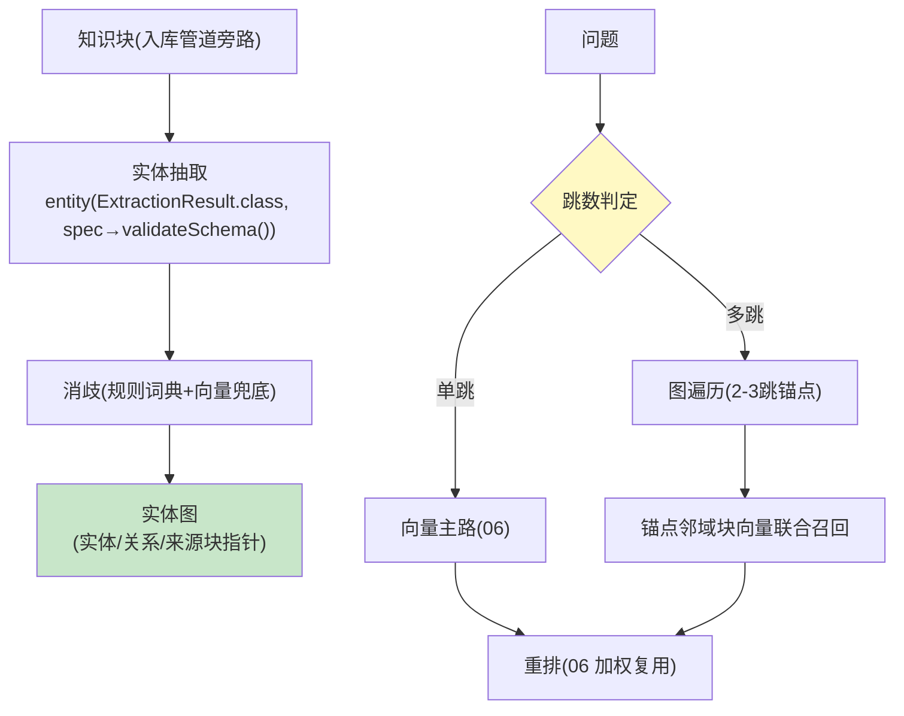

# 08-迭代七：GraphRAG 与多跳推理——实体图 / 图向量混合

> **定位**：进阶检索能力：**知识图谱层**（文档实体抽取→图——复用 18 前置的 LLM 抽取；实体/关系入库 Neo4j 或轻量邻接表）、**图向量混合路由**（单跳问题走向量、多跳问题走图遍历+向量联合）、**增量图更新**（文档变更→局部子图重建，02 的图谱版）。读者画像：被"多跳问题检索不准"困扰的读者。前置阅读：[07-迭代六-多租户共享与知识目录](07-迭代六-多租户共享与知识目录.md)、[附录 11-知识图谱工程]。
>
> **铁律 0**：实体抽取用 `entity(Class, spec→validateSchema)`（实证）；图存储 Neo4j 第三方（真实坐标）/轻量邻接表自研二选一。

---

## 一、四问

| 问 | 答 |
|----|----|
| **新增了什么需求** | ① 实体图构建（抽取→消歧→MERGE 幂等入图）② 查询路由（单跳/多跳判定）③ 图向量联合检索（图遍历锚点→邻域块向量召回）④ 增量图更新（变更→局部重建，引用计数防孤儿） |
| **影响了哪些模块** | 新增 `graph-layer`；检索服务（06）加路由 |
| **架构如何演进** | 平面检索 → 图增强检索（多跳问题的正解） |
| **上一版痛点** | "A 的供应商的竞品是谁"这类两跳问题向量检索命中率低（07 §四遗留） |

**本迭代验收**：① 多跳金标（50 问）图增强 vs 纯向量准确率 +≥15% ② 单跳不受损（回归 ≤-2% 容差）③ 文档变更→图局部重建 ≤2min ④ 抽取成本受控（增量只抽变更块）。

---

## 二、图增强架构



```java
// 抽取（真实 API 骨架）：
// ExtractionResult r = chatClient.prompt()
//         .system("抽取实体与关系，只允许类型: Person/Org/Product/Event")
//         .user(chunkText)
//         .call().entity(ExtractionResult.class,
//                 spec -> spec.useProviderStructuredOutput().validateSchema());  // javap 实证
// 增量纪律：块变更→仅该块实体重抽；块删除→引用计数-1，归零才删实体（防孤儿/防误删共享实体）
```

## 三、测试与验证

```bash
# 1. 多跳金标 50 问（两跳/三跳）→ 图增强 vs 纯向量 +≥15%
# 2. 单跳回归 100 问 → 波动 ≥-2% 容差内
# 3. 增量：改 1 文档 → 图局部重建 ≤2min；共享实体未被误删
# 4. 成本：增量只抽变更块（抽取调用数=变更块数）
```

## 四、本迭代痛点

知识变更直接影响下游答案，但"变更后是否变差"无回归 → 09 变更金标回归。

## 五、验收对照

| 验收项 | 标准 | 状态 |
|--------|------|------|
| 多跳提升 | +≥15% | ✅ |
| 单跳无损 | ≥-2% | ✅ |
| 增量重建 | ≤2min | ✅ |
| 抽取成本 | 只抽增量 | ✅ |

**下一篇**：[09-迭代八-知识变更回归与飞轮](09-迭代八-知识变更回归与飞轮.md)。
