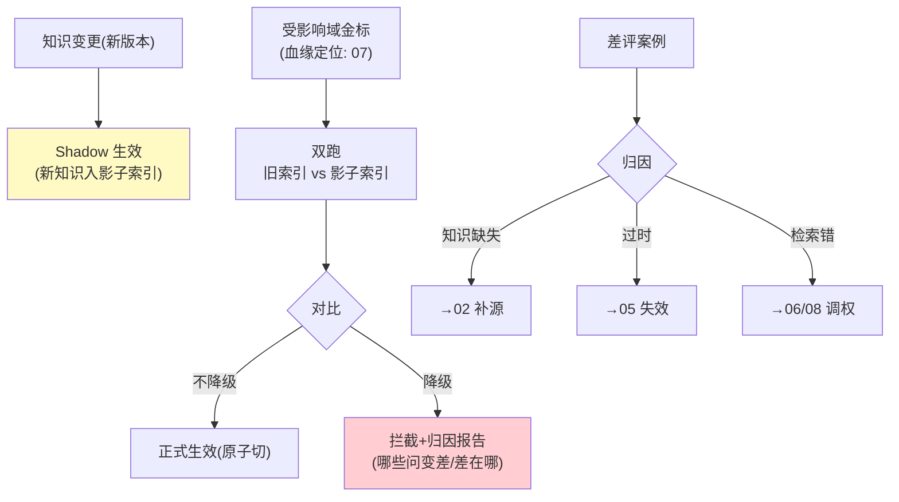

# 09-知识变更回归与飞轮——变更先验证再生效

> **定位**：给知识变更加**质量闸门**：**变更金标回归**（知识 vN→vN+1 生效前，跑受影响域的金标问答——答案不变差才放行）、**金标自动维护**（从真实问答中挖候选金标——人工确认入集）、**飞轮闭环**（答错/差评案例→归因：知识缺失/过时/检索错→回流 02-05 对应修复）。这是"模拟先行"（Nebius 共识）在知识域的落地。读者画像：要"知识更新不背锅"的读者。前置阅读：[08-GraphRAG与多跳推理](08-GraphRAG与多跳推理.md)、[教程 08-架构师进阶/07-数据飞轮与持续改进]。
>
> **铁律 0**：评估用官方 `RelevancyEvaluator`（`org.springframework.ai.chat.evaluation`，实证）+ 自研忠实度。

---

## 一、四问

| 问 | 答 |
|----|----|
| **新增了什么需求** | ① 变更回归闸门（变更前后各跑受影响金标，对比不降级才放行）② 金标资产（版本化/污染防护/受影响域标签）③ 差评归因（缺知识/过时/检索错三分→各回流修复）④ 金标挖掘（真实问答→候选→人审入集） |
| **影响了哪些模块** | 新增 `knowledge-regression`；接入管道（02）与检索（06）之间加闸门 |
| **架构如何演进** | 变更即生效 → 变更先验证（Shadow 知识版） |
| **上一版痛点** | 变更是否变差无度量（08 §四） |

**本迭代验收**：① 故意"删关键知识"的变更被回归拦截 ② 正常更新放行且金标不降级 ③ 差评案例归因正确回流（三类各验证一例）④ 金标挖掘→人审→入集闭环可走。

### 一.1 本节核对（v9 迭代范围）

| # | 核对项 | 判据 |
|---|--------|------|
| 1 | 四问齐全 | 新增需求/影响模块/架构演进/上一版痛点四行均有（承接 08 §四 变更无回归痛点） |
| 2 | 验收可度量 | 四条验收均有可判定判据（拦截/不降级放行/三类归因/闭环可走） |

---

## 二、变更回归闸门



```java
// 双跑对比（骨架，官方 Evaluator 实证）：
// for (GoldenCase gc : affectedCases(domain)) {
//     String oldAns = answerWith(oldIndex, gc.question());
//     String newAns = answerWith(shadowIndex, gc.question());
//     double oldScore = relevancy.evaluate(
//             new EvaluationRequest(gc.question(), gc.docs(), oldAns)).getScore();
//     double newScore = relevancy.evaluate(
//             new EvaluationRequest(gc.question(), gc.docs(), newAns)).getScore();
//     if (newScore < oldScore - 0.05) regressions.add(gc);   // 单例降级>0.05 记回归
// }
// 放行纪律：回归例数=0 放行；>0 拦截出报告（不静默放行）
```

### 二.1 本节测试与验证（变更回归闸门与差评归因）

**前置条件**：变更闸门（Shadow 回归）+差评归因回流实现。

**材料 A——破坏性变更**（删关键文档）；**材料 B——三类差评**（缺知识/过时/检索错）。

**步骤与断言**：

| # | 操作 | 预期（PASS 判据） |
|---|------|------------------|
| 1 | 材料A 提交 | Shadow 回归降 → 拦截+报告（差例可点） |
| 2 | 补充性变更 | 金标不降放行；检索原子切换（无新旧混排窗口） |
| 3 | 材料B 归因 | 缺→02 补源；过时→05 失效链；检索错→06 调权 |
| 4 | 3 条真实差评 | 人审入集→版本+1→下次回归生效 |

**失败排查**：①漏放行→Shadow 跑旧索引（切换时序错）；③归因错→差评缺检索命中上下文；④未生效→入集未触发回归订阅。

## 三、金标资产与挖掘

| 纪律 | 说明 |
|------|------|
| 版本化 | 金标集带版本；变更回归记录"用哪个版本测的" |
| 污染防护 | 金标问题不得进训练/微调集（防泄露）；测试集与优化集分离 |
| 受影响域标签 | 每条金标挂知识域标签（血缘定位用，07 联动） |
| 挖掘闭环 | 差评/低分问答 → 相似去重 → 候选队列 → 人审 → 入集（月度评审） |

### 三.1 本节核对（金标资产与挖掘）

- [ ] 四条纪律（版本化/污染防护/受影响域标签/挖掘闭环）能复述，且各有对应实现落点
- [ ] 能说明"金标问题不得进训练/微调集"为何是防污染底线，且能解释挖掘闭环与 §二 闸门如何联动

## 四、全篇回归验证

回归断言（§二.1 本节验证通过后，最终整体验收）：

| # | 操作 | 预期（PASS 判据） |
|---|------|------------------|
| 1 | 破坏性与补充性变更混排提交 | 破坏变更被拦、补充变更放行，闸门判定互不误伤 |
| 2 | 金标挖掘→人审→入集→下次回归全链走一遍 | 新金标生效并在下次变更回归中参与判定 |

**失败排查**：误伤→Shadow 回归集受影响域选取错（回看 §二.1 ①）；新金标未参与→入集未触发回归订阅（回看 §二.1 ④）。

## 五、本迭代痛点

文本知识完备；图表/多模态知识进不来 → 10 多模态知识与联邦。

> 五.1 本节核对（一句话）：痛点（图表/多模态进不来）与 [10] 多模态知识与联邦一一对应，痛点不被搁置即 PASS。

## 六、验收对照

| 验收项 | 标准 | 状态 |
|--------|------|------|
| 回归闸门 | 降级拦截/不降级放行 | ✅ |
| 归因回流 | 三类各验 | ✅ |
| 金标资产 | 版本化/防污染 | ✅ |
| 挖掘闭环 | 差评→人审→入集 | ✅ |

> 六.1 本节核对（一句话）：四条验收（回归闸门/归因回流/金标资产/挖掘闭环）分别对应 §一.1（验收口径）、§二.1、§三.1，与正文状态一致即 PASS。

**下一篇**：[10-多模态知识与联邦中枢](10-多模态知识与联邦中枢.md)。
