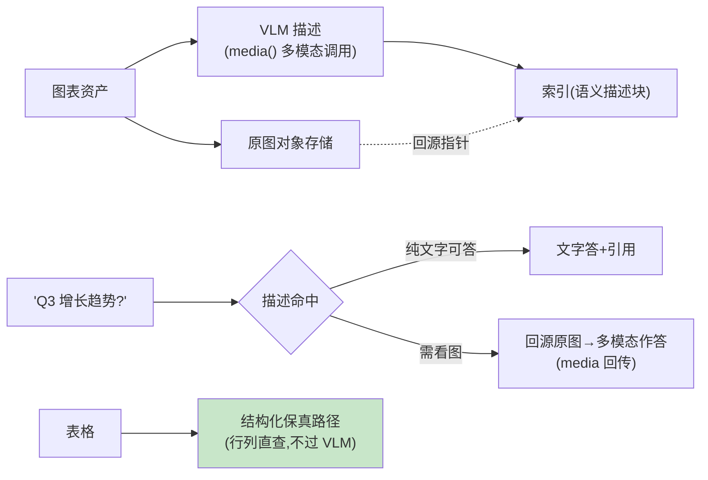
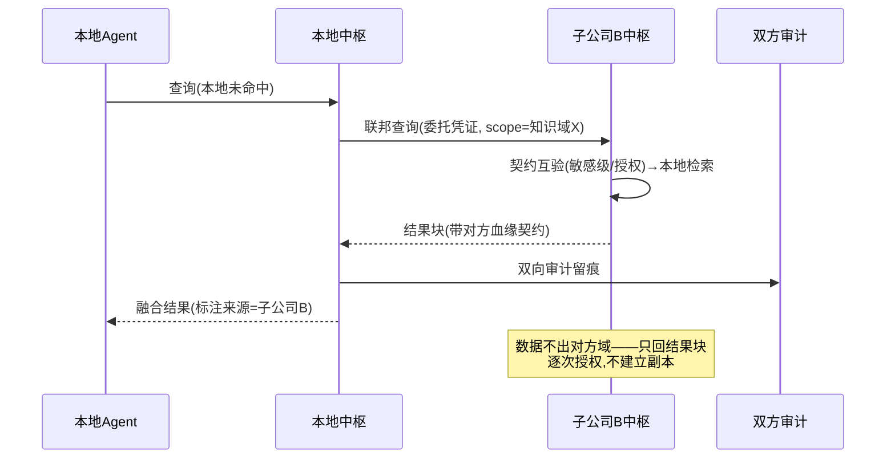

# 10-多模态知识与联邦中枢——图表知识 / 跨组织互认

> **定位**：收官两块拼图：**多模态知识**（图表→语义描述+原图双轨入库——检索命中描述、回答需看图时回源）、**联邦中枢**（跨组织/跨子公司知识互认——元数据契约跨域互验、受控检索不搬数据）。读者画像：图表资产多/集团多子公司的读者。前置阅读：[09-知识变更回归与飞轮](09-知识变更回归与飞轮.md)、[教程 48-多模态Agent开发]。
>
> **铁律 0**：多模态块经 `PromptUserSpec.media(MimeType, Resource)` 实证链；联邦协议自研（A2A 式互信概念）。

---

## 一、四问

| 问 | 答 |
|----|----|
| **新增了什么需求** | ① 图表知识双轨（VLM 生成语义描述入索引 + 原图存储；答案引用可回源显示）② 表格知识（结构化保真——直查不丢精度）③ 联邦契约（跨中枢：资产契约/敏感级互认）④ 受控联邦检索（跨域查询不搬数据，逐次授权+审计） |
| **影响了哪些模块** | 接入管道（多模态 Connector）；新增 `federation-gw` |
| **架构如何演进** | 文本中枢 → 多模态 + 跨组织 |
| **上一版痛点** | 图表检索不到/数据失真；集团各子公司各建中枢（09 §五） |

**本迭代验收**：① 图表问题命中语义描述且答案可附原图 ② 表格数值查询零失真（结构化路径）③ 联邦查询：本地契约验证对方敏感级→授权→审计全程 ④ 未授权域零泄露。

### 一.1 本节核对（v10 迭代范围）

| # | 核对项 | 判据 |
|---|--------|------|
| 1 | 四问齐全 | 新增需求/影响模块/架构演进/上一版痛点四行均有（承接 09 §五 图表进不来痛点） |
| 2 | 验收可度量 | 四条验收均有可判定判据（命中可附原图/零失真/授权+审计全程/未授权零泄露） |

---

## 二、多模态双轨

**表格纪律**：数值精度问题（"精确到元的 GMV"）走结构化路径——VLM 读图有失真风险，图表描述只做检索锚不做数值源。

### 二.1 本节测试与验证（图表双轨与表格保真）

**前置条件**：图表双轨（描述+结构化表格）实现。

**材料 A——图表样例**：柱状图 PNG（含数值）+其结构化表格版。

**步骤与断言**：

| # | 操作 | 预期（PASS 判据） |
|---|------|------------------|
| 1 | 图表类问题（"哪个月最高"） | 描述命中+答案附原图 |
| 2 | 数值精确问（"Q3 具体值"） | 走表格路径零失真（与原表数值一致） |

**失败排查**：②数值错→走了视觉描述路（分流器对精确问误判，应走结构化表）。

## 三、联邦中枢

**联邦纪律**：不搬数据（只回结果）、逐次授权（短 TTL 委托）、敏感级互认（对方机密级→本方同等级过滤）、血缘保留（答案可溯到对方源）。

### 三.1 本节测试与验证（联邦查询授权与审计）

**前置条件**：联邦查询授权+审计留痕实现；**材料 B——越域查询**：scope 外域的问题。

**步骤与断言**：

| # | 操作 | 预期（PASS 判据） |
|---|------|------------------|
| 1 | 材料B 联邦查询 | 拒绝；授权域查询返回结果+对方血缘标注 |
| 2 | 联邦审计 | 双向留痕可查（谁查了谁的什么） |

**失败排查**：①拒不掉→联邦网关无 scope 校验；②单侧留痕→对端未接审计协议。

## 四、全篇回归验证

回归断言（§二.1、§三.1 本节验证通过后，最终整体验收）：

| # | 操作 | 预期（PASS 判据） |
|---|------|------------------|
| 1 | 图表/表格/联邦三条通路同一进程各一次 | 描述命中回源、结构化零失真、联邦授权+审计全正常，无互扰 |
| 2 | 未授权域 + 越级敏感反复试探 | 始终零返回，且审计全程留痕（无任何旁路） |

**失败排查**：通路互扰→分流器边界（回看 §二.1 ②）；试探穿透→scope/敏感级校验漏洞（回看 §三.1 ①）。

## 五、本迭代痛点

九迭代齐备 → 11 核心代码讲解统一复盘。

> 五.1 本节核对（一句话）：痛点（九迭代齐备但缺统一复盘）指向 [11] 核心代码讲解收束，意图清晰即 PASS。

## 六、验收对照

| 验收项 | 标准 | 状态 |
|--------|------|------|
| 图表双轨 | 命中+回源 | ✅ |
| 表格保真 | 数值零失真 | ✅ |
| 联邦互认 | 契约/授权/审计 | ✅ |
| 零泄露 | 未授权 0 返回 | ✅ |

> 六.1 本节核对（一句话）：四条验收（图表双轨/表格保真/联邦互认/零泄露）分别对应 §一.1（验收口径）、§二.1、§三.1，与正文状态一致即 PASS。

**下一篇**：[11-核心代码讲解](11-核心代码讲解.md)。
