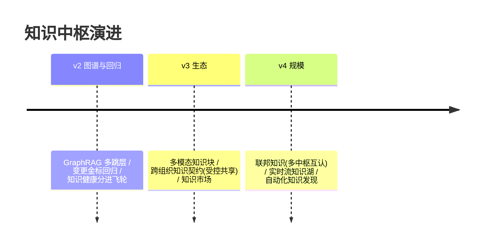

# 13-工业前沿与演进方向：知识中枢的 2026 校准与收官

> **定位**：用 2026 真实工业实践校准方向，给缺口与 v2-v4 演进，项目收官。前置阅读：[12-ADR架构决策记录](12-ADR架构决策记录.md)。
>
> **来源**：真实外部资料（链接文内）。

---

## 一、行业信号

- **PagerDuty**（[Production AI Agents](https://www.pagerduty.com/eng/production-ai-agents-closing-the-gaps-between-idea-and-reality/)）：**共享事实失效**是 RAG 最大坑之一——本中枢 05 失效链/supersededBy 是其直接工程解；其"知识图谱处理多跳关系"对应本中枢 v2 方向。
- **Google**（[五指南](https://cloud.google.com/blog/topics/developers-practitioners/five-guides-to-building-and-scaling-production-ready-ai-agents)）：Grounding（企业知识接地）列为生产关键——本项目是企业级 Grounding 基础设施；其"MCP 连接活数据但需业务上下文/元数据/逻辑"= 语义层（03）的价值注脚。
- **Nebius**（[Blueprint](https://nebius.com/blog/posts/introducing-the-nebius-agents-blueprint)）：Knowledge 组件（Pinecone+Nexus）+ Simulation（先模拟后上线）——模拟先行映射本中枢 v2（新知识上线前金标回归验证）。
- **AWS**（[生产级指南](https://cloud.it168.com/a2026/0708/6939/000006939041.shtml)）：**企业自持金标与评估标准是护城河**——知识中枢的金标（06）+ 质量分（04）正是评估底座的数据侧。

### 一.1 本节核对（行业信号）

| # | 核对项 | 判据 |
|---|--------|------|
| 1 | 四来源齐备且已标注链接 | PagerDuty / Google / Nebius / AWS 四家均有署名与链接（来源不漏） |
| 2 | 每条落到既有模块 | 每条都把外部结论映射到本中枢具体能力（05 失效链 / 03 语义层 / 06 金标 / 04 质量分），无空谈映射 |

---

## 二、现状对照（N1-N6）

| # | 前沿能力 | 现状 | 缺口/演进 |
|---|---------|------|----------|
| N1 | 失效感知（TTL/supersededBy） | ✅ 05 | ✅ 同构 |
| N2 | 知识图谱多跳 | ❌（向量为主） | 🔷 v2：GraphRAG 层（实体图+多跳问题路由） |
| N3 | 模拟先行（知识变更先验证） | 🔶 质量门静态 | 🔷 v2：变更前金标影响回归（影响分析+评估联动） |
| N4 | 企业 Grounding 标准（元数据契约） | ✅ 资产契约 | 🔶 对外发布为组织间知识契约（v3 跨组织共享） |
| N5 | 多模态知识（图表/音频知识块） | ❌ 文本为主 | 🔷 v3：多模态块（图表→语义描述入索引） |
| N6 | 知识来源披露（答案引用规范） | ✅ 血缘契约 | 🔶 披露格式标准化（对齐监管透明度要求） |

### 二.1 本节核对（现状对照 N1-N6）

| # | 核对项 | 判据 |
|---|--------|------|
| 1 | N1-N6 现状标记真实 | 已具备项（N1/N4/N6）标注 ✅ 均能在 05/02/06 找到实体落地，非虚标 |
| 2 | 每个缺口有演进版本号 | N1-N6 的缺口/改进均落到 v2/v3/v4（含在案持续项），与 §三 演进路线对应，无悬空缺口 |

---

## 三、演进路线



### 三.1 本节核对（演进路线）

| # | 核对项 | 判据 |
|---|--------|------|
| 1 | 三步递进且锚定缺口 | v2（图谱/回归）/v3（生态/多模态与契约）/v4（规模/联邦）逐步放大，且分别承接 §二 N2/N3、N5/N4、联邦方向，无越级 |
| 2 | 演进不改第一性 | v2-v4 均在"知识可信"第一性下延伸（图谱强化可信、契约强化共享可信），未偏离 §四 18 列定位 |

## 四、五旗舰对照收官（14-18）

| 视角 | 14 平台 | 15 内核 | 16 网格 | 17 实时 | **18 知识** |
|------|--------|--------|--------|--------|------------|
| 第一性 | 治理全景 | 资源托管 | 零改造 | 延迟预算 | **知识可信** |
| 时间观 | 策略周期 | 进程生命周期 | 配置周期 | 毫秒 | **知识生命周期** |
| 护城河 | 治理能力 | 运行时机制 | 接入规模 | 实时体验 | **企业自持知识资产** |

> 五个旗舰共同回答"企业级 Agent 的基础设施是什么"——五种第一性原理五套蓝图，按场景选型、可组合（中枢的知识供平台 Agent 检索、内核进程引用、网格内共享、实时会话预取）。

### 四.1 本节核对（五旗舰对照收官）

| # | 核对项 | 判据 |
|---|--------|------|
| 1 | 18 列三行有区分度 | 知识中枢在 第一性/时间观/护城河 三行的取值（知识可信/知识生命周期/自持资产）均非其余四旗舰取值，独特性成立 |
| 2 | 组合关系可演 | "中枢供检索 / 内核引用 / 网格共享 / 实时预取"四类消费场景分别对应其他 4 项目定位，可组合非排他 |

## 五、检验方式

```bash
# 对照：05 失效链 vs PagerDuty "共享事实失效"论断逐句同构自查
# v2 PoC：10 个多跳问题在 GraphRAG 层 vs 纯向量的准确率对比
```

### 五.1 本节核对（检验方式）

| # | 核对项 | 判据 |
|---|--------|------|
| 1 | 两检验均有明确行为 | 对照式（逐句同构自查 05 vs PagerDuty）与 PoC 式（10 个多跳问题 GraphRAG vs 纯向量比准确率）各含样本量/维度，非口号 |
| 2 | 目的可达成 | 两项分别验证 §一(PagerDuty)与 §二 N2(GraphRAG)，检验真正落到决策而不只是铺陈 |

## 六、项目收官

| 阶段 | 篇目 | 交付 |
|------|------|------|
| 基础（00-01） | 资产模型/最小闭环 | 三平面+契约纪律 |
| 六迭代（02-07） | 接入/语义/治理/时效/检索/共享 | 完整知识中枢 |
| 资产（08-10） | 讲解/ADR/前沿 | GMV 旅程复盘+11 条决策+五旗舰收官 |

### 六.1 本节核对（项目收官）

| # | 核对项 | 判据 |
|---|--------|------|
| 1 | 收官口径与前述自洽 | "知识即资产/无契约不入库/口径唯一/失效可溯/治理变检索信号"五句分别对应 ADR 18-00/18-03/18-07/06 与 [11] §三，均已在项目落地 |
| 2 | 独立项目无依赖 | 明确"独立项目，无后续依赖"，与此前 00 定位及项目独立铁律一致 |

项目 18 到此收官：**知识即资产、无契约不入库、口径唯一、失效可溯、治理变检索信号**的工业级企业知识中枢蓝图。独立项目，无后续依赖。
