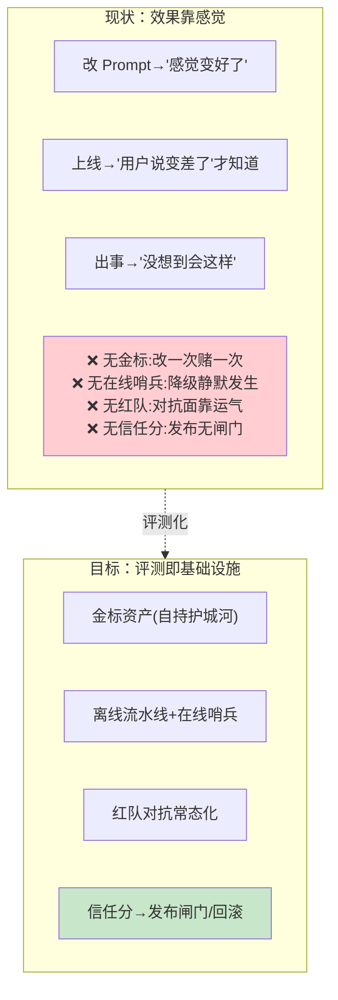
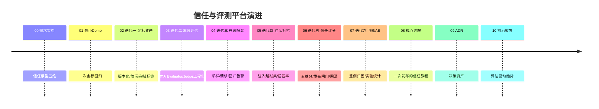

# 00-需求分析与架构设计：企业级 Agent 信任与评测平台

> **定位**：第六旗舰·**信任与评测视角**——把"Agent 效果与安全"做成**基础设施**：金标资产（企业自持=护城河）、离线评估流水线（LLM-as-Judge 工程化）、在线监控（漂移/回归实时告警）、红队对抗（注入/越狱集常态化）、**信任评分**（Agent/版本的量化信任分驱动发布闸门与回滚）。呼应 AWS 2026 判断："评估标准必须企业自持；40% Agent 项目因无度量而砍"。读者画像：要回答"这个 Agent 敢不敢上生产"的读者。前置阅读：[教程 37-自我反思与Agent评估]、[教程 41-数据飞轮与持续改进]、[教程 43-Agent治理与合规框架]。
>
> **铁律 0**：官方 `Evaluator`（`org.springframework.ai.evaluation`/`chat.evaluation`）实证使用。独立项目（与 14-18 五旗舰互补，互不引用）。

---

## ★ 阅读顺序总览（序号 = 阅读顺序）

> 本子文件夹 11 个文件（00-10）：

| 阶段 | 文件 | 读者定位 |
|------|------|---------|
| ① 全貌 | 00-需求分析与架构设计 | **先读**：信任模型、评估矩阵 |
| ② 起步 | 01-最小Demo | **动手**：一次金标回归 |
| ③ 主体迭代 | 02~07（金标资产/离线评估/在线监控/红队/信任评分/飞轮A-B） | **严格顺序** |
| ④ 讲解 | 08-核心代码讲解 | **回顾** |
| ⑤ 资产 | 09-ADR / 10-前沿 | **按需/收官** |

---

## 一、为什么评测是独立问题域



## 二、信任模型（五维评分）

| 维度 | 度量 | 数据源 |
|------|------|--------|
| 质量 | 任务完成率/忠实度/相关度 | 金标+官方 Evaluator |
| 安全 | 注入拦截率/越权率/有害输出率 | 红队集+在线审核 |
| 稳定 | 延迟/错误率/降级率波动 | 在线监控 |
| 成本 | Token 效率/单位任务成本 | 计量 |
| 满意 | 用户反馈/投诉/采纳 | 反馈流 |

**信任分 = 五维加权（权重按场景配置：风控场景安全×3、客服场景满意×2）**——单一分数可比较，多维可解释。

## 三、总体架构

```mermaid
graph TB
    subgraph assets["金标与对抗资产（管控面）"]
        G["金标集(版本化/防污染)"]
        RT["红队集(注入/越狱/有害)"]
    end
    subgraph pipelines["评估流水线（数据面）"]
        OFF["离线:发布前回归<br/>(官方Evaluator+Judge)"]
        ON["在线:采样监控<br/>(漂移/回归告警)"]
    end
    subgraph actions["决策面（管控面）"""
        T["信任分引擎"]
        GATE["发布闸门/回滚触发"]
        FW["飞轮(差例归因回流)"]
    end
    G & RT --> OFF
    ON --> T
    OFF --> T
    T --> GATE
    ON --> FW
    style T fill:#fff9c4
```

## 四、微服务清单与迭代路线

| 服务 | 平面 | 职责 | 迭代 |
|------|------|------|------|
| `golden-store` | 资产 | 金标版本化/防污染/域标签 | 02 |
| `eval-pipeline` | 流水线 | 离线回归/判分 | 03 |
| `online-sentinel` | 流水线 | 采样/漂移/告警 | 04 |
| `redteam-runner` | 流水线 | 对抗集执行/拦截率 | 05 |
| `trust-engine` | 决策 | 五维信任分 | 06 |
| `flywheel-svc` | 决策 | 差例归因/A-B 实验 | 07 |



## 五、量化验收（项目级）

| 指标 | 目标 |
|------|------|
| 金标覆盖 | 核心场景 100% 有金标（≥500 例/Agent） |
| 发布回归 | 100% 发布过金标+红队双闸门 |
| 在线检测 | 效果降级 → 告警 ≤10min |
| 信任分 | 每版本自动出分（发布报告含五维） |
| 误放行 | 红队拦截率 <阈值的版本 0 上线 |

## 六、与教程体系的锚点

[教程 37-评估]（官方 Evaluator）、[教程 41-飞轮]、[教程 29-灰度]（闸门联动）、[教程 43-治理]（信任披露）、[教程 31-安全]（红队联动）、[附录 12-评估生态]（Judge 工程化）。

## 七、六旗舰对照

| 视角 | 14 平台 | 15 内核 | 16 网格 | 17 实时 | 18 知识 | **19 评测** |
|------|--------|--------|--------|--------|--------|------------|
| 第一性 | 治理全景 | 资源托管 | 零改造 | 延迟预算 | 知识可信 | **效果可信** |
| 一句话 | 什么都能治 | 像 OS 跑 | 像网格罩 | 像真人聊 | 答得有据 | **敢不敢上生产** |

## 八、总结

评测平台把"Agent 效果"从感觉变成**基础设施**：金标资产自持、离线在线双评估、红队常态化、信任分驱动闸门与回滚。下一篇从一次回归跑起。

**下一篇**：[01-最小Demo](01-最小Demo.md)。
