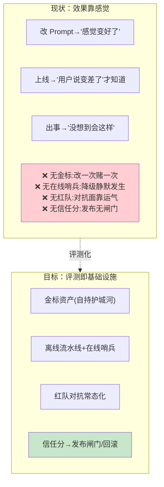
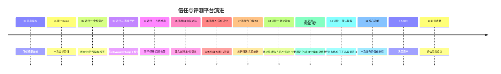

# 00-需求分析与架构设计：企业级 Agent 信任与评测平台

> **定位**：第六旗舰·**信任与评测视角**——把"Agent 效果与安全"做成**基础设施**：金标资产（企业自持=护城河）、离线评估流水线（LLM-as-Judge 工程化）、在线监控（漂移/回归实时告警）、红队对抗（注入/越狱集常态化）、**信任评分**（Agent/版本的量化信任分驱动发布闸门与回滚）。呼应 AWS 2026 判断："评估标准必须企业自持；40% Agent 项目因无度量而砍"。读者画像：要回答"这个 Agent 敢不敢上生产"的读者。前置阅读：[教程 08-架构师进阶/03-自我反思与Agent评估]、[教程 08-架构师进阶/07-数据飞轮与持续改进]、[教程 08-架构师进阶/09-Agent治理与合规框架]。
>
> **铁律 0**：官方 `Evaluator`（`org.springframework.ai.evaluation`/`chat.evaluation`）实证使用。独立项目（与 14-18 五旗舰互补，互不引用）。

---

## ★ 阅读顺序总览（序号 = 阅读顺序）

> 本子文件夹 14 个文件（00-13）：

| 阶段 | 文件 | 读者定位 |
|------|------|---------|
| ① 全貌 | 00-需求分析与架构设计 | **先读**：信任模型、评估矩阵 |
| ② 起步 | 01-最小Demo | **动手**：一次金标回归 |
| ③ 主体迭代 | 02~07（金标资产/离线评估/在线监控/红队/信任评分/飞轮A-B） | **严格顺序** |
| ④ 进阶 | 08~10（轨迹沙箱/攻防自博弈/互认披露） | **严格顺序** |
| ⑤ 讲解 | 11-核心代码讲解 | **回顾** |
| ⑥ 资产 | 12-ADR / 13-前沿 | **按需/收官** |

---

## 一、为什么评测是独立问题域



### 一.1 本节核对（为什么评测是独立问题域）

| # | 核对项 | 判据 |
|---|--------|------|
| 1 | 「现状」痛点可复述 | 能说出四缺：无金标/无在线哨兵/无红队/无信任分——并对应到目标四块（金标/流水线/红队/信任分） |
| 2 | 与迭代路线对接 | 四块目标分别映射到 02-06 六个迭代，无孤立能力 |

## 二、信任模型（五维评分）

| 维度 | 度量 | 数据源 |
|------|------|--------|
| 质量 | 任务完成率/忠实度/相关度 | 金标+官方 Evaluator |
| 安全 | 注入拦截率/越权率/有害输出率 | 红队集+在线审核 |
| 稳定 | 延迟/错误率/降级率波动 | 在线监控 |
| 成本 | Token 效率/单位任务成本 | 计量 |
| 满意 | 用户反馈/投诉/采纳 | 反馈流 |

**信任分 = 五维加权（权重按场景配置：风控场景安全×3、客服场景满意×2）**——单一分数可比较，多维可解释。

### 二.1 本节核对（信任模型五维评分）

| # | 核对项 | 判据 |
|---|--------|------|
| 1 | 五维齐全 | 质量/安全/稳定/成本/满意五维各有度量与数据源，且与 06 场景权重模板的场景列一致 |
| 2 | 加权口径可复述 | 能说明"单一分数可比较、多维可解释"的取舍（风控安全×3、客服满意×2） |

## 三、总体架构

```mermaid
graph TB
    subgraph assets["金标与对抗资产（管控面）"]
        G["金标集(版本化/防污染)"]
        RT["红队集(注入/越狱/有害)"]
    end
    subgraph pipelines["评估流水线（数据面）"]
        OFF["离线:发布前回归<br/>(官方Evaluator+Judge)"]
        ON["在线:采样监控<br/>(漂移/回归告警)"]
    end
    subgraph actions["决策面（管控面）"""
        T["信任分引擎"]
        GATE["发布闸门/回滚触发"]
        FW["飞轮(差例归因回流)"]
    end
    G & RT --> OFF
    ON --> T
    OFF --> T
    T --> GATE
    ON --> FW
    style T fill:#fff9c4
```

### 三.1 本节核对（总体架构）

| # | 核对项 | 判据 |
|---|--------|------|
| 1 | 管控/数据/决策三角色可划分 | 能指出金标集/红队集属管控面（资产）、离线/在线流水线属数据面、信任分/闸门/飞轮属决策面，与 04 §四平面列一致 |
| 2 | 数据流转闭环 | 资产→流水线→信任分→闸门/飞轮的箭头在图中均有对应，无单向悬空 |

## 四、微服务清单与迭代路线

| 服务 | 平面 | 职责 | 迭代 |
|------|------|------|------|
| `golden-store` | 资产 | 金标版本化/防污染/域标签 | 02 |
| `eval-pipeline` | 流水线 | 离线回归/判分 | 03 |
| `online-sentinel` | 流水线 | 采样/漂移/告警 | 04 |
| `redteam-runner` | 流水线 | 对抗集执行/拦截率 | 05 |
| `trust-engine` | 决策 | 五维信任分 | 06 |
| `flywheel-svc` | 决策 | 差例归因/A-B 实验 | 07 |



### 四.1 本节核对（微服务清单与迭代路线）

| # | 核对项 | 判据 |
|---|--------|------|
| 1 | 六个服务各归其位 | 六个服务的平面（资产/流水线/决策）与其职责、迭代号（02-07）一一匹配，无错位 |
| 2 | timeline 与篇章一致 | 00-13 每个阶段标题与子文件夹实际文件名/顺序吻合，无缺漏 |

## 五、量化验收（项目级）

| 指标 | 目标 |
|------|------|
| 金标覆盖 | 核心场景 100% 有金标（≥500 例/Agent） |
| 发布回归 | 100% 发布过金标+红队双闸门 |
| 在线检测 | 效果降级 → 告警 ≤10min |
| 信任分 | 每版本自动出分（发布报告含五维） |
| 误放行 | 红队拦截率 <阈值的版本 0 上线 |

### 五.1 本节核对（量化验收）

| # | 核对项 | 判据 |
|---|--------|------|
| 1 | 五条指标均可度量 | 每条含数值或可判定标准（≥500 例/≤10min/0 上线），非空话 |
| 2 | 每指标有迭代落点 | 覆盖→02、回归/误放行→03-05、在线→04、信任分→06，可指到具体篇 |

## 六、与教程体系的锚点

[教程 05-Observation可观测/04-自定义Convention与Filter：工业标签与脱敏]（官方 Evaluator）、[教程 05-Observation可观测/08-流式响应的观测：stream模式下的span闭合]、[教程 04-企业级架构主干/00-管控分离架构]（闸门联动）、[教程 05-Observation可观测/10-观测测试与跨服务传播：TestObservationRegistry与trace透传]（信任披露）、[教程 04-企业级架构主干/02-全链路可观测性]（红队联动）、[附录 11-评估生态]（Judge 工程化）。

### 六.1 本节核对（与教程体系的锚点）

- [ ] 每条锚点能说出它服务本平台的哪一块（官方 Evaluator→离线判分、飞轮→回流、灰度→闸门联动、治理→信任披露、安全→红队、评估生态→Judge 工程化）

## 七、六旗舰对照

| 视角 | 14 平台 | 15 内核 | 16 网格 | 17 实时 | 18 知识 | **19 评测** |
|------|--------|--------|--------|--------|--------|------------|
| 第一性 | 治理全景 | 资源托管 | 零改造 | 延迟预算 | 知识可信 | **效果可信** |
| 一句话 | 什么都能治 | 像 OS 跑 | 像网格罩 | 像真人聊 | 答得有据 | **敢不敢上生产** |

### 七.1 本节核对（六旗舰对照）

| # | 核对项 | 判据 |
|---|--------|------|
| 1 | 第一性定位明确 | 19 的第一性为"效果可信"，与其余五旗舰区分，互不重复 |
| 2 | 与结论呼应 | "敢不敢上生产"与五维信任分 + 双卡闸门 + 沙箱先行链路自洽 |

## 八、总结

评测平台把"Agent 效果"从感觉变成**基础设施**：金标资产自持、离线在线双评估、红队常态化、信任分驱动闸门与回滚。下一篇从一次回归跑起。

> 本节核对（一句话）：总结四要素（金标自持/离线在线双评估/红队常态化/信任分驱动闸门回滚）与一至七各章正文口径一致即 PASS。

**下一篇**：[01-最小Demo](01-最小Demo.md)。
