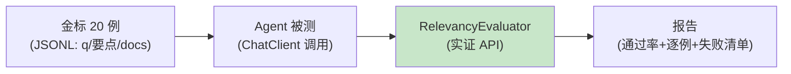

# 01-最小 Demo：一次金标回归

> **定位**：最小闭环：20 条金标（问题/期望要点/上下文）→ 对目标 Agent 跑一轮 → 官方 `RelevancyEvaluator` 判分 → 出通过率报告。读者画像：动手起步。前置阅读：[00-需求分析与架构设计](00-需求分析与架构设计.md)、[教程 37-自我反思与Agent评估]。
>
> **铁律 0**：`RelevancyEvaluator.builder().chatClientBuilder()` / `EvaluationRequest(userText, docs, response)` / `EvaluationResponse.isPass()/getScore()` 全部 javap 实证。

---

## 一、四问

| 问 | 答 |
|----|----|
| **新增了什么需求** | 最小金标回归（跑 Agent→判分→报告） |
| **影响了哪些模块** | 新单体 `eval-runner` |
| **架构如何演进** | 无 → 一次回归闭环 |
| **上一版痛点** | 无 |

**本迭代验收**：① 20 例跑完出通过率 ② 判分走真实官方 Evaluator ③ 报告含逐例分数与失败例。

## 二、最小链路



## 三、核心代码（官方 Evaluator 全实证）

```java
package com.example.evalrunner;

import org.springframework.ai.chat.client.ChatClient;
import org.springframework.ai.chat.evaluation.RelevancyEvaluator;
import org.springframework.ai.document.Document;
import org.springframework.ai.evaluation.EvaluationRequest;
import org.springframework.ai.evaluation.EvaluationResponse;

import java.util.List;

/** 最小金标回归——官方 Evaluator 判分。 */
public class RegressionRunner {

    private final ChatClient agentUnderTest;      // 被测 Agent
    private final RelevancyEvaluator relevancy;   // 裁判

    public RegressionRunner(ChatClient agentUnderTest, ChatClient.Builder judgeBuilder) {
        this.agentUnderTest = agentUnderTest;
        // javap 实证：RelevancyEvaluator 基于 ChatClient.Builder 构造
        this.relevancy = RelevancyEvaluator.builder().chatClientBuilder(judgeBuilder).build();
    }

    public Report run(List<GoldenCase> cases) {
        int pass = 0;
        List<CaseResult> results = new java.util.ArrayList<>();
        for (GoldenCase gc : cases) {
            String answer = agentUnderTest.prompt()
                    .user(gc.question()).call().content();               // 实证
            // javap 实证：EvaluationRequest(userText, dataList, responseContent) 三参
            EvaluationResponse eval = relevancy.evaluate(new EvaluationRequest(
                    gc.question(),
                    gc.docs().stream().map(d -> new Document(d)).toList(),
                    answer));
            boolean ok = eval.isPass();
            if (ok) pass++;
            results.add(new CaseResult(gc.id(), eval.getScore(), ok, answer));
        }
        return new Report(cases.size(), pass, (double) pass / cases.size(), results);
    }

    public record GoldenCase(String id, String question, List<String> docs) {}
    public record CaseResult(String id, double score, boolean pass, String answer) {}
    public record Report(int total, int passed, double passRate, List<CaseResult> results) {}
}
```

## 四、验证包（手工测试与验证）
**前置条件**：金标 20 例（JSONL：question/expected/评分要点）+ RelevancyEvaluator（官方基准：`RelevancyEvaluator.builder().chatClientBuilder(judgeBuilder).build()` + `new EvaluationRequest(...)`）跑通。

**材料 A——金标样例**（`golden-20.jsonl`）：

```json
{"id":"g01","domain":"退款","question":"订单8812没收到货怎么退款","expected":"先查物流状态，未签收可申请仅退款，1-3个工作日到账","rubric":["提到查物流","提到仅退款路径","提到时效"]}
```

**材料 B——人审表**：抽 5 例，人工按 rubric 打 0-2 分对照 Judge 分。

**步骤与断言**：

| # | 操作 | 预期（PASS 判据） |
|---|------|------------------|
| 1 | 跑 20 例 | 报告出通过率（如 16/20=0.8）；失败 4 例有逐例分数+回答原文 |
| 2 | 材料B 对照 | Judge 与人审分相关系数 ≥0.7（方向一致） |
| 3 | 人为注入一例明显跑题回答 | 该例相关度分显著低于均值（判定器有区分度） |

**失败排查**：①Judge 全 0.9+ 无区分度→judge Prompt 缺评分锚点（把 rubric 写进判分上下文）；②跑不通→EvaluationRequest 参数顺序/类型与已实证基准不符。


## 五、本迭代痛点

金标是裸 JSONL：无版本/无防污染/无域标签 → 02 金标资产化。

## 六、验收对照

| 验收项 | 标准 | 状态 |
|--------|------|------|
| 回归闭环 | 20 例出报告 | ✅ |
| 官方 Evaluator | 实证 API | ✅ |
| 失败可见 | 逐例分数 | ✅ |

**下一篇**：[02-迭代一-金标资产化](02-迭代一-金标资产化.md)。
