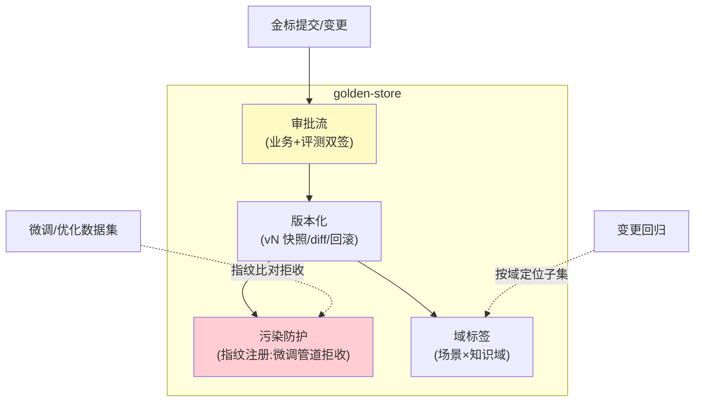

# 02-迭代一：金标资产化——版本 / 防污染 / 域标签

> **定位**：把裸金标变成**资产**：版本化（演进留痕）、**污染防护**（金标不得进微调/优化集——防"背答案"假高分）、域标签（受影响域定位——联动知识血缘）、审批流（金标变更走评审）。呼应 AWS"金标是护城河"——护城河要有资产管理。读者画像：要长期经营评测的读者。前置阅读：[01-最小Demo](01-最小Demo.md)。
>
> **铁律 0**：资产层自研。

---

## 一、四问

| 问 | 答 |
|----|----|
| **新增了什么需求** | ① 金标集版本化（vN 快照/回滚/演进 diff）② 污染防护（指纹标记：微调/优化管道拒收金标指纹）③ 域标签（场景/知识域——变更回归定位）④ 审批流（增删改走评审：业务+评测双签） |
| **影响了哪些模块** | 新增 `golden-store` |
| **架构如何演进** | 文件 → 受管资产 |
| **上一版痛点** | 裸 JSONL 无治理（01 §五） |

**本迭代验收**：① 金标变更走审批且留版本 diff ② 微调管道拒收带金标指纹的样本（防污染验证）③ 域标签联动：知识域变更→定位到受影响金标子集 ④ 回滚到任意历史版本。

---

## 二、资产模型



```sql
CREATE TABLE golden_case (
    id          text NOT NULL,
    set_version int  NOT NULL,
    question    text NOT NULL,
    expected    jsonb NOT NULL,        -- 期望要点/参考答案
    domain_tags text[] NOT NULL,        -- 域标签（场景×知识域）
    fingerprint text NOT NULL,          -- 污染防护指纹（问题+要点 hash）
    status      text DEFAULT 'ACTIVE',
    approved_by text[],
    PRIMARY KEY (id, set_version)
);
```

**防污染机制**：微调/优化数据准备管道在入模前对每样本算指纹 → 与金标指纹库比对 → 命中即拒（金标泄露=评测虚高）。**测试集与优化集物理分离**是铁律。

## 三、测试与验证

```bash
# 1. 审批：提交修改 → 双签流 → vN+1 发布；diff 可视
# 2. 防污染：把金标问题混入微调集 → 管道拒收（指纹命中）
# 3. 域联动：'退款知识域'变更 → 定位到带该标签的金标子集
# 4. 回滚：v3 有问题 → 回滚 v2 → 回归用 v2
```

## 四、本迭代痛点

有了资产但跑评估仍手工 → 03 离线流水线。

## 五、验收对照

| 验收项 | 标准 | 状态 |
|--------|------|------|
| 版本审批 | 双签+diff+回滚 | ✅ |
| 污染防护 | 微调拒收 | ✅ |
| 域标签 | 变更定位子集 | ✅ |
| 资产化 | 受管演进 | ✅ |

**下一篇**：[03-迭代二-离线评估流水线](03-迭代二-离线评估流水线.md)。
