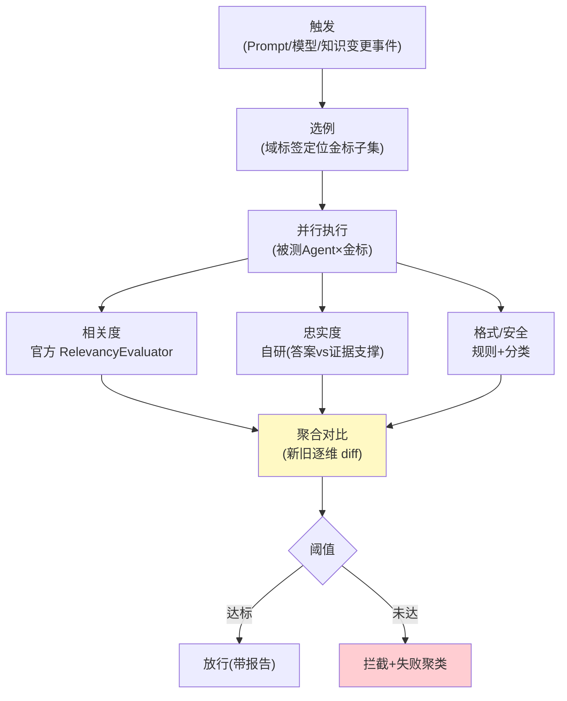

# 03-离线评估流水线——发布前回归 / Judge 工程化 / 幻觉检测

> **定位**：建**离线流水线**：发布触发（新 Prompt/模型/知识版本→自动回归）、**Judge 工程化**（官方 Evaluator+自研忠实度/格式 Judge；偏差控制——Judge 与被测异模型）、**幻觉检测**（答案 vs 检索证据的支撑度）、**回归对比报告**（新旧版本逐维 diff）。读者画像：要"发布必过闸"的读者。前置阅读：[02-金标资产化](02-金标资产化.md)、[附录 11-评估与可观测生态]。
>
> **铁律 0**：官方 `RelevancyEvaluator`/`FactCheckingEvaluator` 实证；忠实度 Judge 自研标注。

---

## 一、四问

| 问 | 答 |
|----|----|
| **新增了什么需求** | ① 发布触发回归（变更事件→自动跑受影响域）② 多维判分（相关度官方/忠实度自研/格式规则/安全分类）③ Judge 偏差控制（异模型裁判/抽样人审校准）④ 对比报告（新旧逐维 diff+失败例聚类） |
| **影响了哪些模块** | 新增 `eval-pipeline`；对接发布事件（平台灰度联动概念） |
| **架构如何演进** | 手工跑 → 触发式流水线 |
| **上一版痛点** | 手工评估（02 §四） |

**本迭代验收**：① 变更事件→自动回归→报告 ≤30min（500 例）② 忠实度 Judge 抽样人审一致率 ≥75% ③ 报告含新旧对比+失败聚类 ④ 阈值判定（低于线=不放行）。

### 一.1 本节核对（四问口径）

| # | 核对项 | 判据 |
|---|--------|------|
| 1 | 四问齐全 | 新增需求（四能力）/影响模块（eval-pipeline）/演进（手工→触发式）/痛点（手工评估）四行均有 |
| 2 | 验收四指标有落点 | ≤30min→二、一致率→二 Judge、对比聚类→三报告契约、阈值→二 VERD，均在正文有实现 |

---

## 二、流水线架构



```java
// 忠实度 Judge（自研骨架）——逐句判定答案是否有证据支撑：
// for (sentence in split(answer)) {
//     supported = any(evidence, e -> entailment(judge, sentence, e))   // NLI 式判定
// }
// faithfulness = supportedCount / sentenceCount   // 无支撑句=潜在幻觉
// 偏差纪律：judge 模型 ≠ 被测模型（防同源偏好）；月度抽样人审校准 Judge
```

### 二.1 本节测试与验证（触发回归与忠实度 Judge 校准）

**前置条件**：流水线（触发→执行→判分→报告→闸门）+异模型 Judge+忠实度自研实现。

**材料 A——坏版本注入**：Prompt v12-bad（故意允许编造）。

**材料 B——人审样本**：忠实度 Judge 判分抽 50 例。

**步骤与断言**：

| # | 操作 | 预期（PASS 判据） |
|---|------|------------------|
| 1 | 提交正常 v12 → 触发流水线 | ≤30min 出报告（500 例并行） |
| 2 | 材料A v12-bad | 报告 BLOCK（幻觉维度跌破阈值） |
| 3 | 材料B 一致率 | Judge vs 人审 ≥75% |
| 4 | 限流验证 | 并行执行时模型配额未打爆（并发数=配置值） |

**失败排查**：②漏放行→忠实度 Judge 未接 grounded 检索文档；③一致率低→Judge 与被测同源（同源偏好，换异模型）；④打爆→并发限制未生效。

## 三、对比报告契约

```json
{ "trigger": "prompt-v12", "goldenVersion": 7, "cases": 500,
  "new": {"relevancy": 0.91, "faithfulness": 0.86, "format": 0.98, "safety": 1.0},
  "old": {"relevancy": 0.90, "faithfulness": 0.88, "format": 0.97, "safety": 1.0},
  "regressions": ["case-217 忠实度 0.9→0.4（幻觉：编造退款政策）"],
  "verdict": "BLOCK" }
```

**纪律**：忠实度下降是最高优先回归（幻觉>格式>相关度波动）；拦截报告必须给失败例聚类（改哪里）。

### 三.1 本节测试与验证（对比报告契约）

**前置条件**：报告已能按 §二.1 步骤 1 产出（新旧双版本数据在握）。

**步骤与断言**：

| # | 操作 | 预期（PASS 判据） |
|---|------|------------------|
| 1 | 检查报告字段 | 含 `trigger/goldenVersion/cases/new/old/regressions/verdict` 全字段，非裸分数 |
| 2 | 对比与聚类 | 报告含新旧版本逐例 diff + 失败例聚类（能指向"改哪里"），regressions 有案例与归因 |

**失败排查**：缺 diff/聚类→聚合器只输出总分未保留逐例；verdict 与阈值计算不符→VERD 判定未接 §二.1 步骤 2 的阈值线。

### 三.2 可执行验证（mvn test）

对比报告契约可直接以 junit 断言（概念代码，断言仅覆盖本节）：

```java
package eval.pipeline;

import lombok.extern.slf4j.Slf4j;
import org.junit.jupiter.api.Test;

import static org.junit.jupiter.api.Assertions.*;

/** 断言仅覆盖本节：材料 A 坏版本 → 报告契约全字段 + verdict=BLOCK。 */
@Slf4j
class DiffReportTest {

    @Test
    void 坏版本报告契约完整且拦截() {
        DiffReport r = pipeline.run("prompt-v12-bad", goldenSubset(500));   // §二.1 材料 A
        assertEquals("prompt-v12-bad", r.trigger());
        assertTrue(r.regressions().stream().anyMatch(g -> g.contains("忠实度")));
        assertEquals("BLOCK", r.verdict());                                 // 阈值闸门拦截
        log.info(r.toJson());                                     // 打印报告便于肉眼核对
    }
}
```

命令与预期输出（报告 JSON 与 §三 契约同构，3-5 行）：

```bash
mvn test -Dtest=DiffReportTest
```

```text
10:15:30 INFO  eval.pipeline.DiffReportTest - { "trigger": "prompt-v12-bad", "goldenVersion": 7, "cases": 500,
  "new": {"relevancy": 0.90, "faithfulness": 0.41, "format": 0.97, "safety": 1.0},
  "regressions": ["case-217 忠实度 0.88→0.40（幻觉：编造退款政策）"], "verdict": "BLOCK" }
[INFO] Tests run: 1, Failures: 0, Errors: 0, Skipped: 0
[INFO] BUILD SUCCESS
```

判据：`verdict=BLOCK`（阈值闸门生效，§二.1 断言 2 同口径）；`regressions` 含逐例归因（失败聚类可指向"改哪里"）。

## 四、评估批次进度可见（结合 RelevancyEvaluator 完整实现）

> 过程可见性是工业级标配。评测流水线是**长时间批量任务**，用户要实时看到批次跑到哪、多少通过多少失败、卡在哪类——不能"提交后等 30min 只给一个最终分数"。下面是一段**可编译的完整实现**，挂在真实判分链（`RelevancyEvaluator.evaluate` 返回后）每个 `caseId` 判分处：

```java
package eval.pipeline;

import reactor.core.publisher.Flux;
import reactor.core.publisher.Sinks;

import java.util.HashMap;
import java.util.Map;

/** 评估批次进度可见(工业级标配)：每个 caseId 判分后发进度事件。 */
public final class EvalProgressEmitter {
    private final Sinks.Many<EvalProgress> sink = Sinks.many().unicast().onOverflowBuffer();
    private int done;
    private int passed;
    private final Map<String, Integer> failByDim = new HashMap<>();

    public record EvalProgress(long batchId, int done, int total, int passed,
                               Map<String, Integer> failByDimension, int currentCaseId) {}

    public Flux<EvalProgress> events() { return sink.asFlux(); }

    /** RelevancyEvaluator.evaluate 返回后调用；failDim 为该例失败的维度(忠实度/相关度/安全)。 */
    public void onCase(int caseId, int total, boolean casePassed, String failDim) {
        this.done += 1;
        if (casePassed) {
            this.passed += 1;
        } else {
            this.failByDim.merge(failDim, 1, Integer::sum);
        }
        sink.tryEmitNext(new EvalProgress(1, this.done, total, this.passed,
                new HashMap<>(this.failByDim), caseId));
    }
}
```


| 维度 | 事件 | 用户看到 |
|------|------|---------|
| 进度 | `done/total/passed` | "进度 62/500，通过率 0.91" |
| 维度失败 | `failByDimension` | "忠实度维失败 8 例" |
| 单例 | `currentCaseId` | 点开看该例判分与 reason |

**四条纪律**：① 进度可算（done/total 渲染进度条，样例聚簇不刷屏）；② 失败即维报告；③ `currentCaseId` 可下钻回原始样本（可审计）；④ 批可续（进度使中断可续跑，不重评已过样例）。

### 四.1 本节测试与验证（评估批次进度可见）

**前置条件**：`EvalProgressEmitter` 已挂到 `RelevancyEvaluator.evaluate` 返回后的判分处。

**步骤与断言**：

| # | 操作 | 预期（PASS 判据） |
|---|------|------------------|
| 1 | 触发一批 500 例判分 | 订阅 `events()` 端到端收到 `done/total/passed` 单调递增至 500 |
| 2 | 混入失败例 | `failByDimension` 按维度计数正确（忠实度/相关度/安全的失败各自入桶） |
| 3 | 中断后重跑 | 已过样例不重评（done 从断点续），进度可复原 |

**失败排查**：①进度不递增→`onCase` 未在每次判分后调用；③未完不重评→批次状态未按 `caseId` 落续跑位。

## 五、全篇回归验证

**回归断言**（§二.1/§三.1/§四.1 各节验证通过后的整体验收）：

| # | 操作 | 预期（PASS 判据） |
|---|------|------------------|
| 1 | 同一变更触发完整回归 | 触发→并行→判分（含忠实度）→对比报告→阈值闸门全链自洽，报告与进度视图对同一批次一致 |
| 2 | 坏版本 v12-bad 再跑一轮 | 依旧 BLOCK 且逐维归因稳定（无不一致） |

**失败排查**：进度与报告不一致→批次 ID 未贯通；坏版本偶发 PASS→忠实度 Judge 阈值偏松（对照 §二.1 排查②）。

## 六、本迭代痛点

发布前有了，线上降级仍静默 → 04 在线哨兵。

> 本节核对（一句话）：痛点（线上降级静默）与 04 的在线哨兵（采样/漂移/告警）方案对应，痛点不被搁置即 PASS。

## 七、验收对照

| 验收项 | 标准 | 状态 |
|--------|------|------|
| 触发回归 | ≤30min/500 例 | ✅ |
| 多维判分 | 官方+自研+规则 | ✅ |
| 对比报告 | diff+聚类+阈值 | ✅ |
| Judge 校准 | 一致率 ≥75% | ✅ |

> 本节核对（一句话）：四条验收与 §一 本迭代验收、§二.1/§三.1 步骤断言逐一对照一致即 PASS。

**下一篇**：[04-在线哨兵与漂移告警](04-在线哨兵与漂移告警.md)。
