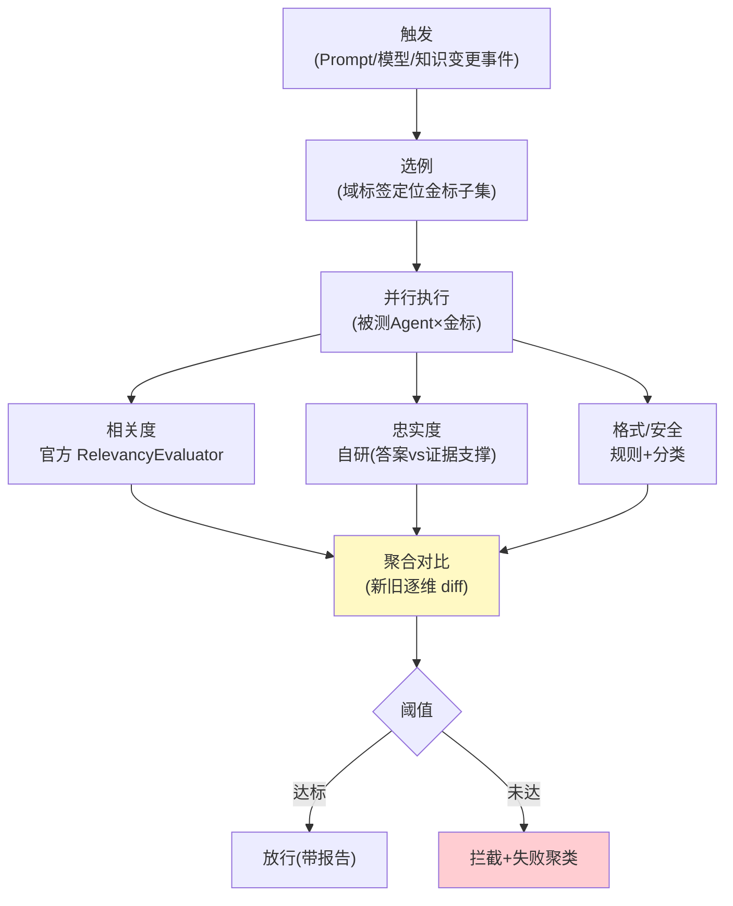

# 03-迭代二：离线评估流水线——发布前回归 / Judge 工程化 / 幻觉检测

> **定位**：建**离线流水线**：发布触发（新 Prompt/模型/知识版本→自动回归）、**Judge 工程化**（官方 Evaluator+自研忠实度/格式 Judge；偏差控制——Judge 与被测异模型）、**幻觉检测**（答案 vs 检索证据的支撑度）、**回归对比报告**（新旧版本逐维 diff）。读者画像：要"发布必过闸"的读者。前置阅读：[02-迭代一-金标资产化](02-迭代一-金标资产化.md)、[附录 12-评估与可观测生态]。
>
> **铁律 0**：官方 `RelevancyEvaluator`/`FactCheckingEvaluator` 实证；忠实度 Judge 自研标注。

---

## 一、四问

| 问 | 答 |
|----|----|
| **新增了什么需求** | ① 发布触发回归（变更事件→自动跑受影响域）② 多维判分（相关度官方/忠实度自研/格式规则/安全分类）③ Judge 偏差控制（异模型裁判/抽样人审校准）④ 对比报告（新旧逐维 diff+失败例聚类） |
| **影响了哪些模块** | 新增 `eval-pipeline`；对接发布事件（平台灰度联动概念） |
| **架构如何演进** | 手工跑 → 触发式流水线 |
| **上一版痛点** | 手工评估（02 §四） |

**本迭代验收**：① 变更事件→自动回归→报告 ≤30min（500 例）② 忠实度 Judge 抽样人审一致率 ≥75% ③ 报告含新旧对比+失败聚类 ④ 阈值判定（低于线=不放行）。

---

## 二、流水线架构



```java
// 忠实度 Judge（自研骨架）——逐句判定答案是否有证据支撑：
// for (sentence in split(answer)) {
//     supported = any(evidence, e -> entailment(judge, sentence, e))   // NLI 式判定
// }
// faithfulness = supportedCount / sentenceCount   // 无支撑句=潜在幻觉
// 偏差纪律：judge 模型 ≠ 被测模型（防同源偏好）；月度抽样人审校准 Judge
```

## 三、对比报告契约

```json
{ "trigger": "prompt-v12", "goldenVersion": 7, "cases": 500,
  "new": {"relevancy": 0.91, "faithfulness": 0.86, "format": 0.98, "safety": 1.0},
  "old": {"relevancy": 0.90, "faithfulness": 0.88, "format": 0.97, "safety": 1.0},
  "regressions": ["case-217 忠实度 0.9→0.4（幻觉：编造退款政策）"],
  "verdict": "BLOCK" }
```

**纪律**：忠实度下降是最高优先回归（幻觉>格式>相关度波动）；拦截报告必须给失败例聚类（改哪里）。

## 四、评估批次进度可见（批量任务的过程透明）

> 过程可见性是工业级标配（[附录 14/01]）。评测流水线是**长时间批量任务**，用户要实时知道批次跑到哪、多少通过多少失败、卡在哪类——不能"提交后等 30min 只给一个最终分数"。

流水线 emit 批次进度事件：`{batchId, 已跑, 总数, 通过率, 当前样例{id,判定}, 失败簇计数}`：

| 维度 | 事件 | 用户看到 |
|------|------|---------|
| 批次进度 | BatchProgress{done,total,通过率}` | "进度 62/500，通过率 0.91" |
| 失败定位 | CaseFailed{caseId,维度}` | "失败集中在'忠实度'维度" |
| 阶段 | StageEntered{金标回归/红队}` | "当前在跑红队对抗集" |
| 抽样判例 | SampleVerdict{caseId,分,reason}` | 可点开单例判分 | 

**四条纪律**：
1. **进度可算**：BatchProgress 带 done/total，前端渲染进度条；失败样例实时汇总成簇（不逐个刷屏）。
2. **失败即定位**：失败样例立即聚簇上报（按失败维度），用户不用等批完才知道哪坏——与 03 的"失败聚类"呼应，只是提前到批中。
3. **样例可下钻**：SampleVerdict 带 caseId，点开看该例的判分与 reason（可审计，呼应 06 可解释性）。
4. **批中止可恢复**：批次阶段事件使中途失败可断点续跑（对齐 06 的 RESUMED 语义），无样例重评浪费。

**验证**（叠加本迭代验证包）：提交 500 例批 → 事件流 BatchProgress 递增到 500；注入一批低忠实度样例 → CaseFailed 聚簇为"忠实度"簇；点开某 SampleVerdict 可返回 caseId 原例。

## 五、验证包（手工测试与验证）
**前置条件**：流水线（触发→执行→判分→报告→闸门）+异模型 Judge+忠实度自研实现。

**材料 A——坏版本注入**：Prompt v12-bad（故意允许编造）。

**材料 B——人审样本**：忠实度 Judge 判分抽 50 例。

**步骤与断言**：

| # | 操作 | 预期（PASS 判据） |
|---|------|------------------|
| 1 | 提交正常 v12 → 触发流水线 | ≤30min 出报告（500 例并行） |
| 2 | 材料A v12-bad | 报告 BLOCK（幻觉维度跌破阈值） |
| 3 | 材料B 一致率 | Judge vs 人审 ≥75% |
| 4 | 报告检查 | 含新旧版本逐例 diff + 失败聚类（非裸分数） |
| 5 | 限流验证 | 并行执行时模型配额未打爆（并发数=配置值） |

**失败排查**：②漏放行→忠实度 Judge 未接 grounded 检索文档；③一致率低→Judge 与被测同源（同源偏好，换异模型）；⑤打爆→并发限制未生效。


## 六、本迭代痛点

发布前有了，线上降级仍静默 → 04 在线哨兵。

## 七、验收对照

| 验收项 | 标准 | 状态 |
|--------|------|------|
| 触发回归 | ≤30min/500 例 | ✅ |
| 多维判分 | 官方+自研+规则 | ✅ |
| 对比报告 | diff+聚类+阈值 | ✅ |
| Judge 校准 | 一致率 ≥75% | ✅ |

**下一篇**：[04-迭代三-在线哨兵与漂移告警](04-迭代三-在线哨兵与漂移告警.md)。
