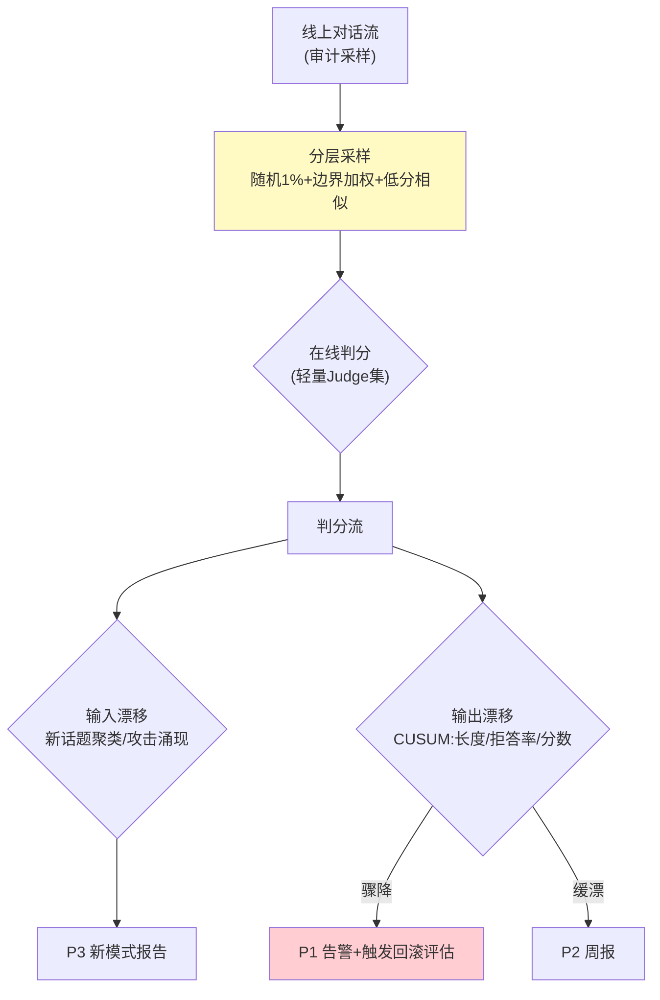

# 04-在线哨兵与漂移告警——采样评估 / 漂移检测 / 静默降级预警

> **定位**：建**在线哨兵**：流量采样评估（1-5% 线上对话离线式判分）、**漂移检测**（输入漂移：新话题/新攻击模式；输出漂移：风格/长度/拒答率突变）、**静默降级预警**（上游模型偷偷变差/知识过期导致的效果滑坡 → ≤10min 告警）。读者画像：要"线上变差立刻知道"的读者。前置阅读：[03-离线评估流水线](03-离线评估流水线.md)。
>
> **铁律 0**：采样判分复用 03 Judge 集；漂移自研。

---

## 一、四问

| 问 | 答 |
|----|----|
| **新增了什么需求** | ① 流量采样评估（分层采样：随机+边界案例加权+低分历史相似）② 输入漂移（新话题聚类/攻击模式涌现）③ 输出漂移（长度/拒答率/风格突变——CUSUM/分布距离）④ 告警分级（P1 效果骤降/ P2 缓慢漂移/ P3 新模式发现） |
| **影响了哪些模块** | 新增 `online-sentinel`；对接审计流采样 |
| **架构如何演进** | 发布前防御 → 运行时哨兵 |
| **上一版痛点** | 线上降级静默（03 §五） |

**本迭代验收**：① 注入效果骤降（换差模型）→ P1 ≤10min ② 新攻击模式涌现 → P3 聚类报告 ③ 采样成本 ≤5% 流量 ④ 判分结果进信任分数据源（06 联动）。

### 一.1 本节核对（四问口径）

| # | 核对项 | 判据 |
|---|--------|------|
| 1 | 四问齐全 | 新增需求（四能力）/影响模块（online-sentinel）/演进（发布前→运行时）/痛点（线上降级静默）四行均有 |
| 2 | 验收四指标有落点 | P1≤10min→二 CUSUM 骤降、P3 聚类→二、≤5%→三采样、进信任分→四步骤 5 数据源，均在正文有实现 |

---

## 二、哨兵架构



```java
// 输出漂移（CUSUM 骨架）——累积和小偏移检测（比固定阈值更早发现缓漂）：
// 每窗口(5min)算指标均值 x；基线 μ（近 7 天同刻）
// cusum = max(0, cusum + (μ - x - k))    // k=容差漂移量
// cusum > h → 告警（h 调到 P2≈3天一次误报）
// 骤降：x < μ - 3σ → 直接 P1
```

### 二.1 本节测试与验证（采样、漂移双检与告警分级）

**前置条件**：分层采样+在线 Judge+CUSUM+聚类实现；灰度流量可回放。

**材料 A——P1 注入**：运行中把模型切到弱版本（mock 降智响应）。

**材料 B——P3 注入**：灌入一批新攻击话题请求。

**步骤与断言**：

| # | 操作 | 预期（PASS 判据） |
|---|------|------------------|
| 1 | 材料A | 判分骤降 → P1 告警 ≤10min |
| 2 | 材料B | 聚类报告出现新簇（簇内样本可点开） |
| 3 | 缓漂注入（每天降 1%） | CUSUM 在 3-7 天内告警（固定阈值不触发对照） |
| 4 | 全天采样审计 | 采样流量 ≤5%（判分调用量/总流量） |
| 5 | 在线分数入信任分数据源 | 06 前置验证（数据源可查） |

**失败排查**：①告警慢→采样间隔过长；③检不出→CUSUM 参考窗口太短；④超 5%→判分没有分层（长会话被多段重复采样）。

## 三、采样策略

| 层 | 占比 | 目的 |
|----|------|------|
| 随机 | 1% | 整体基线 |
| 边界加权 | 长对话/多工具/高延迟 ×2 | 脆弱路径覆盖 |
| 低分相似 | 历史低分问题的相似新对话 ×5 | 回归复发早发现 |

### 三.1 本节核对（采样策略）

| # | 核对项 | 判据 |
|---|--------|------|
| 1 | 三层占比与目的能复述 | 随机=基线、边界加权=脆弱路径、低分相似=复发早发现，与二.1 步骤 4 的 ≤5% 预算自洽 |
| 2 | 分层覆盖 | §一 四问的"分层采样（随机+边界加权+低分相似）"与本章表格逐项对应 |

## 四、全篇回归验证

**回归断言**（§二.1/§三.1 各节验证通过后的整体验收）：

| # | 操作 | 预期（PASS 判据） |
|---|------|------------------|
| 1 | P1 注入+缓漂+新话题三类并发 | 三路告警各自出现且分类正确（P1≤10min / P2 周报 / P3 聚类），互不串扰 |
| 2 | 判分流 7 天窗口 | 总采样率保持 ≤5%，CUSUM 基线 μ 随近 7 天同刻自动滚动更新 |

**失败排查**：告警互串→告警分级判定条件重叠；基线不更新→μ 窗口未随日期滚动（参考窗口固定）。

## 五、本迭代痛点

效果哨兵有了；对抗面（恶意）缺专门基建 → 05 红队。

> 本节核对（一句话）：痛点（对抗面缺专门基建）与 05 红队基建（对抗集/拦截率/变异自动化）方案对应，痛点不被搁置即 PASS。

## 六、验收对照

| 验收项 | 标准 | 状态 |
|--------|------|------|
| 采样评估 | ≤5% 成本 | ✅ |
| 漂移双检 | 输入+输出 | ✅ |
| 告警分级 | P1≤10min | ✅ |
| 数据联动 | 进信任分源 | ✅ |

> 本节核对（一句话）：四条验收与 §一 本迭代验收、§二.1/§三.1 步骤断言逐一对照一致即 PASS。

**下一篇**：[05-红队对抗与安全评估](05-红队对抗与安全评估.md)。
