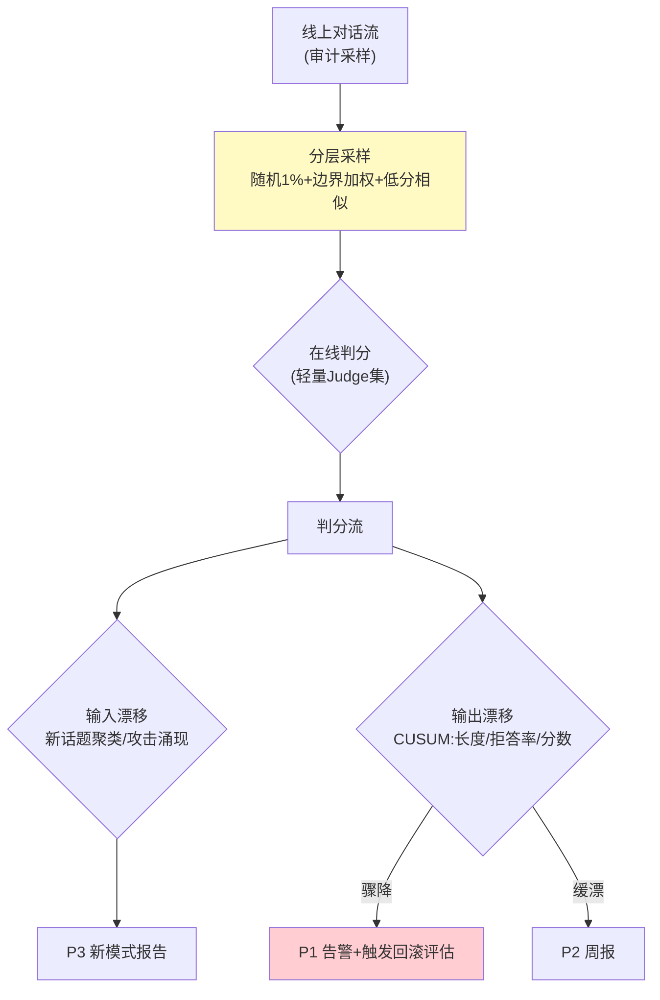

# 04-迭代三：在线哨兵与漂移告警——采样评估 / 漂移检测 / 静默降级预警

> **定位**：建**在线哨兵**：流量采样评估（1-5% 线上对话离线式判分）、**漂移检测**（输入漂移：新话题/新攻击模式；输出漂移：风格/长度/拒答率突变）、**静默降级预警**（上游模型偷偷变差/知识过期导致的效果滑坡 → ≤10min 告警）。读者画像：要"线上变差立刻知道"的读者。前置阅读：[03-迭代二-离线评估流水线](03-迭代二-离线评估流水线.md)。
>
> **铁律 0**：采样判分复用 03 Judge 集；漂移自研。

---

## 一、四问

| 问 | 答 |
|----|----|
| **新增了什么需求** | ① 流量采样评估（分层采样：随机+边界案例加权+低分历史相似）② 输入漂移（新话题聚类/攻击模式涌现）③ 输出漂移（长度/拒答率/风格突变——CUSUM/分布距离）④ 告警分级（P1 效果骤降/ P2 缓慢漂移/ P3 新模式发现） |
| **影响了哪些模块** | 新增 `online-sentinel`；对接审计流采样 |
| **架构如何演进** | 发布前防御 → 运行时哨兵 |
| **上一版痛点** | 线上降级静默（03 §五） |

**本迭代验收**：① 注入效果骤降（换差模型）→ P1 ≤10min ② 新攻击模式涌现 → P3 聚类报告 ③ 采样成本 ≤5% 流量 ④ 判分结果进信任分数据源（06 联动）。

---

## 二、哨兵架构



```java
// 输出漂移（CUSUM 骨架）——累积和小偏移检测（比固定阈值更早发现缓漂）：
// 每窗口(5min)算指标均值 x；基线 μ（近 7 天同刻）
// cusum = max(0, cusum + (μ - x - k))    // k=容差漂移量
// cusum > h → 告警（h 调到 P2≈3天一次误报）
// 骤降：x < μ - 3σ → 直接 P1
```

## 三、采样策略

| 层 | 占比 | 目的 |
|----|------|------|
| 随机 | 1% | 整体基线 |
| 边界加权 | 长对话/多工具/高延迟 ×2 | 脆弱路径覆盖 |
| 低分相似 | 历史低分问题的相似新对话 ×5 | 回归复发早发现 |

## 四、测试与验证

```bash
# 1. P1：运行中把模型切到弱版 → 判分骤降 → ≤10min 告警
# 2. P3：构造新攻击话题涌入 → 聚类报告出现新簇
# 3. 成本：采样流量 ≤5%（判分调用配额核对）
# 4. 联动：在线分数进信任分数据源（06 前置验证）
```

## 五、本迭代痛点

效果哨兵有了；对抗面（恶意）缺专门基建 → 05 红队。

## 六、验收对照

| 验收项 | 标准 | 状态 |
|--------|------|------|
| 采样评估 | ≤5% 成本 | ✅ |
| 漂移双检 | 输入+输出 | ✅ |
| 告警分级 | P1≤10min | ✅ |
| 数据联动 | 进信任分源 | ✅ |

**下一篇**：[05-迭代四-红队对抗与安全评估](05-迭代四-红队对抗与安全评估.md)。
