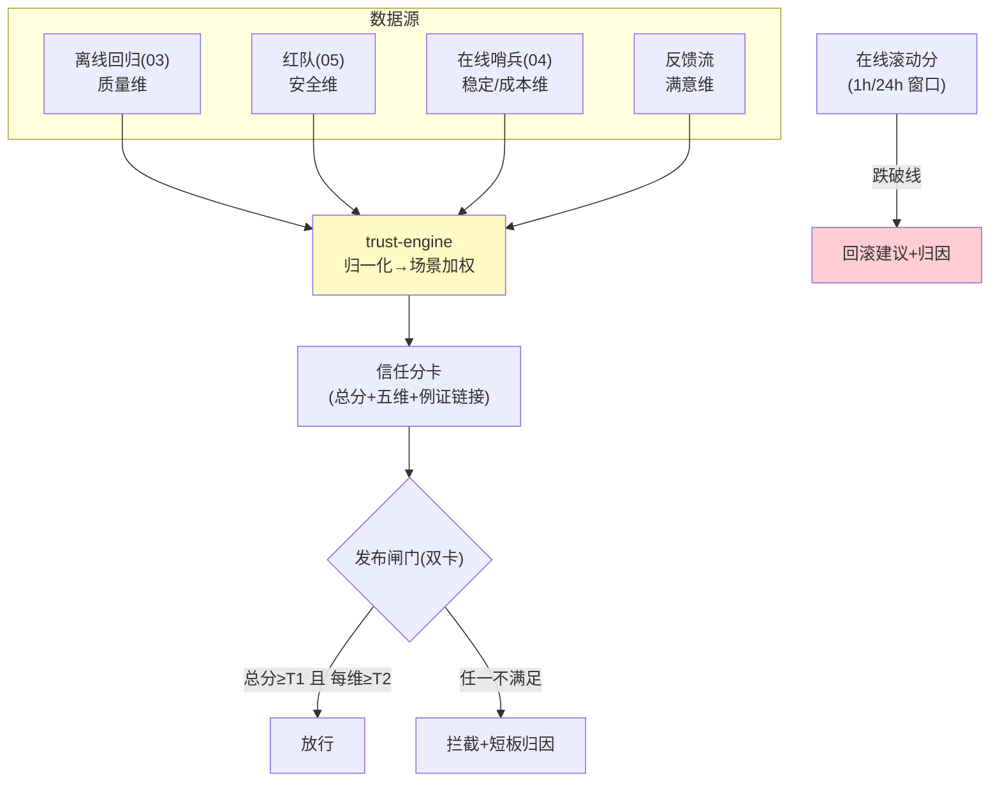

# 06-迭代五：信任评分与发布闸门——五维信任分 / 自动闸门 / 回滚触发

> **定位**：建**信任分引擎**：五维聚合（质量/安全/稳定/成本/满意——离线+在线+红队数据源汇入）、**场景权重**（风控安全×3 / 客服满意×2——一套分场景可调）、**发布闸门自动化**（信任分+分维阈值双卡——总分过但安全维塌也拦）、**回滚触发**（在线信任分跌破线→自动建议回滚/降级——04 P1 的决策化）。读者画像：要"一个分数回答敢不敢上"的读者。前置阅读：[05-迭代四-红队对抗与安全评估](05-迭代四-红队对抗与安全评估.md)。
>
> **铁律 0**：引擎自研；数据源均来自 03-05 实测。

---

## 一、四问

| 问 | 答 |
|----|----|
| **新增了什么需求** | ① 五维聚合（各维归一化 0-1→加权信任分）② 场景权重配置（发布时选场景模板）③ 双卡闸门（总分 ≥T1 且每维 ≥T2——防"平均掩盖短板"）④ 在线信任分滚动计算（近 1h/24h 窗口）+ 回滚建议 |
| **影响了哪些模块** | 新增 `trust-engine`；发布流程（闸门）与运维（回滚）对接 |
| **架构如何演进** | 报告堆 → 决策引擎 |
| **上一版痛点** | 决策靠人拼报告（05 §四） |

**本迭代验收**：① 每次发布自动出五维信任分（报告含分数卡）② 双卡闸门：总分过+安全塌的版本被拦 ③ 在线跌破 → ≤15min 回滚建议（含归因维度）④ 分数可解释（每维溯源到例证）。

---

## 二、信任分引擎



```java
// 信任分（骨架）：
// trust = wq*quality + ws*safety + wt*stability + wc*costEff + wf*satisfaction
// 双卡：trust >= T1(如0.85) && every(dim >= T2(安全维 T2=0.99 上调))
// 例证链接：每维分数附 top-N 失败例（可信度：分数不是黑盒）
// 回滚：在线 1h 窗口 trust < T3(如0.75) → 建议回滚+指出塌的维度
```

## 三、场景权重模板

| 场景 | 安全 | 质量 | 满意 | 稳定 | 成本 |
|------|------|------|------|------|------|
| 风控 | ×3 | ×1.5 | ×0.5 | ×1 | ×0.5 |
| 客服 | ×1.5 | ×1.5 | ×2 | ×1 | ×1 |
| 内部工具 | ×1 | ×1 | ×1 | ×1 | ×1.5 |

## 四、验证包（手工测试与验证）
**前置条件**：五维信任分引擎+双卡闸门+回滚联动实现。

**材料 A——短板版本**：总分 0.87、安全维 0.97（风控场景下限 0.99）。

**材料 B——线上滑坡**：注入在线效果逐日下降。

**步骤与断言**：

| # | 操作 | 预期（PASS 判据） |
|---|------|------------------|
| 1 | 新版本发布 | 自动出分卡；双卡判定（总分卡+分维下限卡） |
| 2 | 材料A | 拦截（安全短板），拦截理由含维度归因 |
| 3 | 材料B | 在线分跌破阈值 → ≤15min 建议回滚；归因到正确维度 |
| 4 | 分卡可解释性 | 每维可点开失败例证（caseId 链回原始样本） |
| 5 | 场景权重 | 风控场景安全×3 vs 客服满意×2 分卡结果不同 |

**失败排查**：②只看总分→下限卡未启用；③回滚慢→在线分数进信任分的频率太低；⑤权重不生效→场景模板没挂到 Agent 注册信息。


## 五、本迭代痛点

分数与闸门闭环了；差例→修复的回流缺实验化 → 07 飞轮与 A/B。

## 六、验收对照

| 验收项 | 标准 | 状态 |
|--------|------|------|
| 五维分卡 | 自动+可解释 | ✅ |
| 双卡闸门 | 短板拦截 | ✅ |
| 回滚建议 | ≤15min+归因 | ✅ |
| 场景权重 | 模板化 | ✅ |

**下一篇**：[07-迭代六-飞轮与AB实验](07-迭代六-飞轮与AB实验.md)。
