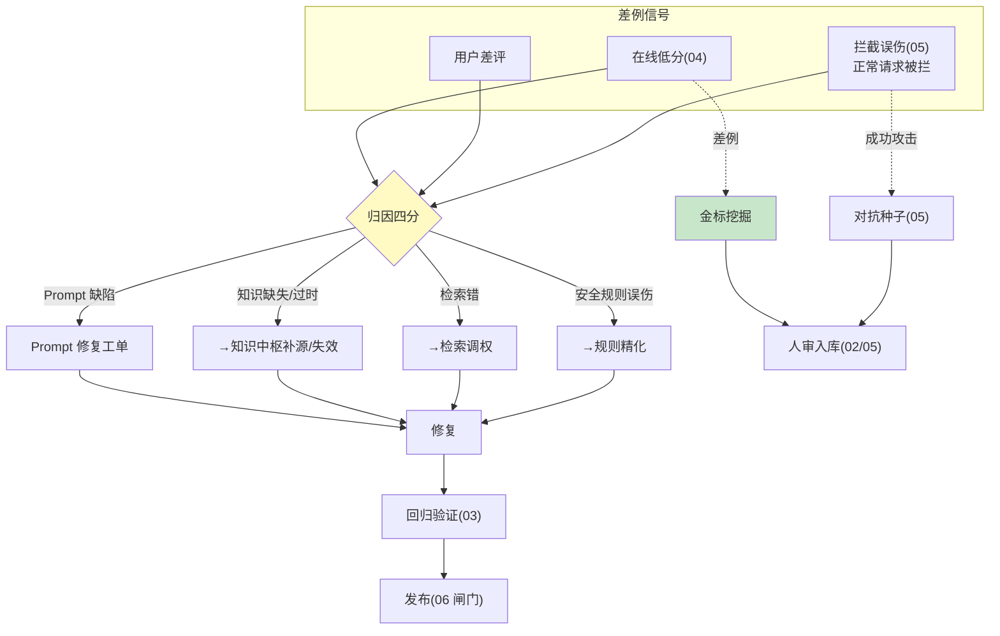

# 07-迭代六：飞轮与 A/B 实验——差例归因回流 / 实验统计 / 金标挖掘

> **定位**：收官闭环：**差例归因回流**（低分/差评/拦截误伤三类 → 归因到 Prompt/知识/检索/安全规则 → 定向修复工单）、**A/B 实验统计**（两版本分流 → 显著性判定——防"看均值拍板"）、**金标挖掘飞轮**（差例→候选金标/对抗种子双通道）。读者画像：要"越跑越好"的读者。前置阅读：[06-迭代五-信任评分与发布闸门](06-迭代五-信任评分与发布闸门.md)、[教程 41-数据飞轮与持续改进]、[附录 12/03-在线实验与AB统计]。
>
> **铁律 0**：统计与归因自研。

---

## 一、四问

| 问 | 答 |
|----|----|
| **新增了什么需求** | ① 差例归因（三类信号→四类根因→修复工单）② A/B 框架（分流/指标/显著性——t 检验或 bootstrap）③ 金标挖掘双通道（差例→金标候选 / 攻击成功例→对抗种子）④ 飞轮度量（修复→回归验证→上线→效果变化的闭环追踪） |
| **影响了哪些模块** | 新增 `flywheel-svc`；对接工单与金标（02） |
| **架构如何演进** | 评估防御 → 持续改进引擎 |
| **上一版痛点** | 闸门闭环但差例不回流（06 §五） |

**本迭代验收**：① 差例→归因→工单→修复→回归验证全链可走 ② A/B 显著性判定（p<0.05 才结论）③ 挖掘双通道月产 ≥30 候选 ④ 飞轮周报（修复了什么/效果变化多少）。

---

## 二、飞轮架构



## 三、A/B 实验纪律

| 要素 | 规范 |
|------|------|
| 分流 | 按会话哈希（同人同组）；样本量预计算（目标效应+α=0.05） |
| 指标 | 主指标（信任分/任务完成率）+ 护栏指标（安全维不许跌） |
| 判定 | 显著性 p<0.05 才结论；护栏破即止损 |
| 时长 | ≥2 个完整业务周期（防星期效应） |
| 留档 | 实验报告归档（决策可回溯） |

## 四、测试与验证

```bash
# 1. 归因：注入 Prompt 缺陷差例 → 归因正确 → 工单 → 修复 → 回归通过 → 上线
# 2. A/B：两版分流 → 显著性判定生效（模拟 p 值）；护栏破止损
# 3. 挖掘：差例月产 ≥30 金标候选；攻击成功例进对抗种子
# 4. 周报：飞轮闭环追踪（修复 N 项/信任分 +Δ）
```

## 五、本迭代痛点

六迭代齐备 → 08 核心代码讲解统一复盘。

## 六、验收对照

| 验收项 | 标准 | 状态 |
|--------|------|------|
| 归因回流 | 四类全链 | ✅ |
| A/B 统计 | 显著性+护栏 | ✅ |
| 挖掘双通道 | 月 ≥30 | ✅ |
| 飞轮度量 | 闭环周报 | ✅ |

**下一篇**：[08-核心代码讲解](08-核心代码讲解.md)。
