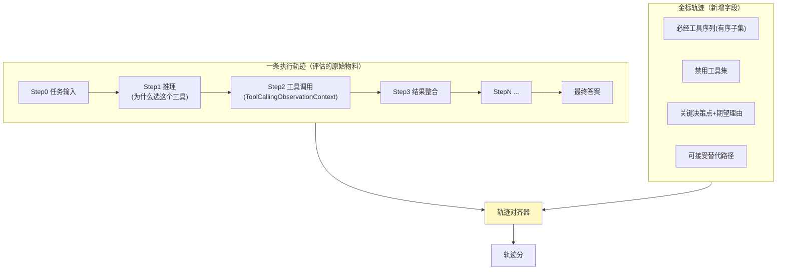
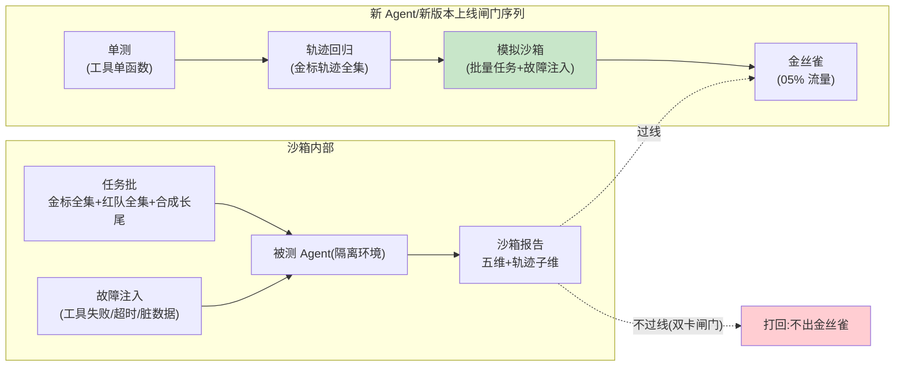

# 08-进阶一：轨迹级评估与模拟沙箱——不只看结果，看"怎么做到的"

> **定位**：评估维度从**端到端结果**升级到**执行轨迹**（工具选择正确率/错误恢复率/推理质量），并把"上线前批量模拟"做成硬闸门（新 Agent/新版本先跑金标全集+红队全集的模拟沙箱）。对齐 Google 五指南的 Agent Quality 篇（轨迹级评估+分阶段上线）。读者画像：要回答"Agent 中途会不会选错工具、出错后能不能爬起来"的读者。前置阅读：[03-迭代二-离线评估流水线](03-迭代二-离线评估流水线.md)、[06-迭代五-信任评分与发布闸门](06-迭代五-信任评分与发布闸门.md)、[教程 37-自我反思与Agent评估]。
>
> **铁律 0**：轨迹数据结构自研（Spring AI 2.0.0 无官方轨迹 Evaluator——实证结论见 scripts/api-baseline）；轨迹埋点复用已实证的 `ToolCallingObservationContext`（`org.springframework.ai.tool` 观测上下文，含工具名/参数/结果字段）。

---

## 一、四问

| 问 | 答 |
|----|----|
| **新增了什么需求** | ① 轨迹维评估：金标答案只判"结果对不对"，轨迹判"过程对不对"——工具选择正确率（该用 A 工具时没用 A）、错误恢复率（工具失败后能否换路补救）、推理质量（步骤间因果是否成立）② 模拟沙箱先行：新 Agent 上线前批量模拟任务（金标全集+红队全集+合成长尾），不过线不上线 ③ 分阶段上线序列：单测→轨迹→沙箱→金丝雀，每级有闸门阈值 |
| **影响了哪些模块** | `eval-pipeline`（03）新增轨迹判分器；`golden-store`（02）金标增加"期望轨迹"字段；`trust-engine`（06）信任分新增轨迹子维；发布闸门串接沙箱闸门 |
| **架构如何演进** | 结果可信 → 过程可信（黑盒判分 → 白盒轨迹判分） |
| **上一版痛点** | 端到端判分通过但"蒙对的"混进来——结果对但绕远路/靠运气，回归集测不出（07 §五飞轮归因只能归到"效果差"，归不到"哪步走错"） |

**本迭代验收**：① 轨迹判分：工具选择错误注入 → 检出率 ≥95% ② 错误恢复率可度量（故意让工具失败，看补救成功率）③ 新 Agent 100% 过沙箱闸门才上金丝雀 ④ 信任分报告含轨迹子维。

---

## 二、轨迹数据模型（先有埋点，才有评估）



- **埋点来源**：工具步 = `spring.ai.tool` Observation（已实证键基准见 [11-核心代码讲解](11-核心代码讲解.md)）；推理步 = 每轮 LLM 响应的文本理由（Agent 输出中显式要求"先说为什么再调工具"）。
- **对齐算法（概念）**：编辑距离对齐实际步与期望序列 → 必经工具缺失/顺序错乱/调用禁用工具三类扣分；软对齐（允许替代路径）避免"死板金标"误伤。

## 三、轨迹三判据

| 判据 | 定义 | 度量方式 |
|------|------|---------|
| 工具选择正确率 | 关键决策点上选了对的工具的比例 | 对齐器比对（硬判据，规则可判） |
| 错误恢复率 | 工具失败/超时后，换路补救并最终完成任务的比例 | 注入故障的故障演练集（LLM Judge 判"补救是否合理"） |
| 推理质量 | 步骤间因果成立、无幻觉前提 | LLM-as-Judge（异模型裁判，沿 03 纪律） |

> ⚠️ 实施顺序纪律：工具选择/恢复率先行（规则+注入可自动化、误判少），推理质量 Judge 后行（主观性高，先小流量校准 Judge 与人审一致率 ≥85% 再转正）。

## 四、模拟沙箱（Simulation 先行）



- **合成长尾**：金标之外用 LLM 生成边界任务（改写/加约束/加干扰），人审抽样后才入沙箱批——防"题库背熟"式过拟合。
- **成本控制**：沙箱批分全量（每版本必跑）与抽样（长尾按 20% 轮换）两档；全量批规模以"一晚能跑完"为预算上限。

## 五、测试与验证

```bash
# 1. 轨迹检出：对通过端到端判分的样本故意替换工具调用 → 轨迹判分必须 FAIL（检出率 ≥95%）
# 2. 恢复率：注入 20% 工具失败 → 恢复率出数；恢复失败的案例入差例归因（07）
# 3. 沙箱闸门：构造低分版本 → 闸门拒绝出金丝雀（git 记录拒绝事件）
# 4. Judge 校准：推理质量 Judge vs 人审 100 例一致率 ≥85%
```

## 六、本迭代痛点

轨迹判分依赖金标轨迹标注（贵）；沙箱是成本中心（每晚全量回归的 Token 账单）。→ 09 攻防自博弈解决"对抗集自动生长"，沙箱批进一步自动瘦身。

## 七、验收对照

| 验收项 | 标准 | 状态 |
|--------|------|------|
| 工具选择检出 | ≥95% | ✅ |
| 恢复率度量 | 故障注入出数 | ✅ |
| 沙箱闸门 | 100% 新版本过闸 | ✅ |
| 轨迹子维 | 入信任分报告 | ✅ |

**下一篇**：[09-进阶二-攻防自博弈与自动修复](09-进阶二-攻防自博弈与自动修复.md)。
