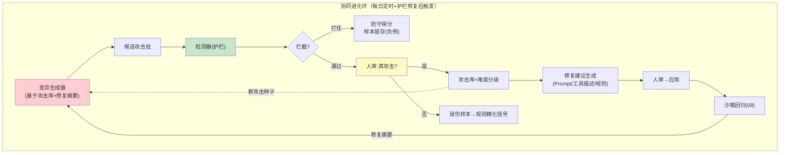
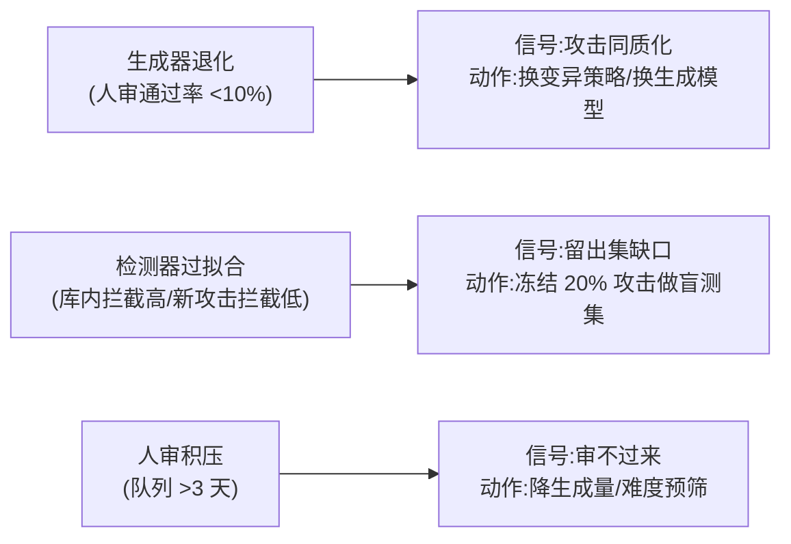

# 09-攻防自博弈与自动修复——让红队和检测器一起进化

> **定位**：把红队对抗（05）从"人工攒攻击集+人工变异"升级为**自博弈系统**：变异生成器不断造新攻击 → 检测器（护栏）拦 → 拦不住的攻击人审入库 → 护栏修复 → 生成器再针对修复后的护栏进化，形成协同进化；同时把差例归因（07）的"修复建议"从人工工单升级为**自动生成修复项**（Prompt 补丁/工具描述修正/规则精化，人审后一键应用）。读者画像：要回答"攻击集怎么持续生长、修复能不能再快一点"的读者。前置阅读：[05-红队对抗与安全评估](05-红队对抗与安全评估.md)、[07-飞轮与AB实验](07-飞轮与AB实验.md)、[教程 45-授权与最小权限]。
>
> **铁律 0**：生成器/检测器/裁判均自研编排（LLM 调用走已实证 ChatClient 基准）；无官方自博弈 API（概念代码标注）。

---

## 一、四问

| 问 | 答 |
|----|----|
| **新增了什么需求** | ① 变异生成器：基于已入库攻击自动变异（改写/编码/多语言/上下文投毒拼接），批量产出候选攻击 ② 检测器协同进化：护栏每次修复后，生成器拿到"修复摘要"定向再攻（打昨天的补丁不等于挡明天的枪）③ 攻击难度分级入库：简单攻击挡不住=高危，难攻击挡不住=低危——避免难度不分摊薄拦截率指标 ④ 自动修复建议：差例+攻击成功例 → 自动生成修复项（Prompt 补丁/工具描述修正/规则精化）→ 人审 → 应用 → 沙箱回归（08） |
| **影响了哪些模块** | `redteam-runner`（05）扩为生成器+检测器双角色；`flywheel-svc`（07）修复工单前置"自动建议"步骤；沙箱（08）承接修复回归 |
| **架构如何演进** | 对抗集静态资产 → 攻防协同进化引擎 |
| **上一版痛点** | 对抗变异靠人工模板（慢、覆盖窄）；修复靠人想方案（周期长）；护栏修复后没有机制性再攻击（05 §五） |

**本迭代验收**：① 生成器周产候选攻击 ≥200（人审通过率 ≥30%——通过率过低说明生成退化）② 修复后再攻击：针对已修复漏洞的定向再攻拦截率 ≥90% ③ 自动修复建议采纳率 ≥40% ④ 全流程人审在环（自动生成的攻击与修复均不直接生效）。

---

## 二、自博弈循环

**关键纪律**：
- **人审是闸门不是瓶颈**：人审只做二分类（真攻击/误伤）与采纳决策，不做创作——创作交给生成器。
- **难度分级**：每条攻击标注 L1（模板改写）/L2（编码混淆/多语言）/L3（多步组合/上下文投毒）；拦截率按级分层报告——L1 拦截率要求 ≥99%，L3 ≥80%，混在一起的"总拦截率"是自欺指标。
- **多 Agent 协同攻击仿真（L3 生成器核心）**：编排"诱导 Agent + 执行 Agent"两条对话，诱导 Agent 负责在共享上下文（文档/工具结果）中埋入指令，执行 Agent 是被测对象——对应间接 Prompt 注入的真实攻击形态。

## 三、自动修复建议（三类模板）

| 根因 | 自动生成物 | 人审要点 |
|------|-----------|---------|
| Prompt 缺陷 | System Prompt 补丁段（明确禁止行为/边界案例示范） | 是否过严伤正常任务 |
| 工具描述含糊 | `@Tool` description 修正稿（触发条件/参数边界写清）「概念代码，具体见 11 讲解基准」 | 是否改变调用分布 |
| 安全规则误伤 | 规则白名单/阈值微调建议 | 放宽的暴露面 |

修复应用后**必须过 08 沙箱回归**（金标全集不跌 + 攻击库定向再攻拦截达标），否则自动回滚建议——闭环为：生成→攻→审→修→归→再攻。

## 四、指标与防退化

- **盲测集（防"背题"）**：攻击库 20% 永不参与生成器训练输入，仅用于护栏评估——护栏在盲测集上的拦截率才是真实拦截率。

## 五、验证包（手工测试与验证）
**前置条件**：变异生成器+检测器+盲测集+自动修复建议+沙箱回归联动实现。

**材料 A——漏洞植入**：在护栏故意留一个可被编码绕过的注入漏洞。

**材料 B——库内过拟合**：训练护栏至库内拦截 98%。

**步骤与断言**：

| # | 操作 | 预期（PASS 判据） |
|---|------|------------------|
| 1 | 生成器周产能统计 | ≥200 候选；语义去重后多样性保留 ≥60% |
| 2 | 材料A | 生成器 ≤3 轮命中漏洞 → 修复 → 定向再攻拦截 ≥90% |
| 3 | 材料B 盲测 | 盲测集 ≥90%；差值 >8pp 触发过拟合告警 |
| 4 | 自动修复建议 | 采纳率 ≥40%；应用后 100% 过沙箱回归（0 直接生效） |
| 5 | 人审闸 | 生成的攻击与修复均人审后才入库/应用（流程断言） |

**失败排查**：①同质化→变异策略池太小；②命不中→生成器没拿到修复摘要（定向再攻失效）；④直接生效→人审闸旁路（流程漏洞，立即堵）。

## 六、本迭代痛点

平台与企业内信任仍止步于本组织——供应链上的 Agent 服务、跨组织采购的 Agent 能力，信任如何"带得走"？→ 10 跨组织信任互认与监管披露。

## 七、验收对照

| 验收项 | 标准 | 状态 |
|--------|------|------|
| 攻击产能 | 周产 ≥200（人审通过 ≥30%） | ✅ |
| 定向再攻 | 修复后拦截 ≥90% | ✅ |
| 盲测纪律 | 留出集常态化 | ✅ |
| 自动修复 | 采纳率 ≥40% + 回归强制 | ✅ |

**下一篇**：[10-跨组织信任互认与监管披露](10-跨组织信任互认与监管披露.md)。
