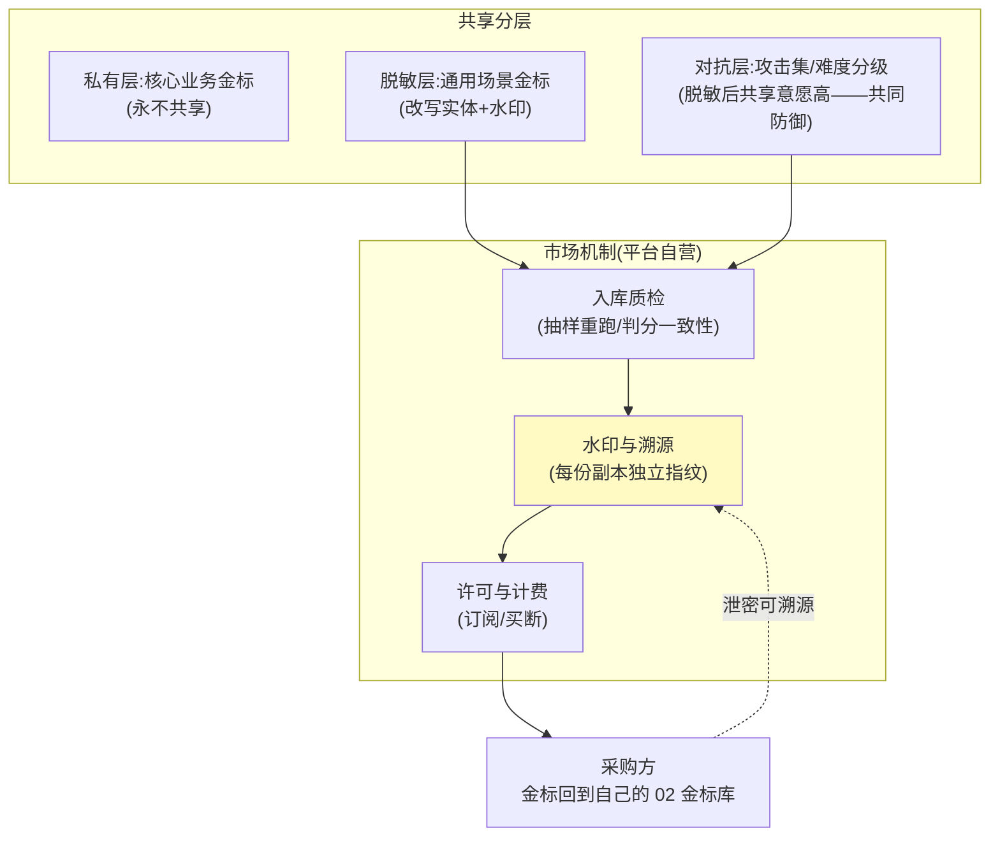
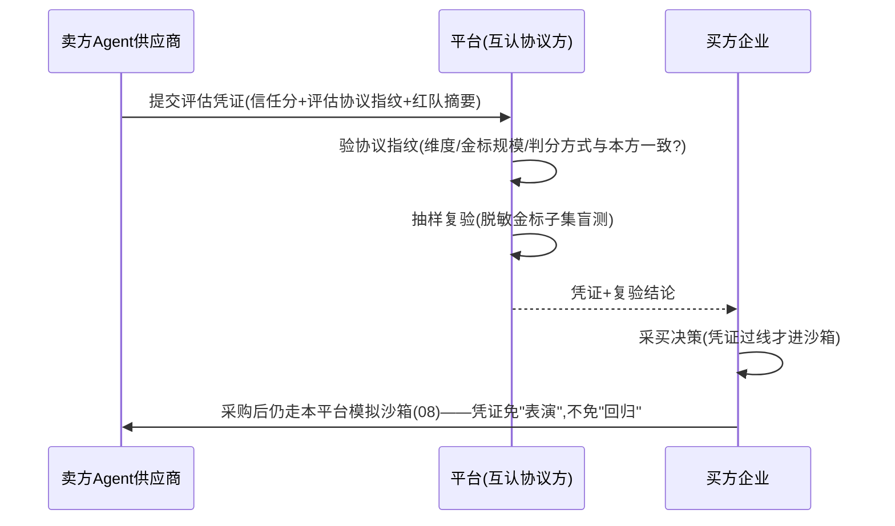

# 10-跨组织信任互认与监管披露——让信任分"带得走、查得到"

> **定位**：把信任能力从"企业内闸门"扩展为**对外资产**：① 评测市场（场景金标/对抗集的安全共享——资产变现与生态共建）② 跨组织信任互认（信任分可携带——采购第三方 Agent 能力时要求对方出示可信的评估凭证）③ 监管直连披露（EU AI Act 式审计接口——监管机构按标准格式拉取评估记录，而非临时应付检查）。读者画像：要回答"买别人的 Agent 怎么验、监管来了怎么交"的读者。前置阅读：[06-信任评分与发布闸门](06-信任评分与发布闸门.md)、[教程 43-Agent治理与合规框架]。
>
> **铁律 0**：披露接口与凭证格式自研（JSON-LD 概念标注）；无官方 API。

---

## 一、四问

| 问 | 答 |
|----|----|
| **新增了什么需求** | ① 评测市场：场景金标与对抗集的**脱敏共享**（买卖/订阅），本平台做中介与质检（防"注水金标"）② 信任互认：与互认伙伴约定评估协议（维度/金标规模/判分方式），互相承认对方信任凭证——采购 Agent 时验凭证而非"演示一场" ③ 监管披露 API：评估记录、信任分历史、红队报告、回滚事件按监管格式（附录模板）可拉取、可签名、不可篡改 ④ 披露与商业机密的边界：金标本身不外泄，披露的是"怎么评的+结果" |
| **影响了哪些模块** | `golden-store`（02）增加脱敏导出与市场协议；`trust-engine`（06）增加凭证签发（含评估协议指纹）；新增 `disclosure-svc`（披露只读接口+审计留痕） |
| **架构如何演进** | 信任基础设施（内部闸门）→ 信任协议（组织间通用语） |
| **上一版痛点** | 信任分只在本组织有意义；采购第三方 Agent 靠 POC 表演；监管检查临时拼材料（07/09 均未触及组织边界） |

**本迭代验收**：① 金标脱敏导出：人审抽查 0 泄密、注入水印可溯源 ② 互认凭证：与 ≥1 试点伙伴完成凭证验签闭环 ③ 披露 API：按模板一次拉全 12 个月记录、签名验证通过 ④ 披露调用 100% 留审计痕。

---

## 二、评测市场：金标共享的信任问题

金标是护城河（00），共享会不会自废武功？——分层共享：

- **防注水质检**：卖方金标入库前用买方视角抽 10% 由市场自己的 Judge 重判——判分一致率 <90% 拒收。
- **对抗集共享是最佳切入点**：攻击集不泄露业务（天然脱敏），且"共同防御"激励一致——L2 层先行做活市场。

## 三、跨组织信任互认

**互认协议核心条款**（简化）：评估维度集合、金标最低规模与盲测比例、Judge 异模型与一致率下限、凭证有效期（≤90 天，过期重评）、撤销机制（发现造假全量拉黑）。

> 纪律：**凭证减面试，不减回归**——凭证只能免"从零考察"，被采购的 Agent 进本组织前仍必过自家沙箱闸门（08）。信任转移的是考察成本，不是最终责任。

## 四、监管直连披露

| 披露项 | 内容 | 频率 |
|--------|------|------|
| 评估记录 | 每版本五维信任分+金标/红队规模 | 每版本 |
| 闸门与回滚 | 拦截的发布/触发回滚事件及原因 | 事件驱动 |
| 在线哨兵摘要 | 漂移/降级告警与处置 | 月度 |
| 红队报告 | 分级拦截率（脱敏攻击模式统计） | 季度 |
| 互认与采购 | 凭证验签与复验记录 | 事件驱动 |

- **只读+签名**：披露接口只读，响应整体签名；记录不可篡改（账本式追加，与 06 信任分历史同源）。
- **模板化**：按监管模板字段映射一次配置——检查不再是"临时攒材料"而是"开权限"。

## 五、验证包（手工测试与验证）
**前置条件**：脱敏导出+水印+互认凭证签发验签+披露 API+审计留痕实现。

**材料 A——脱敏导出批**：100 份场景金标；复制一份模拟外流。

**材料 B——凭证生命周期**：签发→验签→过期→撤销四步样本。

**步骤与断言**：

| # | 操作 | 预期（PASS 判据） |
|---|------|------------------|
| 1 | 材料A 导出+人审 | 0 实体泄露；复制品可由水印定位到买家 |
| 2 | 材料B 全周期 | 验签通过→过期拒绝→撤销后拒绝；互认协议指纹校验生效 |
| 3 | 披露 API 拉取 12 个月记录 | 模板字段全、<30s；响应签名验证通过 |
| 4 | 篡改任一评估记录再拉取 | 验签失败（不可篡改证明） |
| 5 | 披露调用日志审计 | 100% 留痕（谁在何时拉了什么） |

**失败排查**：①泄露→改写规则漏了某实体类型（NER 召回不足，补规则）；④验签过→签名未覆盖全部记录（只签了响应头）；⑤无痕→披露走旁路读库。

## 六、本迭代痛点

互认依赖伙伴、市场依赖生态——单平台推不动行业标准。行业协议（谁定义"信任分的 SI 单位制"）是 v4 生态议题 → 13 前沿收官讨论。

## 七、验收对照

| 验收项 | 标准 | 状态 |
|--------|------|------|
| 脱敏与溯源 | 0 泄密+水印可溯源 | ✅ |
| 互认闭环 | 试点全生命周期 | ✅ |
| 披露 API | 模板化+签名+审计 | ✅ |
| 凭证纪律 | 减面试不减回归 | ✅ |

**下一篇**：[11-核心代码讲解](11-核心代码讲解.md)。
