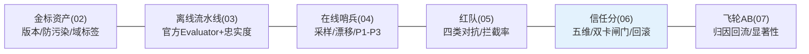

# 11-核心代码讲解：一次发布的信任旅程

> **定位**：复盘平台关键实现，并以**一次 Prompt v12 发布的完整信任旅程**串起六迭代。前置阅读：[02-迭代一-金标资产化](02-迭代一-金标资产化.md) 至 [07-迭代六-飞轮与AB实验](07-迭代六-飞轮与AB实验.md)。

---

## 一、机制速查



## 二、完整旅程（Prompt v12 从发布到飞轮）

```mermaid
sequenceDiagram
    participant DEV as 开发者
    participant PIPE as 离线流水线(03)
    participant RT as 红队(05)
    participant TE as 信任分(06)
    participant OPS as 运维/在线(04)
    participant FW as 飞轮(07)

    DEV->>PIPE: 提交 Prompt v12
    PIPE->>PIPE: 域定位金标(02)→500 例回归
    PIPE->>PIPE: 相关度0.91↑ 忠实度0.86↑ 格式0.98
    RT->>RT: 对抗 500 例→拦截率 99.4%
    PIPE & RT --> TE
    TE->>TE: 信任分卡: 总0.90✓ 安全0.994✓(双卡过)
    TE-->>DEV: 放行(带分卡+例证)
    Note over OPS: 上线后——
    OPS->>OPS: 哨兵采样: 稳定0.95 成本效率0.88
    OPS->>FW: 发现低分例聚集(退款话术)
    FW->>FW: 归因=Prompt 缺陷→工单→修复→回归→v13
    FW->>FW: 差例→金标候选×12 人审入库
    Note over FW: 越跑越好 ✅
```

**一句话**：一次发布过了 500 例金标+500 例红队+双卡闸门才上线，线上哨兵盯着，差例自动回流成 v13 和新金标——六迭代各就各位。

## 三、关键设计复盘

| # | 设计 | 为什么 |
|---|------|--------|
| 1 | 金标=防污染资产 | 背答案的评测是假护城河 |
| 2 | 官方 Evaluator+自研忠实度互补 | 相关≠无幻觉 |
| 3 | 双卡闸门 | 平均分掩盖安全短板 |
| 4 | CUSUM 缓漂检测 | 固定阈值发现不了缓慢滑坡 |
| 5 | 对抗变异自动化 | 攻击面指数增长，人写跟不上 |
| 6 | 飞轮双通道挖掘 | 差例既修当下也防未来 |

## 四、测试与验证

按 §二旅程逐跳断言（各迭代已有用例）；全链演练脚本（发布→滑坡→回滚→修复）季度例行。

**下一篇**：[12-ADR架构决策记录](12-ADR架构决策记录.md)。
