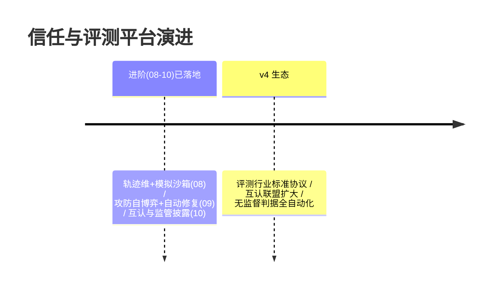

# 13-工业前沿与演进方向：信任与评测的 2026 校准与收官

> **定位**：用 2026 真实工业实践校准方向，给缺口与 v4 演进，项目收官。前置阅读：[12-ADR架构决策记录](12-ADR架构决策记录.md)。
>
> **来源**：真实外部资料（链接文内）。

---

## 一、行业信号

- **AWS**（[企业生产级指南](https://cloud.it168.com/a2026/0708/6939/000006939041.shtml)）：**评估驱动开发**为第一范式——六步闭环（定义标准→开发→评估→灰度→监控→改进）、八维评估、三层指标库；金标与评分标准**企业自持**是核心竞争力——本平台是其完整基础设施化。
- **Google**（[五指南](https://cloud.google.com/blog/topics/developers-practitioners/five-guides-to-building-and-scaling-production-ready-ai-agents)）：Agent Quality 篇提出**轨迹级评估**（工具选择/推理质量/错误恢复）+ 分阶段上线（单测→轨迹→沙箱→金丝雀）——本平台 v2 的轨迹维对应。
- **Nebius**（[Blueprint](https://nebius.com/blog/posts/introducing-the-nebius-agents-blueprint)）：**Simulation（模拟先行）**——上线前批量模拟任务产出回归集——对应本平台 v2（新 Agent 上线前模拟跑金标全集+红队全集）。
- **Arthur.ai**（[上线清单](https://www.arthur.ai/blog/checklist-to-launch-a-production-ready-ai-agent)）："埋点一切（Prompt/token/工具/检索/决策点）——看不见就修不了"——对应本平台 04 在线哨兵的数据面纪律。

---

## 二、现状对照（N1-N6）

| # | 前沿能力 | 现状 | 缺口/演进 |
|---|---------|------|----------|
| N1 | 评估驱动闭环（六步） | ✅ 03-07 | ✅ 同构 |
| N2 | 轨迹级评估（工具选择/恢复） | ✅ 08（轨迹维+故障注入） | ✅ |
| N3 | 模拟先行 | ✅ 08（沙箱闸门先行） | ✅ |
| N4 | 金标防污染 | ✅ 指纹 | ✅ |
| N5 | 在线无监督评估 | ✅ 采样+漂移 | 🔶 二元化具体判据（v4 细化） |
| N6 | 对抗自动化 | ✅ 09（攻防自博弈+盲测集） | 🔷 v4：生成器与检测器全自动化闭环（去人审化） |

---

## 三、演进路线



## 四、六旗舰对照收官（14-19）

| 视角 | 14 平台 | 15 内核 | 16 网格 | 17 实时 | 18 知识 | **19 评测** |
|------|--------|--------|--------|--------|--------|------------|
| 第一性 | 治理全景 | 资源托管 | 零改造 | 延迟预算 | 知识可信 | **效果可信** |
| 护城河 | 治理能力 | 运行机制 | 接入规模 | 实时体验 | 知识资产 | **金标资产** |
| 时间观 | 策略周期 | 进程周期 | 配置周期 | 毫秒 | 知识生命周期 | **版本生命周期** |

> 六旗舰共同回答"企业级 Agent 基础设施全景"：六种第一性原理六套蓝图，可组合——评测平台给其他五旗舰的所有版本发"信任通行证"。

## 五、检验方式

```bash
# 对照：本平台闭环 vs AWS 六步逐句同构自查
# v2 PoC：轨迹维判分（工具选择错误注入→检出）
```

## 六、项目收官

| 阶段 | 篇目 | 交付 |
|------|------|------|
| 基础（00-01） | 五维信任模型/最小回归 | 决策引擎雏形 |
| 六迭代（02-07） | 金标/离线/在线/红队/信任分/飞轮 | 完整评测基础设施 |
| 进阶（08-10） | 轨迹沙箱/攻防自博弈/互认披露 | 过程可信+协同进化+信任外溢 |
| 资产（11-13） | 讲解/ADR/前沿 | 信任旅程复盘+10 条决策+六旗舰收官 |

项目 19 到此收官：**金标资产自持、双维评估（效果+安全+轨迹）、双卡闸门、模拟沙箱先行、在线哨兵、飞轮回流、攻防自博弈、跨组织互认与监管披露**的工业级信任与评测平台蓝图。独立项目，无后续依赖。
