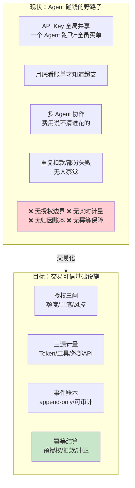
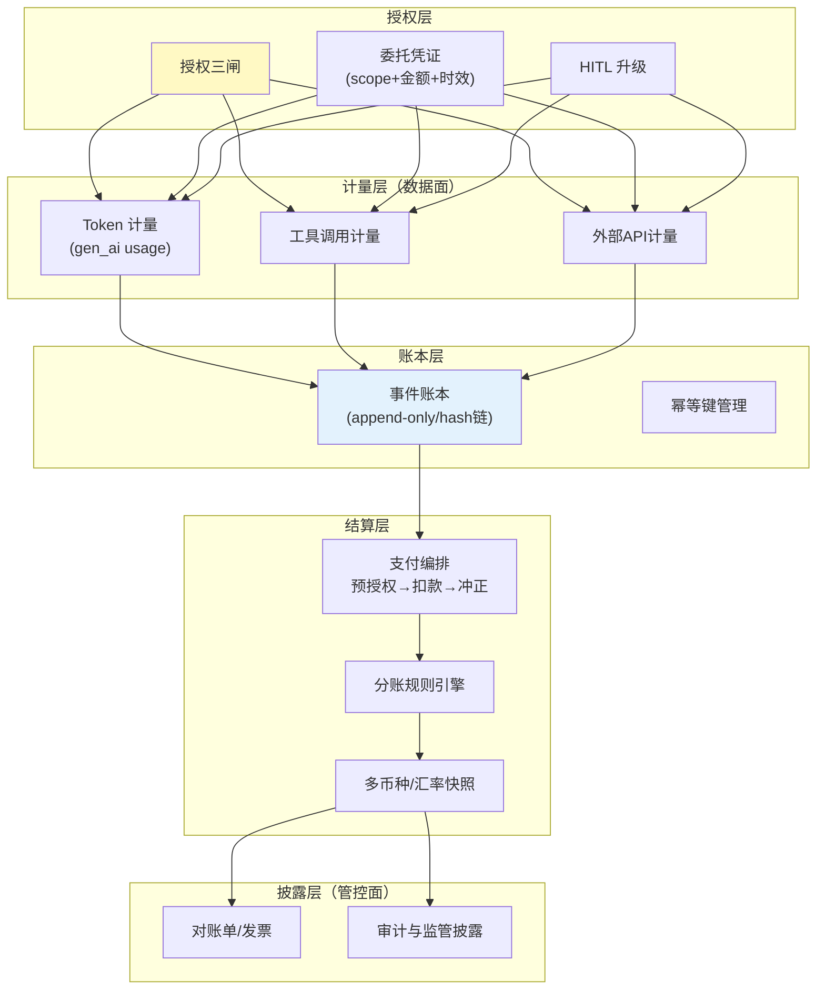
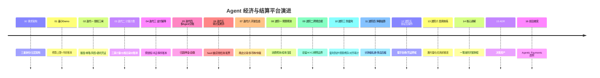

# 00-需求分析与架构设计：企业级 Agent 经济与结算平台

> **定位**：第七旗舰·**交易可信视角**——当 Agent 代替人花钱（调付费工具/买外部数据/与其它 Agent 交易），**钱必须比 Agent 本身更可信**。把授权（谁批的、批了多少、批给谁）、计量（花了多少、花在哪）、账本（每笔可追、不可篡改）、结算（幂等、可冲正）、披露（对账单/发票/审计）做成基础设施。呼应 [教程 92-Agent经济与支付集成]、[教程 45-授权与最小权限]。读者画像：要回答"让 Agent 碰钱，怎么敢"的读者。
>
> **铁律 0**：Spring AI 2.0.0 无计费/支付官方 API（实证结论见 scripts/api-baseline）；本平台计量埋点复用已实证的 Observation 体系（Token 用量、工具调用），授权/账本/结算全部自研并标注「概念代码」。

---

## ★ 阅读顺序总览（序号 = 阅读顺序）

> 本子文件夹 17 个文件（00-16）：

| 阶段 | 文件 | 读者定位 |
|------|------|---------|
| ① 全貌 | 00-需求分析与架构设计 | **先读**：三重身份、五层架构 |
| ② 起步 | 01-最小Demo | **动手**：预算上限+逐笔记账 |
| ③ 主体迭代 | 02~07（授权三闸/计量计费/支付幂等/多Agent分账/审计反欺诈/开放生态） | **严格顺序** |
| ④ 进阶 | 08~13（预算预测/跨境合规/防套利/净额结算/协议互操作/信用体系） | **严格顺序** |
| ⑤ 讲解 | 14-核心代码讲解 | **回顾** |
| ⑥ 资产 | 15-ADR / 16-前沿 | **按需/收官** |

---

## 一、为什么"Agent 经济"是独立问题域

核心判断：**传统支付系统解决"人对商家"，Agent 经济多出三层**——①委托（人授权 Agent 花钱，权责怎么划）②微额高频（单笔 $0.001 级、每秒万笔）③机器间交易（Agent 向 Agent 采购能力，无人在环时谁担责）。

### 一.1 本节核对（为什么是独立问题域）

- [ ] 能不看正文说出传统支付系统与 Agent 经济的三层差异（委托 / 微额高频 / 机器间交易），并各举一个本平台的落点
- [ ] 现状图所列四个野路子（Key 共享 / 月底看账单 / 费用说不清 / 重复扣款）各能对应到目标四件套（授权三闸 / 三源计量 / 事件账本 / 幂等结算）中的一件

## 二、三重身份（平台的三个视角）

| 身份 | 场景 | 核心诉求 |
|------|------|---------|
| 授权方 | 人把预算委托给 Agent | 边界明确、超额可拦、随时可撤 |
| 消费方 | Agent 调付费工具/买数据 | 一次授权多处可用、凭证短时效 |
| 供给方 | 本企业把 Agent 能力卖出去 | 按调用量计费、分润、防白嫖 |

> 一个企业常常三重身份同时存在——平台必须同构支持（同一套账本，不同视图）。

### 二.1 本节核对（三重身份）

- [ ] 能分别说出授权方 / 消费方 / 供给方的核心诉求（边界超额可拦 / 一次授权随处用 / 计费分润防白嫖），且"多 Agent 分账"落在哪一方清晰
- [ ] 理解"三重身份同构支持"（同一套账本、不同视图），不与 [06-审计与反欺诈] 的"归因"冲突

## 三、总体架构（五层）

### 三.1 本节核对（五层架构）

- [ ] 五层自下往上是 授权 → 计量 → 账本 → 结算 → 披露，能说出每层对应一个迭代篇（02/03/04/05/07）
- [ ] 数据面（计量 L2）与管控面（披露 L5）的分离体现在哪个服务归属哪个平面（对照 §四表格），与"管控分离"原则一致

## 四、微服务清单与迭代路线

| 服务 | 平面 | 职责 | 迭代 |
|------|------|------|------|
| `authz-svc` | 授权 | 三闸/委托凭证/撤销 | 02 |
| `metering-svc` | 计量 | 三源计量/价格目录 | 03 |
| `ledger-svc` | 账本 | append-only/幂等/对账 | 04 |
| `split-svc` | 结算 | 分账/押金/追缴 | 05 |
| `fraud-svc` | 审计 | 异常检测/双记账/发票 | 06 |
| `market-svc` | 生态 | 商店分润/仲裁/汇率 | 07 |

### 四.1 本节核对（微服务清单与演进路线）

- [ ] 六个微服务（authz/metering/ledger/split/fraud/market）与迭代篇 02-07 一一对应，无错位缺漏
- [ ] timeline 中每行版本号与对应迭代文档标题能对上号（如 07 开放生态 = 商店分润/多币种/仲裁）

## 五、量化验收（项目级）

| 指标 | 目标 |
|------|------|
| 授权覆盖 | 100% 花钱动作先过授权三闸（无旁路） |
| 计量精度 | 计量 vs 供应商账单差异 <0.1% |
| 幂等 | 重复请求 0 重复记账 |
| 可审计 | 任意一笔支出 ≤3 跳定位到授权人 |
| 超支拦截 | 超预算动作 100% 实时拦截或转 HITL |

### 五.1 本节核对（量化验收口径）

- [ ] 五项验收指标（授权覆盖 / 计量精度 / 幂等 / 可审计 / 超支拦截）均含可判定数值或 100% 强约束，非空话
- [ ] 每项指标都能在后续某迭代找到实现落点（如超支拦截 → 01 预算上限、02 授权三闸）

## 六、与教程体系的锚点

[教程 92-Agent经济与支付集成]（计费模型）、[教程 45-授权与最小权限]（凭证设计）、[教程 30-HumanInTheLoop]（审批升级）、[教程 35-可观测性]（计量埋点）、[教程 43-治理]（披露合规）。

> 本节核对（一句话）：所列五个教程锚点正好覆盖五层架构的每一层（授权/计量/治理/披露/结算预览），读者受阻时可逐条回到对应教程即可 PASS。

## 七、七旗舰对照

| 视角 | 14 平台 | 15 内核 | 16 网格 | 17 实时 | 18 知识 | 19 评测 | **20 经济** |
|------|--------|--------|--------|--------|--------|--------|------------|
| 第一性 | 治理全景 | 资源托管 | 零改造 | 延迟预算 | 知识可信 | 效果可信 | **交易可信** |
| 一句话 | 什么都能治 | 像 OS 跑 | 像网格罩 | 像真人聊 | 答得有据 | 敢不敢上生产 | **敢让它花钱** |

> 本节核对（一句话）：本项目第一性为"交易可信"、一句话为"敢让它花钱"，与其余 19-14 旗舰的定位纵向不同不混淆即 PASS。

## 八、总结

Agent 经济平台的答案只有一个：**花钱的每个环节都先有边界（授权）、后有记录（账本）、终有交代（结算披露）**。下一篇从"预算上限+逐笔记账"的最小闭环跑起。

> 本节核对（一句话）：总结的"授权→账本→结算披露"三段分别对应五层架构的授权/账本/结算披露层，且明确点出下一篇是 01-最小Demo，口径一致即 PASS。

**下一篇**：[01-最小Demo](01-最小Demo.md)。
