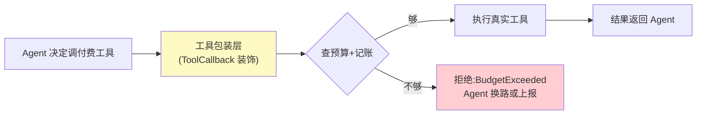

# 01-最小 Demo：预算上限 + 逐笔记账

> **定位**：用最小闭环回答"怎么敢让 Agent 花钱"：**花钱前**查预算、**花钱后**记一笔、**超预算**当场拒绝。内存实现（后续迭代落库），可测试。前置阅读：[00-需求分析与架构设计](00-需求分析与架构设计.md)、[教程 09-前沿专题/03-Agent经济与支付集成]。
>
> **铁律 0**：本篇计费/账本全自研「概念代码」；计量数据源用已实证 Observation 基准。

---

## 一、四问

| 问 | 答 |
|----|----|
| **新增了什么需求** | 最小信任闭环：① 每个 Agent 会话有预算 ② 每次付费工具调用前扣预算 ③ 每笔花费入账 ④ 超预算拒绝调用 |
| **影响了哪些模块** | 单体单类（BudgetLedger）+ 工具包装层 |
| **架构如何演进** | 从无到有：账本优先（先记账，再谈支付） |
| **上一版痛点** | 无（起点） |

**本迭代验收**：① 预算内调用全部放行且逐笔记账 ② 超预算调用实时拒绝（抛预算异常）③ 账本能回答"这个会话花了多少、买了什么"。

### 一.1 本节核对（四问口径）

| # | 核对项 | 判据 |
|---|--------|------|
| 1 | 四问齐全 | 新增需求 / 影响模块 / 架构演进 / 上一版痛点四行均有，无空答 |
| 2 | 架构演进可落地 | "账本优先"对应 §二 BudgetLedger 有完整实现，"先记账再谈支付"与 01 定位一致 |

---

## 二、核心抽象（三个类搞定）

```java
// 概念代码：最小账本（内存版）
record SpendEntry(String sessionId, String toolName, BigDecimal amount,
                  Instant at, String idempotencyKey) {}

class BudgetLedger {
    private final Map<String, BigDecimal> budgets = new ConcurrentHashMap<>();
    private final List<SpendEntry> ledger = new CopyOnWriteArrayList<>();

    void grant(String sessionId, BigDecimal budget) { budgets.put(sessionId, budget); }

    /** 花钱前调用：预算不足抛异常，足够则记账 */
    void charge(String sessionId, String toolName, BigDecimal amount, String idemKey) {
        budgets.compute(sessionId, (k, remain) -> {
            if (remain.compareTo(amount) < 0)
                throw new BudgetExceededException(k, remain, amount);
            return remain.subtract(amount);
        });
        ledger.add(new SpendEntry(sessionId, toolName, amount, Instant.now(), idemKey));
    }
}
```

设计要点（三个，多了不要）：
1. **先扣后花**（reserve 语义）：预算检查与扣减在 `compute` 内原子完成——先花钱后记账必然超支。
2. **记账与扣减同事务边界**：本 demo 内存里同方法；落库后同事务（04 迭代）。
3. **幂等键字段从第一天就留**：`idempotencyKey` 本版不校验，04 迭代启用——账本 schema 一次到位，避免迁移。

### 二.1 本节测试与验证（BudgetLedger 原子扣减与记账）

**前置条件**：BudgetLedger（原子扣减版）已按本节实现；测试可运行。

**材料 A——扣减测试**（junit，断言仅覆盖本节类）：

```java
@Test void 预算内放行且逐笔记账() {
    ledger.grant("s1", new BigDecimal("10"));
    for (int i = 0; i < 5; i++) ledger.charge("s1", "weather", new BigDecimal("1"), "k" + i);
    assertEquals(0, ledger.balance("s1").compareTo(new BigDecimal("5")));
    assertEquals(5, ledger.entriesOf("s1").size());
}
@Test void 超预算拒绝且原子() {
    ledger.grant("s1", new BigDecimal("10"));
    assertThrows(BudgetExceededException.class,
        () -> ledger.charge("s1", "weather", new BigDecimal("6"), "k9"));
    assertEquals(10, ledger.balance("s1").intValue()); // 拒绝不扣减
}
```

**步骤与断言**：

| # | 操作 | 预期（PASS 判据） |
|---|------|------------------|
| 1 | 材料 A 两个用例 | 全绿；拒绝后余额不变（原子性） |
| 2 | 对账断言：∑entries 金额 == 预算-余额 | 恒等式成立 |
| 3 | `idempotencyKey` 字段存在 | 本版不校验但 schema 已留字段（设计要点 3 达成） |

**失败排查**：①拒绝仍扣减→检查与扣减不在同一原子段（必须在 `compute` 内完成）；②余额未扣→`compute` 返回的剩余未被回写。

## 三、接到 Agent 上（工具包装层）



- 包装位置：**ToolCallback 包装层**（HITL/拦截类逻辑的正确落点，见 [教程 04-企业级架构主干/01-微服务拆分与Agent部署]——非 Advisor）。
- 拒绝的艺术：拒绝信息要**可行动**（"剩余 ¥0.3，本次需 ¥0.5，可换免费数据源或申请追加"）——Agent 才能自主换路，而不是报错死循环。

### 三.1 本节测试与验证（工具包装层拦截与拒绝可行动）

**前置条件**：工具包装层（ToolCallback 装饰）实现；被包装的付费工具 mock（记执行次数）。

**材料 B——拒绝信息检查**：捕获拒绝异常的消息文本（需含剩余额度/金额/替代建议）。

**材料 C——续路检查**：被拒后 mock 一个免费工具，验证 Agent 收到可行动信息能换路。

**步骤与断言**：

| # | 操作 | 预期（PASS 判据） |
|---|------|------------------|
| 1 | 预算内走真实工具 | 付费工具被调 1 次（mock 计数 == 1），日志无拦截 |
| 2 | 超预算走拦截 | 付费工具 mock 未再被调，抛 `BudgetExceededException` |
| 3 | 检查材料 B 文本 | 含剩余额度与金额、且含替代建议（可行动） |
| 4 | 材料 C 被拒后 Agent 继续 | 收到可行动信息后能换免费工具（mock 断言免费工具被调） |
| 5 | 包装位置核对 | 拦截逻辑落在 ToolCallback 包装层，未误用 Advisor（对照 [教程 04-企业级架构主干/10-容错与弹性设计]） |

**失败排查**：①超预算仍执行真实工具→包装未真正装饰原工具（校验 `ToolCallback` 调用链）；②拒绝无建议→拒绝信息只抛了金额差，没拼可行动文案。

## 四、全篇回归验证

**回归断言**（§二.1 与 §三.1 本节验证均通过后，最终整体验收）：

| # | 操作 | 预期（PASS 判据） |
|---|------|------------------|
| 1 | 预算内连续 5 笔 + 超预算 1 笔（同一会话一个流程） | 逐一通过；最终对账恒等式成立（∑entries == 预算-余额） |
| 2 | 本迭代验收三项（放行记账 / 实时拒绝 / 账本可查"花了多少买了什么"） | 全部覆盖，任一 FAIL 即回归不通过 |

**失败排查**：整体对账不相等→§二.1 或 §三.1 的扣减/记账链路未走同一条路径，回查对应小节排查项。

## 五、本迭代痛点

预算是**全局一口价**：不管买什么、买多少、多危险，都走同一道闸——分不清"买 1 次股票数据"和"连刷 1000 次图片生成"。→ 02 授权三闸。

> 本节核对（一句话）：痛点（全局一口价、无维度细分）与下一篇 02 授权三闸（额度/单笔/风控）一一对应，痛点不被搁置即 PASS。

## 六、验收对照

| 验收项 | 标准 | 状态 |
|--------|------|------|
| 预算放行/拒绝 | 原子扣减 | ✅ |
| 逐笔记账 | 每笔可查 | ✅ |
| 可行动拒绝 | Agent 能换路 | ✅ |

> 本节核对（一句话）：三项验收（原子扣减 / 逐笔记账 / 可行动拒绝）分别对应 §二.1 步骤 1-2、§二.1 步骤 2、§三.1 步骤 3-4，与本迭代验收段落口径一致即 PASS。

**下一篇**：[02-授权三闸](02-授权三闸.md)。
