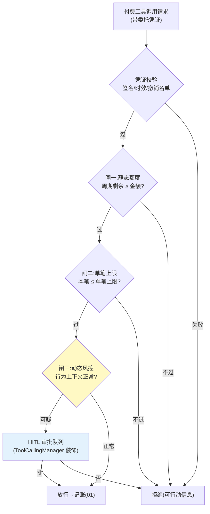

# 02-授权三闸——静态额度 / 单笔上限 / 动态风控闸

> **定位**：把 01 的一口价预算升级为**三道顺序闸门**：①静态额度（周期总额）②单笔上限（防一次跑飞）③动态风控闸（行为上下文判定——凌晨高频大额、非常规工具组合等触发拦截或 HITL）。并引入**委托凭证**（Delegation Grant）：授权的可验证载体——scope 限定工具与金额、短时效、可撤销。读者画像：要回答"怎么把授权边界划清楚"的读者。前置阅读：[01-最小Demo](01-最小Demo.md)、[教程 05-Observation可观测/12-综合实战：工业巡检Agent可观测闭环]。
>
> **铁律 0**：凭证格式自研（JWT 思路「概念代码」）；HITL 落点 = ToolCallingManager 装饰器/ToolCallback 包装（已实证基准，非 Advisor）。

---

## 一、四问

| 问 | 答 |
|----|----|
| **新增了什么需求** | ① 三闸：总额度/单笔上限/动态风控，顺序执行、任一拦截即终 ② 委托凭证：who（委托人）/whom（Agent）/scope（可花钱的工具集）/how much（额度）/until（时效）五要素，签名防篡改 ③ HITL 升级：高风险动作（首次使用某付费工具/单笔超阈值×0.5）转人工审批，批准后凭证扩权并留痕 ④ 撤销：委托人随时一键撤销，撤销传播到已签发凭证 |
| **影响了哪些模块** | 新增 `authz-svc`；01 的 BudgetLedger 改为闸门链第一环；工具包装层接入凭证校验 |
| **架构如何演进** | 记账优先 → 授权优先（先有边界，才有账） |
| **上一版痛点** | 全局一口价预算，风险不分层（01 §五） |

**本迭代验收**：① 三闸全过才扣款，风控闸拦截率可度量 ② 伪造凭证（改 scope/金额）校验失败 ③ 撤销 ≤5s 生效 ④ HITL 审批全链留痕（谁批的/批了什么）。

### 一.1 本节核对（四问口径）

| # | 核对项 | 判据 |
|---|--------|------|
| 1 | 四问齐全 | 新增需求 / 影响模块 / 架构演进 / 上一版痛点四行均有，无空答 |
| 2 | 演进与痛点对应 | "授权优先"对应 01 §五 痛点（全局一口价），新模块 authz-svc 落在 §三 有实现 |

---

## 二、三闸与凭证



**为什么是三道而不是一道**：三闸各拦一类事故——额度闸拦"累积超支"、单笔闸拦"一次跑飞"、风控闸拦"凭证被盗用/Agent 被诱导"（前两闸对盗用者完全无效，因为花得"很守规矩"）。

### 二.1 本节核对（三闸职责与次序）

- [ ] 能不看正文说出三闸各拦哪类事故（累积超支 / 一次跑飞 / 盗用诱导），并解释为何前两闸对"盗用者守规矩消费"无效
- [ ] 图内流程：凭证校验失败→拒绝；三闸任一不过→拒绝；风控闸可疑→HITL、正常→放行；HITL 批准→放行、拒绝→拒绝——与文字描述一致

## 三、委托凭证（授权的可验证载体）

```java
// 概念代码：委托凭证（JWT 思路）
record DelegationGrant(
    String grantId,          // 撤销锚点
    String principal,        // 委托人（人）
    String agentId,          // 被委托 Agent
    Set<String> toolScopes,  // 可花钱的工具集（最小权限）
    BigDecimal perCallCap,   // 单笔上限
    BigDecimal totalCap,     // 周期总额
    Instant expiresAt        // 短时效（默认 ≤24h）
) {}
// 签发：authz-svc 私钥签名；校验：网关/包装层公钥验签 + 撤销名单(Redis, TTL=时效)
```

**最小权限纪律**：scope 按**工具白名单**而非"全付费工具"；金额只给任务预算的 1.2 倍（留余量不留挥霍空间）；时效越短越好——宁可到期续签，不可长证短用。

### 三.1 本节测试与验证（委托凭证签发与验签）

**前置条件**：委托凭证签发（authz-svc 私钥签名）+ 校验（网关/包装层公钥验签 + 撤销名单）已实现。

**材料 A——凭证样例**（概念 JSON）：`grantId/principal/agentId/toolScopes=["stock-quote"]/perCallCap=10/totalCap=50/expiresAt=+24h`。

**材料 B——篡改矩阵**：分别篡改 scope 扩权、金额上调、过期后重放、改 grantId。

**步骤与断言**：

| # | 操作 | 预期（PASS 判据） |
|---|------|------------------|
| 1 | 材料 A 合法凭证过校验 | 验签通过，取出的 scope/金额/时效与签发一致 |
| 2 | 材料 B 四类篡改凭证 | 验签全失败（4/4 拒绝） |
| 3 | 时间核对 | 过期凭证（expiresAt 已过）被拒；撤销名单内 grantId 被拒 |
| 4 | 最小权限核对 | 凭证 toolScopes 是白名单（如 stock-quote），非"全付费工具"；金额为预算 1.2 倍 |

**失败排查**：①某篡改通过→签名未覆盖该字段（scope/金额必须在签名体内，payload 与 signature 分离）；②撤销不生效→撤销名单未推到校验点或缓存 TTL 太长。

## 四、风控闸信号（首批）

| 信号 | 判定 | 动作 |
|------|------|------|
| 高频连续消费 | 1min 内同工具 >N 次 | 拦截+冷却 |
| 非常规时段 | 业务低峰期大额 | HITL |
| 工具组合异常 | 任务画像外的新付费工具首次使用 | HITL |
| 余额骤降斜率 | 按当前速率撑不过任务周期 | 预警给委托人 |

### 四.1 本节核对（首批风控信号）

- [ ] 四个信号（高频 / 非常规时段 / 工具组合异常 / 余额骤降）各有判定与动作，"拦截+冷却 / HITL / 预警"三类动作分层清晰
- [ ] 每个信号都能在 §五 的 `FundEvent`（`Gate{gate, Decision}`）上落点——高危转 HITL、普通拦截，与三闸图 G3 分支一致

## 五、资金动作过程可见（结合三闸/BudgetLedger 完整实现）

> 过程可见性是工业级标配。**Agent 经济最敏感的是信任**——委托人委托 Agent 花钱，必须实时看到"钱花到哪一步、被哪个闸拦住、记了多少账"。下面是一段**可编译的完整实现**，挂在三闸校验点与 `BudgetLedger.charge` 记账点（事件金额=账本实际扣减，分毫对齐）：

```java
package econ.fund;

import reactor.core.publisher.Flux;
import reactor.core.publisher.Sinks;
import java.math.BigDecimal;

/** 资金动作可见：每个授权闸判定与每笔记账发事件。 */
public final class FundEventEmitter {
    private final Sinks.Many<FundEvent> sink = Sinks.many().unicast().onOverflowBuffer();

    public sealed interface FundEvent {
        String grantId(); String txId(); BigDecimal amountMicro();
        record Gate(String grantId, String txId, BigDecimal amountMicro, int gate, Decision d)
            implements FundEvent {}
        record Captured(String grantId, String txId, BigDecimal amountMicro) implements FundEvent {}
        record Reversed(String grantId, String txId, BigDecimal amountMicro, String reason)
            implements FundEvent {}
        enum Decision { ALLOW, BLOCK }
    }

    public Flux<FundEvent> events() { return sink.asFlux(); }

    /** 每过一闸调用；gate=1/2/3 对应静态额度/单笔上限/风控闸。 */
    public void onGate(String grantId, String txId, BigDecimal amountMicro, int gate, FundEvent.Decision d) {
        sink.tryEmitNext(new FundEvent.Gate(grantId, txId, amountMicro, gate, d));
    }
    /** BudgetLedger.charge 实际扣减后调用。 */
    public void onCaptured(String grantId, String txId, BigDecimal amountMicro) {
        sink.tryEmitNext(new FundEvent.Captured(grantId, txId, amountMicro));
    }
    /** 工具失败/冲正解冻时调用。 */
    public void onReversed(String grantId, String txId, BigDecimal amountMicro, String reason) {
        sink.tryEmitNext(new FundEvent.Reversed(grantId, txId, amountMicro, reason));
    }
}
```

| 环节 | 资金事件 | 委托人看到 |
|------|---------|-----------|
| 三闸 | `Gate{gate, Decision}` | "闸二(单笔上限)→被拦" |
| 记账 | `Captured{amountMicro}` | "已扣 0.08$"(与账本一致) |
| 失败 | `Reversed` | "已冲正 0.08$" |

**四条纪律**：① 三闸决策可见（`gate` 标出哪闸）、每过一闸发 `Gate`；② `Captured.amountMicro`= `BudgetLedger` 实际扣减额（分毫对齐对账单）；③ `Reversed` 明确冲正确认；④ 事件只带 `grantId`/`txId`/`amountMicro`，**绝不含 `DelegationGrant` 签名秘密**。

### 五.1 本节测试与验证（资金动作过程可见）

**前置条件**：三闸链 + `FundEventEmitter` 实现（含 §五 完整类）；委托人事件订阅端（SSE/推送）可观察。

**步骤与断言**：

| # | 操作 | 预期（PASS 判据） |
|---|------|------------------|
| 1 | 构造逐闸越限：超额（闸一）/单笔超上限（闸二）/夜间高频（闸三） | 各闸独立拦截，订阅端收到 `Gate` 事件且 `gate` 字段标注闸名 |
| 2 | 一笔记账 | 订阅端收到 `Captured{amountMicro}`，金额与 `BudgetLedger` 实际扣减分毫一致 |
| 3 | 一次工具失败冲正 | 收到 `Reversed{reason}` 明确冲正确认 |
| 4 | 安全核对 | 事件 JSON 只含 grantId/txId/amountMicro，**无** `DelegationGrant` 签名/私钥字段 |

**失败排查**：①闸名未标注→拦截事件缺 `gate` 字段；②金额对不上→`Captured.amountMicro` 没有取 `BudgetLedger` 实际扣减值（取的是申请值）；③事件泄漏秘密→发布前未做字段白名单过滤。

## 六、全篇回归验证

**回归断言**（§三.1 与 §五.1 本节验证均通过后，最终整体验收）：

| # | 操作 | 预期（PASS 判据） |
|---|------|------------------|
| 1 | 三闸全过的合法请求（从 §一 材料 A 合法凭证发起） | 放行且记账（接 01 账本） |
| 2 | 撤销 grantId 后 ≤5s 再请求 | 已签发凭证全部失效 |
| 3 | 构造"首次使用新付费工具" | 进 HITL 队列；批准后凭证扩权留痕（审批人/内容可查） |
| 4 | 本迭代验收四项（三闸拦截率可度量 / 伪造全失败 / 撤销≤5s / HITL 留痕） | 全部覆盖，任一 FAIL 即回归不通过 |

**失败排查**：HITL 批准后凭证未扩权→HITL 队列回调与凭证签发未打通；撤销只在缓存端生效→撤销名单广播未覆盖所有校验节点。

## 七、本迭代痛点

闸门拦了"该不该花"，但"花完记多少、怎么计价"还是拍脑袋——Token 和外部 API 的计量口径没统一。→ 03 计量与计费引擎。

> 本节核对（一句话）：痛点（计量口径未统一、Token 与外部 API 各说各话）与下一篇 03 计量与计费引擎（三源计量/价格目录）一一对应即 PASS。

## 八、验收对照

| 验收项 | 标准 | 状态 |
|--------|------|------|
| 三闸顺序拦截 | 任一拦截即终 | ✅ |
| 凭证五要素 | 伪造全失败 | ✅ |
| 撤销时效 | ≤5s | ✅ |
| HITL 留痕 | 全链可查 | ✅ |

> 本节核对（一句话）：四项验收（三闸顺序拦截 / 凭证五要素 / 撤销时效 / HITL 留痕）分别对应 §二.1、§三.1、§五.1 及回归断言，与本迭代验收段落口径一致即 PASS。

**下一篇**：[03-计量与计费引擎](03-计量与计费引擎.md)。
