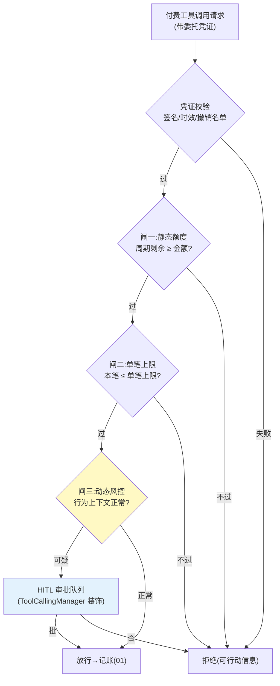

# 02-迭代一：授权三闸——静态额度 / 单笔上限 / 动态风控闸

> **定位**：把 01 的一口价预算升级为**三道顺序闸门**：①静态额度（周期总额）②单笔上限（防一次跑飞）③动态风控闸（行为上下文判定——凌晨高频大额、非常规工具组合等触发拦截或 HITL）。并引入**委托凭证**（Delegation Grant）：授权的可验证载体——scope 限定工具与金额、短时效、可撤销。读者画像：要回答"怎么把授权边界划清楚"的读者。前置阅读：[01-最小Demo](01-最小Demo.md)、[教程 45-授权与最小权限]。
>
> **铁律 0**：凭证格式自研（JWT 思路「概念代码」）；HITL 落点 = ToolCallingManager 装饰器/ToolCallback 包装（已实证基准，非 Advisor）。

---

## 一、四问

| 问 | 答 |
|----|----|
| **新增了什么需求** | ① 三闸：总额度/单笔上限/动态风控，顺序执行、任一拦截即终 ② 委托凭证：who（委托人）/whom（Agent）/scope（可花钱的工具集）/how much（额度）/until（时效）五要素，签名防篡改 ③ HITL 升级：高风险动作（首次使用某付费工具/单笔超阈值×0.5）转人工审批，批准后凭证扩权并留痕 ④ 撤销：委托人随时一键撤销，撤销传播到已签发凭证 |
| **影响了哪些模块** | 新增 `authz-svc`；01 的 BudgetLedger 改为闸门链第一环；工具包装层接入凭证校验 |
| **架构如何演进** | 记账优先 → 授权优先（先有边界，才有账） |
| **上一版痛点** | 全局一口价预算，风险不分层（01 §五） |

**本迭代验收**：① 三闸全过才扣款，风控闸拦截率可度量 ② 伪造凭证（改 scope/金额）校验失败 ③ 撤销 ≤5s 生效 ④ HITL 审批全链留痕（谁批的/批了什么）。

---

## 二、三闸与凭证



**为什么是三道而不是一道**：三闸各拦一类事故——额度闸拦"累积超支"、单笔闸拦"一次跑飞"、风控闸拦"凭证被盗用/Agent 被诱导"（前两闸对盗用者完全无效，因为花得"很守规矩"）。

## 三、委托凭证（授权的可验证载体）

```java
// 概念代码：委托凭证（JWT 思路）
record DelegationGrant(
    String grantId,          // 撤销锚点
    String principal,        // 委托人（人）
    String agentId,          // 被委托 Agent
    Set<String> toolScopes,  // 可花钱的工具集（最小权限）
    BigDecimal perCallCap,   // 单笔上限
    BigDecimal totalCap,     // 周期总额
    Instant expiresAt        // 短时效（默认 ≤24h）
) {}
// 签发：authz-svc 私钥签名；校验：网关/包装层公钥验签 + 撤销名单(Redis, TTL=时效)
```

**最小权限纪律**：scope 按**工具白名单**而非"全付费工具"；金额只给任务预算的 1.2 倍（留余量不留挥霍空间）；时效越短越好——宁可到期续签，不可长证短用。

## 四、风控闸信号（首批）

| 信号 | 判定 | 动作 |
|------|------|------|
| 高频连续消费 | 1min 内同工具 >N 次 | 拦截+冷却 |
| 非常规时段 | 业务低峰期大额 | HITL |
| 工具组合异常 | 任务画像外的新付费工具首次使用 | HITL |
| 余额骤降斜率 | 按当前速率撑不过任务周期 | 预警给委托人 |

## 五、资金动作过程可见（花钱的过程要让委托人看得见）

> 过程可见性是工业级标配。**Agent 经济最敏感的是信任**——委托人委托 Agent 花钱，必须实时看到"钱花到哪一步、被哪个闸拦住、记了多少账"。资金动作全程透明。

可见性直接挂在本迭代真实的**三闸校验点**与 [BudgetLedger（01）](01-最小Demo.md) 记账点：每次授权闸判断与每笔记账都发资金事件，事件值与 `DelegationGrant`（委托凭证）、三闸阈值的真实字段对齐：

```java
// 概念代码：在三闸校验点与记账点发资金过程事件（交易 id 贯穿）
record FundEvent(String grantId, String txId, Stage stage, Decision decision, BigDecimal amount/*micro*/) {
    enum Stage { GATE_1_QUOTA, GATE_2_PER_CALL, GATE_3_RISK, METERED, CAPTURED, REVERSED }
    enum Decision { ALLOW, BLOCK, REVERSED }
}
// 闸内发: FundEvent(grant.grantId(), txId, GATE_2_PER_CALL, ALLOW/BLOCK, callAmount)
// 记账后发: FundEvent(... CAPTURED, ALLOW, realAmount) —— 与 BudgetLedger 扣减一致
// 工具失败回退: FundEvent(... REVERSED, REVERSED, reversedAmount)
```

| 环节 | 资金事件（对齐本项目） | 委托人看到 |
|------|------------------------|-----------|
| 三闸 | 闸二（单笔上限）事件 | "单笔 8.2 超上限 8→被拦" |
| 计量 | METERED 事件 | "工具 stock-quote 计量 0.08$" |
| 记账 | CAPTURED 事件（预算已扣） | "已扣 0.08$，余额入账" |
| 失败回退 | REVERSED 事件（冲正解冻） | "工具失败→已冲正 0.08$" |

**四条纪律**：
1. **三闸决策可见**：每过一闸发一个 `GATE_N_*` 事件带 `grantId`——委托人看得见"这单为什么过了/被闸二拦"（对齐三闸的真实顺序与阈值）。
2. **与账本一致**：CAPTURED 事件金额 = `BudgetLedger` 实际扣减额（分毫），与对账单（03）一一对上——资金事件不是"想当然"，是账本的投影。
3. **冲正确认**：任何失败/超差发 `REVERSED` 事件，委托人看到"这笔没白扣"——资金信任的关键。
4. **隐藏敏感**：事件只带 `grantId`/`txId`/`amount`（micro 整数），**绝不含 `DelegationGrant` 的签名/凭证秘密**——防中间人窃取授权。

**验证**（叠加六、验证包）：一次合法调用→资金事件流 闸三→METERED→CAPTURED（金额=账本扣减）；构造闸二超限→该闸事件 BLOCK；工具失败→REVERSED 且账本余额回补；grep 断言事件无凭证签名。

## 六、验证包（手工测试与验证）
**前置条件**：三闸链+委托凭证签发验签+撤销名单+HITL 队列实现。

**材料 A——凭证样例**（概念 JSON）：grantId/principal/agentId/toolScopes=["stock-quote"]/perCallCap=10/totalCap=50/expiresAt=+24h。

**材料 B——篡改矩阵**：分别篡改 scope 扩权、金额上调、过期后重放、改 grantId。

**步骤与断言**：

| # | 操作 | 预期（PASS 判据） |
|---|------|------------------|
| 1 | 逐闸越限：超额（闸一）/单笔超上限（闸二）/夜间高频（闸三） | 各闸独立拦截，拦截点事件标注闸名 |
| 2 | 三闸全过的合法请求 | 放行且记账（接 01） |
| 3 | 材料B 四类篡改凭证 | 验签全失败（4/4 拒绝） |
| 4 | 撤销 grantId 后 ≤5s 再请求 | 已签发凭证全部失效 |
| 5 | 构造“首次使用新付费工具” | 进 HITL 队列；批准后凭证扩权留痕（审批人/内容可查） |

**失败排查**：①闸名未标注→拦截事件缺 gate 字段；③某篡改通过→签名未覆盖该字段（scope/金额必须在签名体内）；④撤销延迟→撤销名单未推到校验点或缓存 TTL 太长。


## 七、本迭代痛点

闸门拦了"该不该花"，但"花完记多少、怎么计价"还是拍脑袋——Token 和外部 API 的计量口径没统一。→ 03 计量与计费引擎。

## 八、验收对照

| 验收项 | 标准 | 状态 |
|--------|------|------|
| 三闸顺序拦截 | 任一拦截即终 | ✅ |
| 凭证五要素 | 伪造全失败 | ✅ |
| 撤销时效 | ≤5s | ✅ |
| HITL 留痕 | 全链可查 | ✅ |

**下一篇**：[03-迭代二-计量与计费引擎](03-迭代二-计量与计费引擎.md)。
