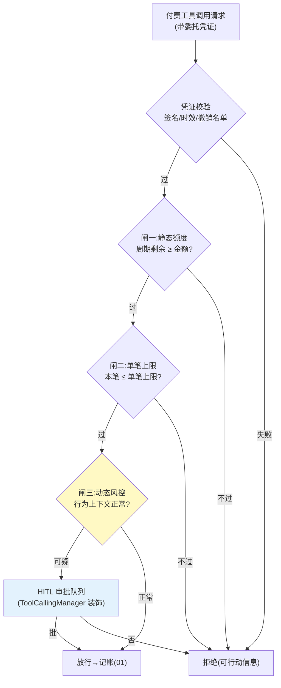

# 02-迭代一：授权三闸——静态额度 / 单笔上限 / 动态风控闸

> **定位**：把 01 的一口价预算升级为**三道顺序闸门**：①静态额度（周期总额）②单笔上限（防一次跑飞）③动态风控闸（行为上下文判定——凌晨高频大额、非常规工具组合等触发拦截或 HITL）。并引入**委托凭证**（Delegation Grant）：授权的可验证载体——scope 限定工具与金额、短时效、可撤销。读者画像：要回答"怎么把授权边界划清楚"的读者。前置阅读：[01-最小Demo](01-最小Demo.md)、[教程 45-授权与最小权限]。
>
> **铁律 0**：凭证格式自研（JWT 思路「概念代码」）；HITL 落点 = ToolCallingManager 装饰器/ToolCallback 包装（已实证基准，非 Advisor）。

---

## 一、四问

| 问 | 答 |
|----|----|
| **新增了什么需求** | ① 三闸：总额度/单笔上限/动态风控，顺序执行、任一拦截即终 ② 委托凭证：who（委托人）/whom（Agent）/scope（可花钱的工具集）/how much（额度）/until（时效）五要素，签名防篡改 ③ HITL 升级：高风险动作（首次使用某付费工具/单笔超阈值×0.5）转人工审批，批准后凭证扩权并留痕 ④ 撤销：委托人随时一键撤销，撤销传播到已签发凭证 |
| **影响了哪些模块** | 新增 `authz-svc`；01 的 BudgetLedger 改为闸门链第一环；工具包装层接入凭证校验 |
| **架构如何演进** | 记账优先 → 授权优先（先有边界，才有账） |
| **上一版痛点** | 全局一口价预算，风险不分层（01 §五） |

**本迭代验收**：① 三闸全过才扣款，风控闸拦截率可度量 ② 伪造凭证（改 scope/金额）校验失败 ③ 撤销 ≤5s 生效 ④ HITL 审批全链留痕（谁批的/批了什么）。

---

## 二、三闸与凭证



**为什么是三道而不是一道**：三闸各拦一类事故——额度闸拦"累积超支"、单笔闸拦"一次跑飞"、风控闸拦"凭证被盗用/Agent 被诱导"（前两闸对盗用者完全无效，因为花得"很守规矩"）。

## 三、委托凭证（授权的可验证载体）

```java
// 概念代码：委托凭证（JWT 思路）
record DelegationGrant(
    String grantId,          // 撤销锚点
    String principal,        // 委托人（人）
    String agentId,          // 被委托 Agent
    Set<String> toolScopes,  // 可花钱的工具集（最小权限）
    BigDecimal perCallCap,   // 单笔上限
    BigDecimal totalCap,     // 周期总额
    Instant expiresAt        // 短时效（默认 ≤24h）
) {}
// 签发：authz-svc 私钥签名；校验：网关/包装层公钥验签 + 撤销名单(Redis, TTL=时效)
```

**最小权限纪律**：scope 按**工具白名单**而非"全付费工具"；金额只给任务预算的 1.2 倍（留余量不留挥霍空间）；时效越短越好——宁可到期续签，不可长证短用。

## 四、风控闸信号（首批）

| 信号 | 判定 | 动作 |
|------|------|------|
| 高频连续消费 | 1min 内同工具 >N 次 | 拦截+冷却 |
| 非常规时段 | 业务低峰期大额 | HITL |
| 工具组合异常 | 任务画像外的新付费工具首次使用 | HITL |
| 余额骤降斜率 | 按当前速率撑不过任务周期 | 预警给委托人 |

## 五、测试与验证

```bash
# 1. 三闸：分别构造越限请求 → 各闸独立拦截；三闸全过才记账
# 2. 伪造：篡改 scope/金额/过期重放 → 验签全失败
# 3. 撤销：撤销后已签发凭证 ≤5s 内全部失效
# 4. HITL：高风险动作进队列 → 批准扩权留痕 / 拒绝可行动
```

## 六、本迭代痛点

闸门拦了"该不该花"，但"花完记多少、怎么计价"还是拍脑袋——Token 和外部 API 的计量口径没统一。→ 03 计量与计费引擎。

## 七、验收对照

| 验收项 | 标准 | 状态 |
|--------|------|------|
| 三闸顺序拦截 | 任一拦截即终 | ✅ |
| 凭证五要素 | 伪造全失败 | ✅ |
| 撤销时效 | ≤5s | ✅ |
| HITL 留痕 | 全链可查 | ✅ |

**下一篇**：[03-迭代二-计量与计费引擎](03-迭代二-计量与计费引擎.md)。
