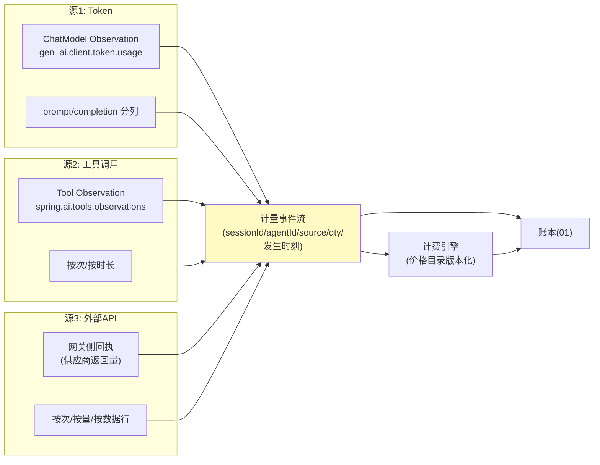

# 03-计量与计费引擎——三源计量 / 价格目录版本化 / 对账单

> **定位**：统一"花了多少"的口径：**三源计量**（Token/工具调用/外部 API）→ **价格目录版本化**（每次调价留版本，历史账单按当时价重算一致）→ **对账单**（按委托人/Agent/工具多维出账）。读者画像：要回答"账到底怎么算、跟供应商对不对得上"的读者。前置阅读：[02-授权三闸](02-授权三闸.md)、[教程 92-Agent经济与支付集成]、[教程 35-可观测性]。
>
> **铁律 0**：Token 计量用已实证 Observation 基准（`gen_ai.client.token.usage` 语义键、`spring.ai.chat.observations.*` 配置）；价格目录与计费自研「概念代码」。

---

## 一、四问

| 问 | 答 |
|----|----|
| **新增了什么需求** | ① 三源计量：LLM Token（prompt/completion 分开）、工具调用（按次/按时长）、外部 API（按次/按量/按数据行）三口径统一进计量事件流 ② 价格目录版本化：价目表带 `effectiveFrom`，计量事件按**发生时刻**绑定价——调价不翻旧账 ③ 对账单生成：周期账单（委托人视角/Agent 视角/成本中心视角）+ 与供应商账单的差异报告 ④ 量纲统一：内部记账一律微单位（micro-USD），避免浮点误差累积 |
| **影响了哪些模块** | 新增 `metering-svc`；02 闸门的扣减金额改由计费引擎实时报价；账本（01）接计量事件 |
| **架构如何演进** | 授权可信 → 度量可信（没有计量，闸门只是感觉） |
| **上一版痛点** | 扣款金额写死在调用参数里（01/02 都是"工具说自己多少钱"——工具说多少就是多少，等于没有定价权） |

**本迭代验收**：① 计量 vs 供应商账单差异 <0.1% ② 调价后历史账单金额不变（版本重算一致）③ 三视角对账单一键出 ④ 微单位换算无精度损失。

### 一.1 本节核对（四问口径）

| # | 核对项 | 判据 |
|---|--------|------|
| 1 | 四问齐全 | 新增需求 / 影响模块 / 架构演进 / 上一版痛点四行均有，无空答 |
| 2 | 演进与痛点对应 | "度量可信"对应 02 §七 痛点（扣款金额写死在参数、无定价权）；新模块 metering-svc 落在 §三/§五 有实现 |

---

## 二、三源计量



**关键纪律——计量以回执为准**：外部 API 消费优先用**供应商回执量**（响应头/体中的用量），本地预估只做闸门预扣（02）的临时值——预扣与回执的差异定期冲销，账才对得平。

### 二.1 本节核对（三源口径）

- [ ] 三源（Token/工具/外部 API）各自的数据来源与计量单位能说清（gen_ai usage / tool observation / 网关回执；token 分 prompt/completion）
- [ ] 理解"计量以回执为准、预扣仅临时"的纪律及其用途（对账差异 [四]/[五] 材料 B 冲销），不混淆预估入账

## 三、价格目录版本化

```java
// 概念代码：价目条目（版本化）
record PriceItem(
    String resource,          // e.g. "tool:stock-quote" / "model:gpt-x" / "api:weather"
    BigDecimal unitPriceMicro, // micro-USD
    String unit,               // CALL / 1K_TOKENS / ROW
    Instant effectiveFrom,
    String version
) {}
// 计费：事件发生时刻 t → 取 effectiveFrom<=t 的最新版本
// 纪律：调价只新增版本，禁止 UPDATE——历史账单永久可重算
```

### 三.1 本节测试与验证（价格目录版本化计费）

**前置条件**：`PriceItem` 版本化表 + 计费引擎（按发生时刻取 `effectiveFrom<=t` 最新版本）实现。

**材料 A——价格版本**（概念表）：`tool:stock-quote v1=80micro/CALL effectiveFrom=T1；v2=100micro effectiveFrom=T2`。

**步骤与断言**：

| # | 操作 | 预期（PASS 判据） |
|---|------|------------------|
| 1 | T1 前后各 100 条事件（材料 A） | T1 前按 v1（80micro）、T1 后按 v2（100micro）计价，各自金额正确 |
| 2 | 调价后重算历史 | 历史账单金额不变（版本重算一致）——调价只新增版本，未 UPDATE 旧条目 |
| 3 | 无版本命中核对 | 事件发生在首个版本生效前 → 报错或降级处理，不产生负账 |

**失败排查**：①历史账单变→计费直接改写了旧版本（应只新增）；②版本取错→取的 latest 而非 `effectiveFrom<=t` 的最新生效版本。

## 四、对账（三个视角 + 供应商差异）

| 视角 | 维度 | 用途 |
|------|------|------|
| 委托人 | 我授权的钱花在哪 | 月度通知/信任 |
| Agent | 单 Agent 成本效率 | 优化依据 |
| 成本中心 | 部门/项目归集 | 财务口径 |
| 供应商差异 | 我方计量 vs 供应商账单 | 每月对账，差异 >0.1% 告警 |

### 四.1 本节核对（对账三视角 + 供应商差异）

- [ ] 四个视角（委托人 / Agent / 成本中心 / 供应商差异）各按不同维度切片（月度通知 / 成本效率 / 财务归集 / 对账），用途不混
- [ ] 三视角账单总额同源一致（同一批计量事件不同切片），差异 >0.1% 是供应商对账的告警阈值，理解其与 §一 验收①的关联

## 五、全篇回归验证

**回归断言**（§二 计量纪律、§三.1 版本化、§四 对账口径均落实后，最终整体验收）：

**材料 B——回执差样例**：本地预估 90micro，供应商回执 85micro。

| # | 操作 | 预期（PASS 判据） |
|---|------|------------------|
| 1 | 三源各注入 100 条计量事件 | 事件流字段完整（source/qty/sessionId/发生时刻）；量纲统一 micro |
| 2 | 材料 B 冲销 | 预扣 90 与回执 85 差额 5 自动冲销事件生成 |
| 3 | 三视角账单（委托人 / Agent / 成本中心） | 总额一致（同源切片互验） |
| 4 | 月度对账 | 我方计量 vs 供应商账单差异 <0.1% |
| 5 | 本迭代验收四项（计量精度 / 版本重算 / 三视角账单 / 微单位无损） | 全部覆盖，任一 FAIL 即回归不通过 |

**失败排查**：①量纲错→混用元/micro（统一 micro，展示层再换算）；②无冲销→回执与预扣无对账作业；③差异大→回执未优先（仍在用预估入账）。

## 六、本迭代痛点

账记上了、价算对了，但**扣钱本身**还不可靠：工具执行一半失败钱已扣？重复请求重复扣？→ 04 支付轨道与幂等。

> 本节核对（一句话）：痛点（执行一半失败钱已扣 / 重复扣款）与下一篇 04 支付轨道与幂等（预授权/冲正/幂等键）一一对应即 PASS。

## 七、验收对照

| 验收项 | 标准 | 状态 |
|--------|------|------|
| 计量精度 | vs 供应商 <0.1% | ✅ |
| 价格版本 | 历史可重算 | ✅ |
| 三视角账单 | 同源一致 | ✅ |
| 回执优先 | 预估只做预扣 | ✅ |

> 本节核对（一句话）：四项验收（计量精度 / 价格版本 / 三视角账单 / 回执优先）分别对应 §三.1 步骤、§五 回归断言 3-4，与本迭代验收段落口径一致即 PASS。

**下一篇**：[04-支付轨道与幂等](04-支付轨道与幂等.md)。
