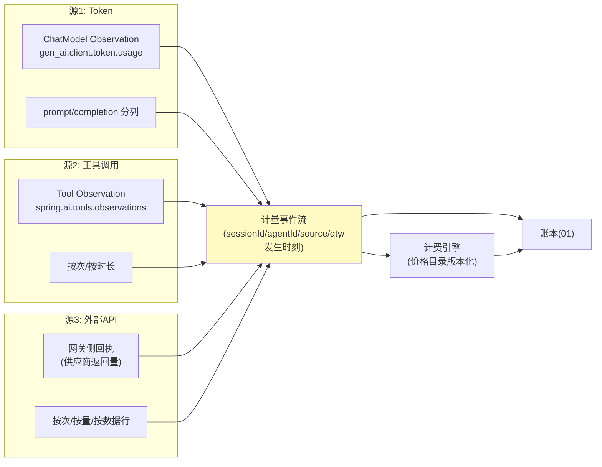

# 03-迭代二：计量与计费引擎——三源计量 / 价格目录版本化 / 对账单

> **定位**：统一"花了多少"的口径：**三源计量**（Token/工具调用/外部 API）→ **价格目录版本化**（每次调价留版本，历史账单按当时价重算一致）→ **对账单**（按委托人/Agent/工具多维出账）。读者画像：要回答"账到底怎么算、跟供应商对不对得上"的读者。前置阅读：[02-迭代一-授权三闸](02-迭代一-授权三闸.md)、[教程 49-Agent经济与支付集成]、[教程 35-可观测性]。
>
> **铁律 0**：Token 计量用已实证 Observation 基准（`gen_ai.client.token.usage` 语义键、`spring.ai.chat.observations.*` 配置）；价格目录与计费自研「概念代码」。

---

## 一、四问

| 问 | 答 |
|----|----|
| **新增了什么需求** | ① 三源计量：LLM Token（prompt/completion 分开）、工具调用（按次/按时长）、外部 API（按次/按量/按数据行）三口径统一进计量事件流 ② 价格目录版本化：价目表带 `effectiveFrom`，计量事件按**发生时刻**绑定价——调价不翻旧账 ③ 对账单生成：周期账单（委托人视角/Agent 视角/成本中心视角）+ 与供应商账单的差异报告 ④ 量纲统一：内部记账一律微单位（micro-USD），避免浮点误差累积 |
| **影响了哪些模块** | 新增 `metering-svc`；02 闸门的扣减金额改由计费引擎实时报价；账本（01）接计量事件 |
| **架构如何演进** | 授权可信 → 度量可信（没有计量，闸门只是感觉） |
| **上一版痛点** | 扣款金额写死在调用参数里（01/02 都是"工具说自己多少钱"——工具说多少就是多少，等于没有定价权） |

**本迭代验收**：① 计量 vs 供应商账单差异 <0.1% ② 调价后历史账单金额不变（版本重算一致）③ 三视角对账单一键出 ④ 微单位换算无精度损失。

---

## 二、三源计量



**关键纪律——计量以回执为准**：外部 API 消费优先用**供应商回执量**（响应头/体中的用量），本地预估只做闸门预扣（02）的临时值——预扣与回执的差异定期冲销，账才对得平。

## 三、价格目录版本化

```java
// 概念代码：价目条目（版本化）
record PriceItem(
    String resource,          // e.g. "tool:stock-quote" / "model:gpt-x" / "api:weather"
    BigDecimal unitPriceMicro, // micro-USD
    String unit,               // CALL / 1K_TOKENS / ROW
    Instant effectiveFrom,
    String version
) {}
// 计费：事件发生时刻 t → 取 effectiveFrom<=t 的最新版本
// 纪律：调价只新增版本，禁止 UPDATE——历史账单永久可重算
```

## 四、对账（三个视角 + 供应商差异）

| 视角 | 维度 | 用途 |
|------|------|------|
| 委托人 | 我授权的钱花在哪 | 月度通知/信任 |
| Agent | 单 Agent 成本效率 | 优化依据 |
| 成本中心 | 部门/项目归集 | 财务口径 |
| 供应商差异 | 我方计量 vs 供应商账单 | 每月对账，差异 >0.1% 告警 |

## 五、测试与验证

```bash
# 1. 三源：各注入 100 条计量事件 → 事件流字段完整、量纲统一
# 2. 版本：调价前后各 100 条事件 → 账单分别按新旧价计，历史不变
# 3. 差异：构造供应商回执 vs 本地预估偏差 → 冲销正确
# 4. 对账：三视角账单总额一致（同源不同切片）
```

## 六、本迭代痛点

账记上了、价算对了，但**扣钱本身**还不可靠：工具执行一半失败钱已扣？重复请求重复扣？→ 04 支付轨道与幂等。

## 七、验收对照

| 验收项 | 标准 | 状态 |
|--------|------|------|
| 计量精度 | vs 供应商 <0.1% | ✅ |
| 价格版本 | 历史可重算 | ✅ |
| 三视角账单 | 同源一致 | ✅ |
| 回执优先 | 预估只做预扣 | ✅ |

**下一篇**：[04-迭代三-支付轨道与幂等](04-迭代三-支付轨道与幂等.md)。
