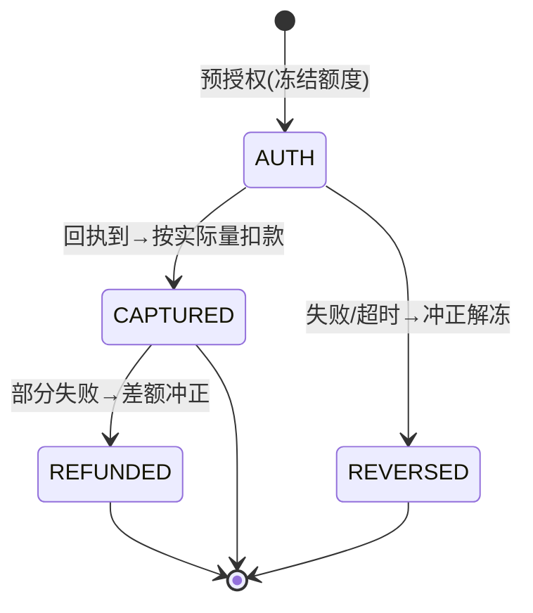
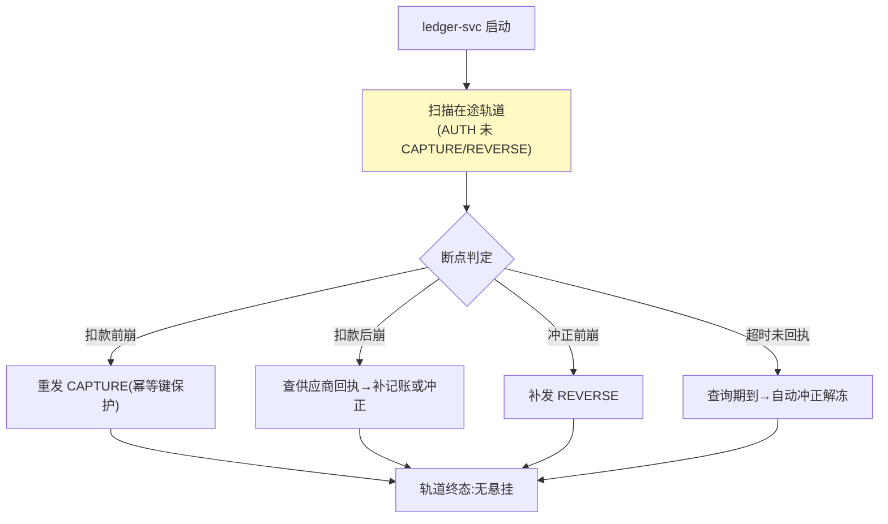

# 04-支付轨道与幂等——预授权 / 扣款 / 冲正 + 事件账本

> **定位**：让"扣钱"本身可靠：**支付编排三段式**（预授权→扣款→冲正）、**幂等键**（网络重试/Agent 重放不重复扣）、**事件溯源式账本**（append-only，exactly-once 记账）。读者画像：要回答"支付一半失败了怎么办"的读者。前置阅读：[03-计量与计费引擎](03-计量与计费引擎.md)。
>
> **铁律 0**：支付编排与账本自研「概念代码」；持久化选型 PostgreSQL（需在 pom.xml 中添加依赖）。

---

## 一、四问

| 问 | 答 |
|----|----|
| **新增了什么需求** | ① 预授权→扣款→冲正三段轨道：预授权冻结额度（02 的预扣转正）、实际消费回执后扣款、失败/超差冲正解冻 ② 幂等键全链强制：调用方生成 `Idempotency-Key`，账本按键去重（重试/重放/双发全挡）③ 事件账本：只追加不改删（append-only），按事件序重放可得任意时刻余额——对账从"查表"变"重放" ④ 部分失败恢复：进程崩溃后启动扫描"在途轨道"续跑（扣款前/扣款后/冲正前三个断点各有恢复策略） |
| **影响了哪些模块** | 新增 `ledger-svc`（事件表+幂等表+轨道状态机）；02 闸门预扣改为发"预授权事件"；03 计费结果落账走事件 |
| **架构如何演进** | 记账（记录）→ 账本（事实）：余额从存储字段变为事件重放的投影 |
| **上一版痛点** | 扣款没有失败语义：工具失败钱照扣、重试重扣、崩了以后没人知道扣没扣（03 §六） |

**本迭代验收**：① 同幂等键重复请求 100% 只记一笔 ② 三断点注入崩溃 → 恢复后轨道终态正确（无悬挂冻结/无漏扣）③ 任意事件序重放余额一致 ④ 冲正在供应商退款到账前先行解冻内部额度。

### 一.1 本节核对（四问口径）

| # | 核对项 | 判据 |
|---|--------|------|
| 1 | 四问齐全 | 新增需求 / 影响模块 / 架构演进 / 上一版痛点四行均有，无空答 |
| 2 | 演进与痛点对应 | "账本（事实）"对应 03 §六 痛点（扣款无失败语义）；新模块 ledger-svc 在 §三/§七 有实现落点 |

---

## 二、支付轨道状态机



**为何预授权不可省**：Agent 环境重试率高（模型重试/网络重试/用户重发）。没有预授权，每次重试都真实扣款；有了预授权，重试命中同一幂等键 → 命中同一轨道 → 冻结不增加。

### 二.1 本节核对（支付轨道状态机）

- [ ] 四态（预授权 AUTH / 扣款 CAPTURED / 冲正 REVERSED / 部分冲正 REFUNDED）的迁移关系能口述：AUTH→CAPTURED|REVERSED，CAPTURED→REFUNDED|终态，REVERSED/REFUNDED→终态
- [ ] 能解释"为什么预授权不可省"：重试命中同一幂等键→同一轨道→冻结不增加，而不产生重复扣款

## 三、幂等记账（exactly-once）

```java
// 概念代码：幂等表 + 事件表同事务
@Transactional
LedgerEvent append(String idemKey, Supplier<LedgerEvent> eventFactory) {
    if (idemRepo.existsByKey(idemKey)) return idemRepo.findEventByKey(idemKey);
    LedgerEvent e = eventFactory.get();
    eventRepo.append(e);        // INSERT ONLY（库层禁止 UPDATE/DELETE，触发器兜底）
    idemRepo.insert(idemKey, e.id());
    return e;
}
```

- **键的生成纪律**：键 = `轨道ID + 段名`（auth/capture/reverse 分段），不是裸业务 ID——同轨道不同段天然不同键，跨轨道同业务不会误判重放。
- **账本事件类型**：GRANT（授权）/ AUTH / CAPTURE / REVERSE / REFUND / ADJUST（冲销）——六类穷举，余额 = 序列和。

### 三.1 本节测试与验证（幂等记账 exactly-once）

**前置条件**：事件账本（六类事件）+ 幂等表 + `append` 同事务实现。

**材料 A——幂等并发**（junit）：100 线程同 idemKey 并发 append。

**步骤与断言**：

| # | 操作 | 预期（PASS 判据） |
|---|------|------------------|
| 1 | 材料 A | 事件表仅 1 条；其余 99 命中幂等返回同事件 |
| 2 | 键纪律核对 | 同一轨道不同段（auth/capture/reverse）键不同；跨轨道同业务不误判重放 |
| 3 | 六类事件核对 | 事件类型 GRANT/AUTH/CAPTURE/REVERSE/REFUND/ADJUST 穷举，无第七类入账 |

**失败排查**：①有重复→幂等检查与 INSERT 不在同一事务（先查后插无锁）；②误判重放→键生成用了裸业务 ID 而非"轨道ID+段名"。

## 四、部分失败恢复



### 四.1 本节测试与验证（部分失败恢复——断点注入）

**前置条件**：事件账本 + 轨道状态机 + 启动扫描实现齐备。

**材料 B——断点注入**：在 CAPTURE 前 / CAPTURE 后 / REVERSE 前三处各设 kill 开关（System.exit）。

**步骤与断言**：

| # | 操作 | 预期（PASS 判据） |
|---|------|------------------|
| 1 | 材料 B 三个断点各 kill 后重启 | 恢复后轨道终态正确（无悬挂冻结 / 无漏扣） |
| 2 | 工具执行失败 | 冲正事件生成、冻结解冻、三段事件（AUTH/尝试/REVERSE）齐全 |
| 3 | 超时未回执 | 查询期到自动冲正解冻（R4 分支命中） |

**失败排查**：①悬挂冻结→启动扫描没扫到 REVERSE 前断点；②恢复后漏扣→CAPTURE 后断点未重发捕查询/未补记账；③乱扣→恢复分支走错（扣款前崩被当成扣款后崩）。

## 五、全篇回归验证

**回归断言**（§三.1 幂等、§四.1 断点恢复均通过后，最终整体验收）：

| # | 操作 | 预期（PASS 判据） |
|---|------|------------------|
| 1 | 同幂等键重复请求 | 100% 只记一笔（0 重复记账） |
| 2 | 任取事件序重放 | 余额投影 == 存储余额 |
| 3 | 事件表 UPDATE/DELETE 尝试 | 库层触发器拒绝（append-only 兜底） |
| 4 | 冲正先行 | 供应商退款到账前内部额度已先解冻 |
| 5 | 本迭代验收三项（幂等 / 断点恢复 / 重放一致） | 全部覆盖，任一 FAIL 即回归不通过 |

**失败排查**：①投影与存储余额不一致→投影漏算某事件类型（六类逐一核对）；②冲正不先行→内部解冻依赖外部退款回执（应先解冻后异步对账）。

## 六、本迭代痛点

单 Agent 的钱管住了；但**多 Agent 协作**时费用怎么分——A 委托 B、B 调 C，钱各出多少、谁批的、超了追谁？→ 05 多 Agent 分账。

> 本节核对（一句话）：痛点（多 Agent 协作账本只记在最后执行者头上、发起方看不懂账）与下一篇 05 多 Agent 分账（归因/分账/押金与追缴）一一对应即 PASS。

## 七、验收对照

| 验收项 | 标准 | 状态 |
|--------|------|------|
| 幂等 | 0 重复记账 | ✅ |
| 断点恢复 | 无悬挂/漏扣 | ✅ |
| 事件重放 | 余额一致 | ✅ |
| 冲正先行 | 内部额度即刻解冻 | ✅ |

> 本节核对（一句话）：四项验收（幂等 / 断点恢复 / 事件重放 / 冲正先行）分别对应 §三.1、§四.1、§五 回归断言，与本迭代验收段落口径一致即 PASS。

**下一篇**：[05-多Agent分账](05-多Agent分账.md)。
