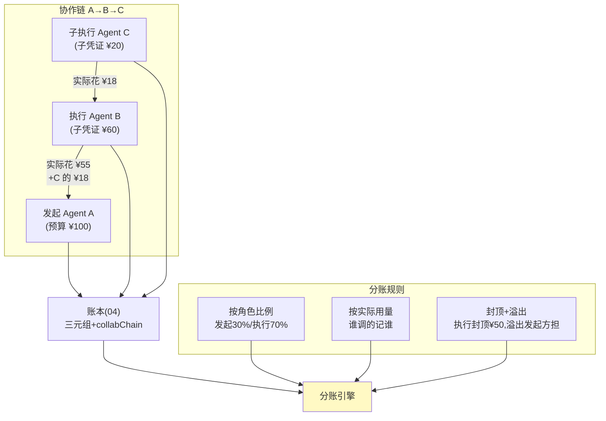

# 05-多 Agent 分账——费用归因 / 分账规则 / 押金与追缴

> **定位**：多 Agent 协作任务（A 委托 B、B 调 C）的费用**归因**（谁发起/谁执行/谁受益三分）、**分账规则引擎**（按角色拆账）、**押金与预算代持**（下游 Agent 先押后用）、**超支追缴**（超了向谁追）。读者画像：要回答"多 Agent 干活，账怎么分"的读者。前置阅读：[04-支付轨道与幂等](04-支付轨道与幂等.md)、[教程 05-Observation可观测/12-综合实战：工业巡检Agent可观测闭环]。
>
> **铁律 0**：分账自研「概念代码」。

---

## 一、四问

| 问 | 答 |
|----|----|
| **新增了什么需求** | ① 费用归因模型：每笔支出挂三元组（发起人/执行 Agent/受益方）+ 协作链（A→B→C 传递路径）② 分账规则引擎：按角色比例/按实际用量/封顶+溢出三种拆法可配 ③ 押金代持：上游 Agent 向下游划拨子预算（子委托凭证），下游超额自己垫或停 ④ 超支追缴：责任链判定（执行超预算→执行方；需求变更高成本→发起方）→ 追缴单 |
| **影响了哪些模块** | 新增 `split-svc`；04 账本事件增加 `collabChain` 字段；02 委托凭证支持"子凭证签发"（权限只能缩不能放——子凭证 scope ⊆ 父凭证） |
| **架构如何演进** | 单 Agent 账 → 协作账（费用沿委托链流动） |
| **上一版痛点** | 账本只有 sessionId——协作任务的账记在最后执行者头上，发起方月底看不懂自己的账（04 §六） |

**本迭代验收**：① 三元组归因覆盖 100% 支出 ② 子凭证权限收缩校验（放权签发被拒）③ 押金闭环（划拨-使用-回收差额）④ 追缴责任判定可回溯（依据事件链）。

### 一.1 本节核对（四问口径）

| # | 核对项 | 判据 |
|---|--------|------|
| 1 | 四问齐全 | 新增需求 / 影响模块 / 架构演进 / 上一版痛点四行均有，无空答 |
| 2 | 演进与痛点对应 | "协作账"对应 04 §六 痛点（账本只有 sessionId、记在最后执行者头上）；新模块 split-svc 在 §三/§四 有实现落点 |

---

## 二、费用归因与委托链



**核心不变式**：∑各环节实际支出 ≤ 父凭证额度——押在凭证链上强制，不靠事后对账。

### 二.1 本节核对（费用归因与委托链）

- [ ] 三元组（发起人 / 执行 Agent / 受益方）+ `collabChain`（A→B→C）能说清，每笔支出都挂这两个字段（支撑 100% 归因覆盖）
- [ ] 三种分账规则（角色比例 / 按实际用量 / 封顶+溢出）各有个适用场景，且"∑实际支出 ≤ 父凭证额度"不变式在凭证链上强制

### 二.2 本节测试与验证（三元组归因与协作链）

**前置条件**：账本事件携带三元组（发起人/执行 Agent/受益方）与 `collabChain` 字段；分账引擎（三种规则）可跑 junit（分账自研「概念代码」）。

**材料 A——协作链归因测试**（junit，断言仅覆盖本节归因口径）：

```java
@Test void 协作链每笔支出挂三元组且逐层汇总一致() {
    // A(预算100) → B(子凭证60) → C(子凭证20)；C 实花 18、B 实花 55
    ledger.charge("C", "search", amt("18"), "k1");   // 归因三元组: 发起A/执行C/受益A
    ledger.charge("B", "report", amt("55"), "k2");   // 归因三元组: 发起A/执行B/受益A
    SpendEntry c = ledger.entriesOf("C").get(0);
    assertEquals("A", c.initiator());                 // 三元组完整（发起人/执行/受益）
    assertNotNull(c.collabChain());                   // collabChain = A→B→C
    assertEquals(0, ledger.sumOf("B").add(ledger.sumOf("C"))
        .compareTo(ledger.sumByChain("A→B→C")));      // 三级账单逐层汇总一致
    assertTrue(ledger.sumByChain("A→B→C").compareTo(amt("100")) < 0); // ∑支出 ≤ 父凭证额度
}
```

**步骤与断言**：

| # | 操作 | 预期（PASS 判据） |
|---|------|------------------|
| 1 | 材料 A 用例 | 全绿；每笔 `SpendEntry` 三元组与 `collabChain` 非空 |
| 2 | 三级账单切换（A 视角/B 视角/C 视角） | 逐层汇总一致（B 层 = 自有 55 + C 的 18） |
| 3 | 三种分账规则各跑一次同批事件 | 角色 30/70、按用量、封顶+溢出三种拆法结果各自自洽（∑拆分 = 总支出） |

**失败排查**：①汇总不一致→某事件漏带 `collabChain`（归因覆盖缺口）；②分账和不等→比例精度用整数 micro 运算（同 07 纪律）。

## 三、押金与子凭证

- **划拨即子凭证**：A 给 B 划 ¥60 ≠ 转账，而是签发 scope 收缩的子凭证（工具集⊆、单笔上限⊆、时效更短）——A 的账上是一笔"代持支出"，B 的账上是"代持收入+自己的预算"。
- **回收**：任务结束，子凭证余额自动回收（差额冲正事件）——不需要 B"还钱"这个主动动作。

### 三.1 本节核对（押金与子凭证）

- [ ] 理解"划拨即子凭证"（scope 收缩、金额缩、时效短，A 账为代持支出、B 账为代持收入+自己预算），非转账
- [ ] 回收是自动差额冲正（无主动"还钱"动作），且"只缩不放"（子凭证 scope ⊆ 父凭证）在签发时强制校验

### 三.2 本节测试与验证（子凭证收缩与押金回收）

**前置条件**：子凭证签发（scope 收缩校验）与回收（差额冲正）逻辑可跑 junit。

**材料 B——押金闭环测试**（junit）：

```java
@Test void 放权签发被拒且回收自动冲正() {
    // 只缩不放：父凭证 scope={search}，子凭证申请加 tool:trade → 拒绝
    assertThrows(ScopeEscalationException.class,
        () -> delegate.issue(parent, scope("search", "trade"), amt("60")));
    // 押金闭环：划拨 60 → 实花 18 → 任务结束差额 42 自动冲正回 A
    SubCredential sub = delegate.issue(parent, scope("search"), amt("60"));
    ledger.charge(sub.id(), "search", amt("18"), "k3");
    delegate.settle(sub.id());
    assertEquals(0, ledger.reclaimedOf("A").compareTo(amt("42")));   // 差额自动回收
    assertEquals(0, ledger.spentAsProxyOf("A").compareTo(amt("18"))); // A 账=代持支出 18
}
```

**步骤与断言**：

| # | 操作 | 预期（PASS 判据） |
|---|------|------------------|
| 1 | 材料 B 第一段：scope 放权签发 | 抛 `ScopeEscalationException`（只缩不放） |
| 2 | 材料 B 第二段：settle 后对账 | 差额 42 冲正回 A，无"主动还钱"动作（回收为自动事件） |
| 3 | A/B 两方账目核对 | A 账为代持支出 18，B 账为代持收入 60 + 自有预算（§三 口径） |

**失败排查**：①放权被放行→签发前未做 scope ⊆ 父凭证校验；②冲正金额错→回收只退了余额未冲正代持支出（两边账都要动）。

## 四、超支追缴（责任链判定）

| 情形 | 判定依据（事件链） | 责任方 |
|------|-------------------|--------|
| B 超子凭证硬闯被拦 | 拦截事件 | 无损失，记 B 违规 1 次 |
| B 变更需求导致 C 超支 | 需求变更事件先于超支 | B |
| A 给的预算客观不足（同类任务历史均值 > 预算） | 历史比价 | A |
| 无法判定 | 事件链断（缺埋点） | 平台责任——倒逼归因覆盖 100% |

### 四.1 本节核对（超支追缴责任链）

- [ ] 四类情形（B 硬闯被拦 / B 需求变更致 C 超支 / A 预算客观不足 / 事件链断）各依什么判定依据、判给谁，能不看正文复述
- [ ] "事件链断→判平台责任→倒逼归因 100%" 这个自我强化闭环能说清（与 §一 验收①联动）

### 四.2 本节测试与验证（追缴责任链判定）

**前置条件**：责任链判定器（依据事件链）可跑 junit；历史比价数据（同类任务均价）可注入。

**材料 C——责任判定测试**（junit）：

```java
@Test void 责任链四情形判定可回溯() {
    // ①B 需求变更致 C 超支：变更事件时间戳先于超支 → 判 B
    assertEquals(Party.B, liability.judge(chainOf(
        event(REQUIREMENT_CHANGED, by("B"), t0), event(OVERSPENT, by("C"), t1))));
    // ②事件链断（缺埋点）→ 判平台责任 + 归因覆盖告警
    LiabilityDecision d = liability.judge(chainOf(event(OVERSPENT, by("C"), t1))); // 无前因
    assertEquals(Party.PLATFORM, d.party());
    assertTrue(d.alerts().contains("ATTRIBUTION_COVERAGE"));   // 倒逼补埋点
    // ③A 预算客观不足：同类任务历史均价 80 > A 给的 60 → 判 A
    assertEquals(Party.A, liability.judge(withHistory(chainOf(
        event(OVERSPENT, by("B"), t0)), avgCost("80"))));
}
```

**步骤与断言**：

| # | 操作 | 预期（PASS 判据） |
|---|------|------------------|
| 1 | 材料 C 用例 | 全绿；三类可自动化情形判定与 §四 表一致 |
| 2 | 每条判定回放判定依据 | 输出引用的事件链/比价证据（可回溯） |
| 3 | 情形①硬闯被拦 | 无损失、记 B 违规 1 次（拦截事件驱动，不产生追缴单） |

**失败排查**：①判定漂移→事件时间戳未单调校验（乱序链会误判）；②判平台但无告警→归因覆盖告警未接判定器（§一 验收①的倒逼闭环断点）。

## 五、全篇回归验证

**回归断言**（§二-§四 归因/押金/追缴口径落实后，最终整体验收）：

**材料 A——协作链**：A(预算100) → B(子凭证60) → C(子凭证20)；C 实花 18、B 实花 55。

**材料 B——超支剧本**：①B 需求变更致 C 超支；②A 预算客观不足（同类任务历史均价 >预算）；③删掉一条埋点制造事件链断。

| # | 操作 | 预期（PASS 判据） |
|---|------|------------------|
| 1 | 材料 A 全链跑单 | 三元组+collabChain 完整；三级账单可切且逐层汇总一致 |
| 2 | 尝试签发 scope/金额超过父凭证的子凭证 | 拒绝（只缩不放不变式） |
| 3 | 任务结束查押金 | 子凭证余额自动差额冲正回收（无主动"还钱"动作） |
| 4 | 材料 B ① | 责任判 B（变更事件在超支前） |
| 5 | 材料 B ② | 责任判 A（历史比价证据） |
| 6 | 材料 B ③ | 判平台责任+归因覆盖告警（倒逼补埋点） |
| 7 | 本迭代验收四项（归因覆盖 / 子凭证收缩 / 押金闭环 / 追缴可回溯） | 全部覆盖，任一 FAIL 即回归不通过 |

**失败排查**：①账切不开→三元组字段缺失（某事件没带 sessionId/agentId）；③回收未触发→子凭证无到期回收作业；④⑥判定不可回溯→事件链存证不足。

## 六、本迭代痛点

账能分了，但**账本本身会被质疑**：财务要"改不了的账"，风控要"发现得了的异常"。→ 06 审计与反欺诈。

> 本节核对（一句话）：痛点（账本会被质疑：不可篡改 / 可发现异常）与下一篇 06 审计与反欺诈（hash 链防篡改 + 异常检测）一一对应即 PASS。

## 七、验收对照

| 验收项 | 标准 | 状态 |
|--------|------|------|
| 归因覆盖 | 100% | ✅（§二.2 断言 1，失败排查兜底 ⑤→平台责任倒逼） |
| 子凭证收缩 | 只缩不放 | ✅（§三.2 断言 1） |
| 押金闭环 | 自动差额回收 | ✅（§三.2 断言 2-3） |
| 追缴判定 | 可回溯 | ✅（§四.2 断言 1-2，回归 §五 断言 4-6 复验） |

> 本节核对（一句话）：四项验收（归因覆盖 / 子凭证收缩 / 押金闭环 / 追缴判定）分别锚定 §二.2 断言 1、§三.2 断言 1、§三.2 断言 2-3、§四.2 断言 1-2（§五 回归 4-6 整体复验），与本迭代验收段落口径一致即 PASS。

**下一篇**：[06-审计与反欺诈](06-审计与反欺诈.md)。
